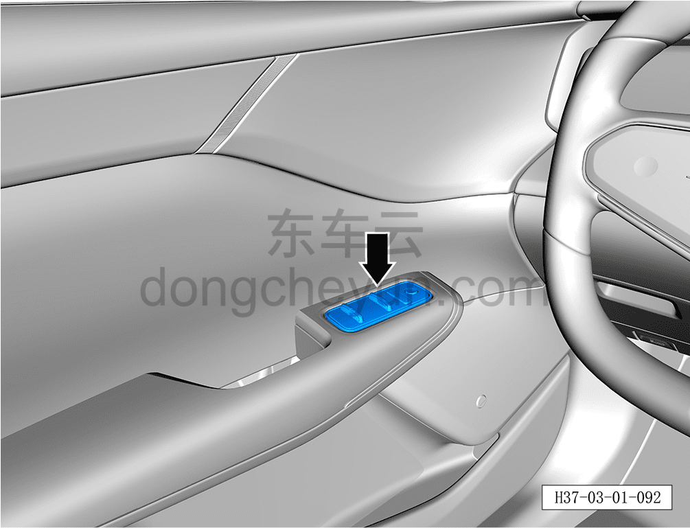
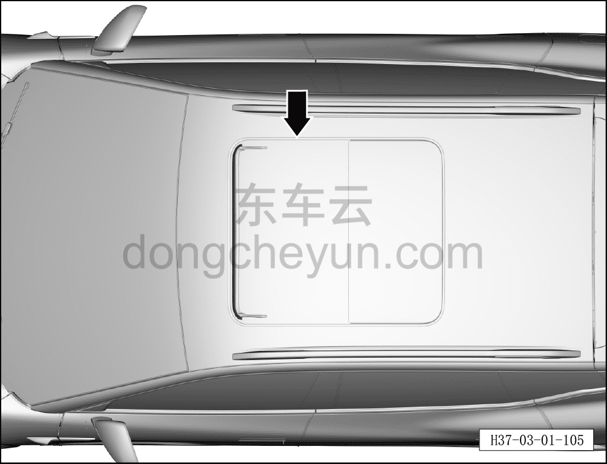
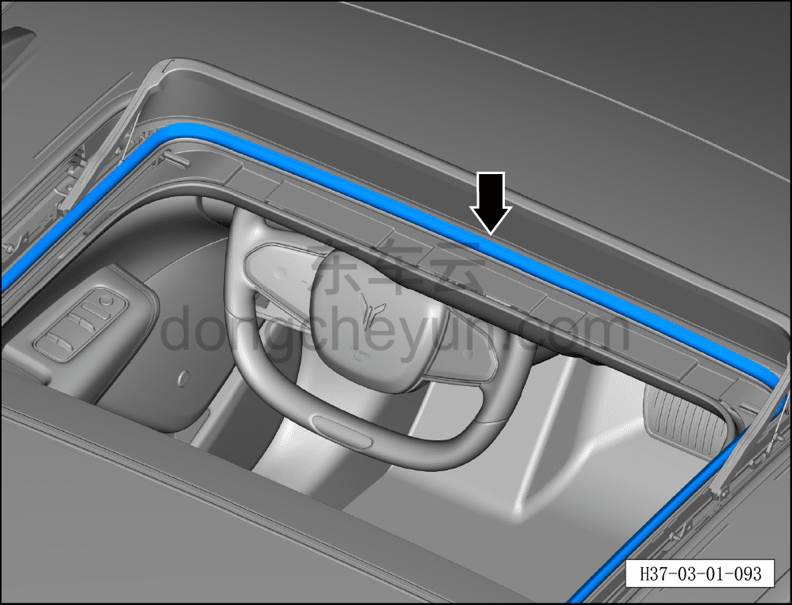
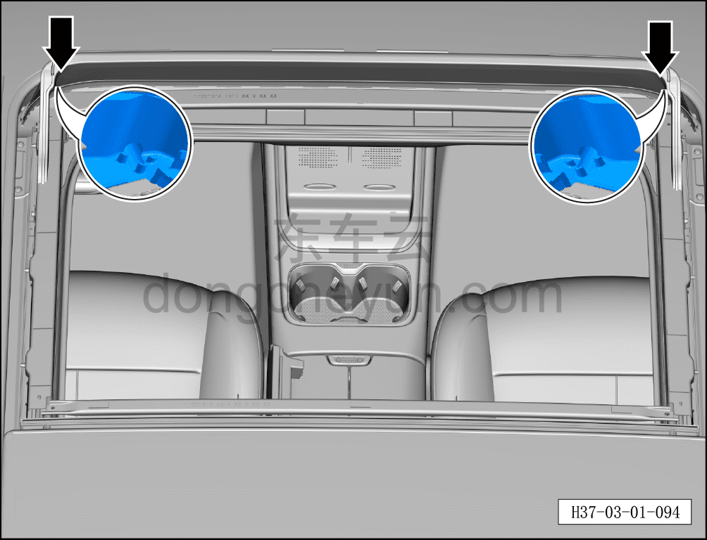

# Проверка дверных стёкол и люка

> Техническое обслуживание › Техническое обслуживание › Работы в салоне автомобиля  
> Оригинал: `检查门窗、天窗` · [dongcheyun 56746](https://dongcheyun.com/p/56746), страница `2f6653c1269b4178b8fa86515fabf765` · [оглавление](../README.md)

1. Проверьте передние и задние дверные стёкла.

a. Проверьте, не возникают ли посторонние шумы при открытии и закрытии передних и задних дверных стёкол; при их наличии удалите посторонние предметы и смажьте механизм, при необходимости замените механизм стеклоподъёмника.

b. Проверьте исправность функции защиты от зажатия стекла.

2. Проверьте сдвижной люк.

a. Визуально проверьте уплотнение сдвижного люка и наличие коррозионных повреждений.

b. Проверьте работу сдвижного люка.

c. Очистите направляющие сдвижного люка, при необходимости смажьте направляющие смазкой.

d. Проверьте работоспособность подвижного люка, обращая внимание на возможные следы истирания.

3. Проверьте и обслужите дренажные трубки люка.

a. Откройте люк в положение полного открытия и отсоедините уплотнитель люка.

b. Очистите передние дренажные отверстия люка и направляющие люка от посторонних предметов и проверьте, не заблокированы ли дренажные отверстия.

**Внимание:**

**-Если люк долгое время не обслуживать, возможна течь. Рекомендуется очищать уплотнитель раз в год, а дренажные трубки — раз в два года.**
