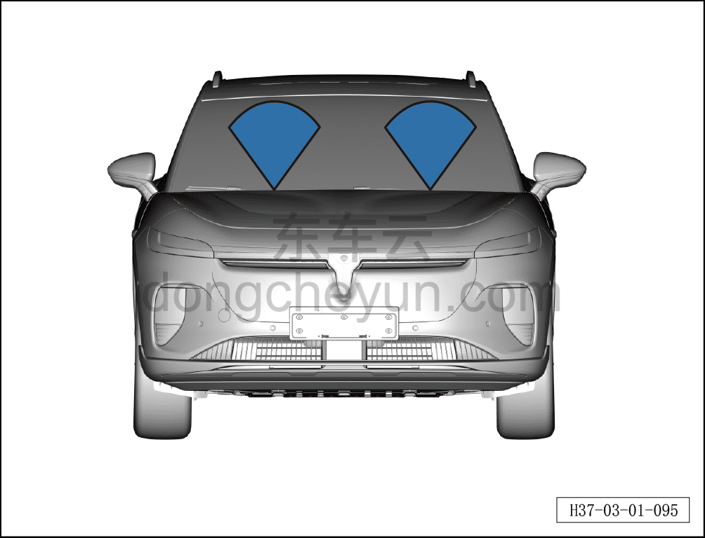
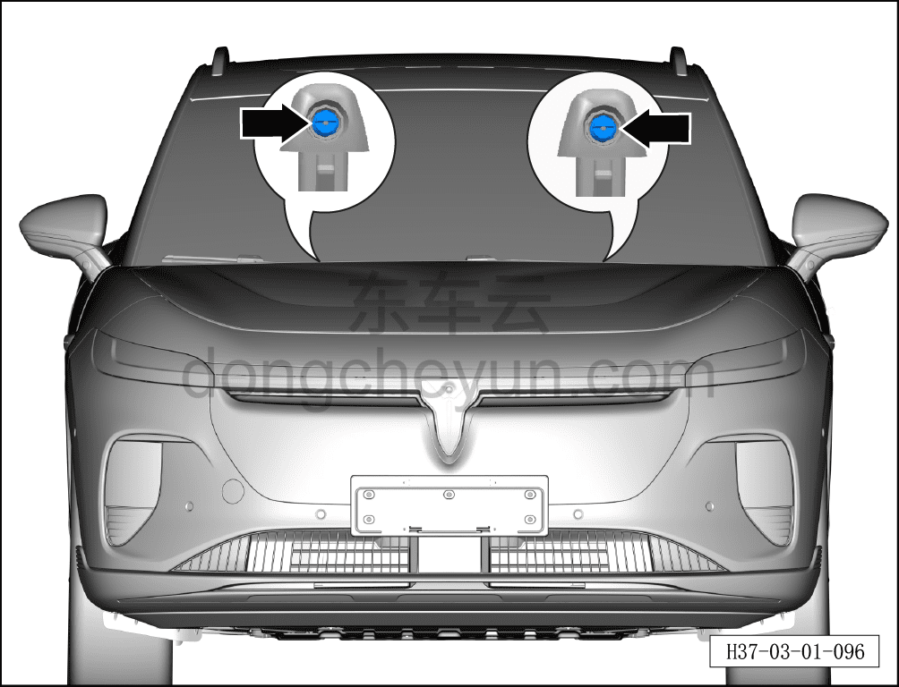

# Проверка и регулировка направления омывания лобового стекла

> Техническое обслуживание › Техническое обслуживание › Работы в салоне автомобиля  
> Оригинал: `检查调节风窗清洗方向` · [dongcheyun 56746](https://dongcheyun.com/p/56746), страница `b246b81dc3d742958d9b447ca3bac307` · [оглавление](../README.md)

**Внимание:**

**-Если из-за загрязнения форсунки зона распыла становится неравномерной, снимите форсунку и промойте её водой в направлении, противоположном направлению распыла форсунки. Затем продуйте сжатым воздухом в направлении, противоположном направлению распыла форсунки.**

1. Проверьте устройство очистки/омывания лобового стекла.

a. Включите функцию омывания стеклоочистителя и проверьте, подаётся ли омывающая жидкость из обоих стеклоочистителей.

b. Если из стеклоочистителя не подаётся омывающая жидкость, проверьте её наличие в бачке.

c. Если из одного из стеклоочистителей не подаётся омывающая жидкость, проверьте правильность установки трубопровода и отсутствие в нём засоров.
