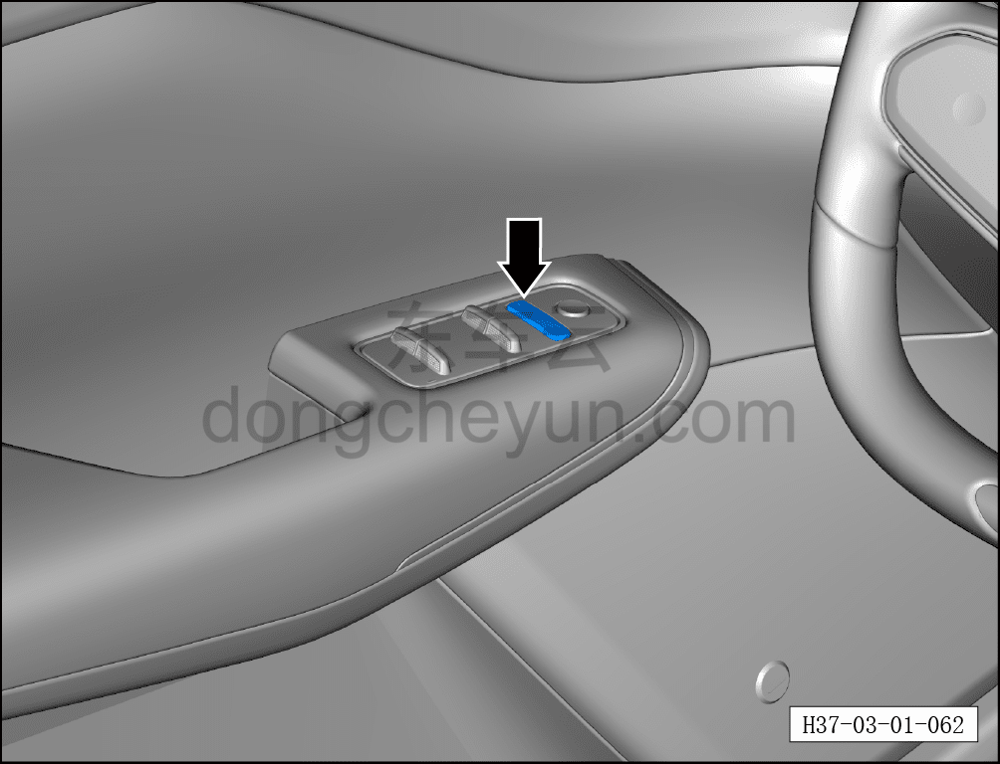
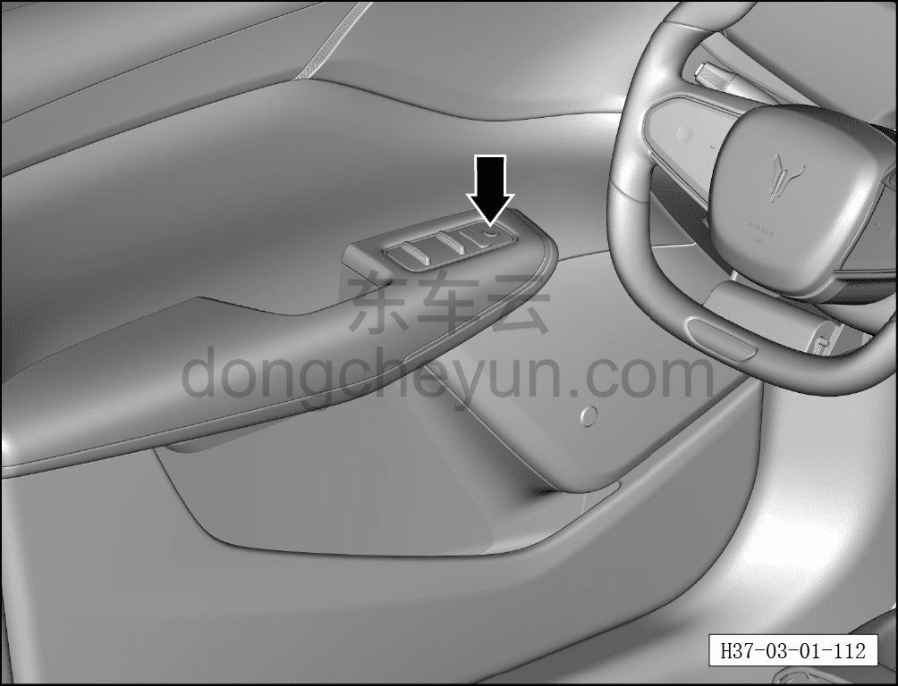

# Проверка и обслуживание замков дверей, центрального замка, детских замков

> Техническое обслуживание › Техническое обслуживание › Работы в салоне автомобиля  
> Оригинал: `检查维护车门锁、中控锁、儿童锁` · [dongcheyun 56746](https://dongcheyun.com/p/56746), страница `f2bc49495d2d4eb6ad42722bf3dc6fb6` · [оглавление](../README.md)

1. Проверьте центральный замок.

a. На стоящем автомобиле проверьте исправность работы кнопки центрального замка.

2. Проверьте замки дверей и детские замки.

a. На стоящем автомобиле проверьте исправность работы кнопок замков дверей и детских замков.
