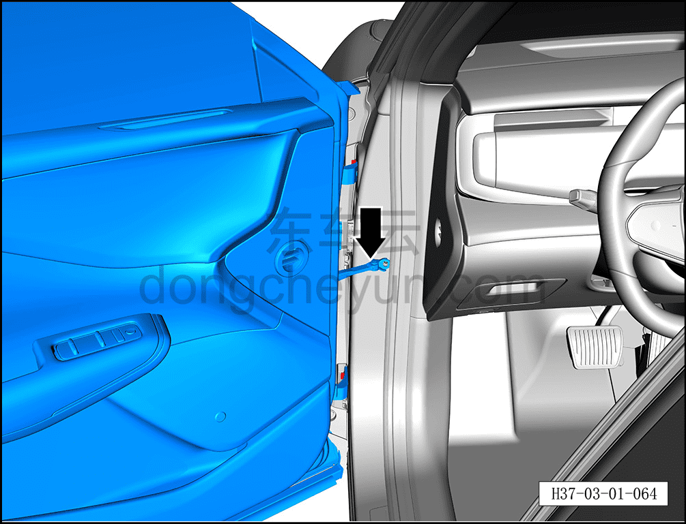
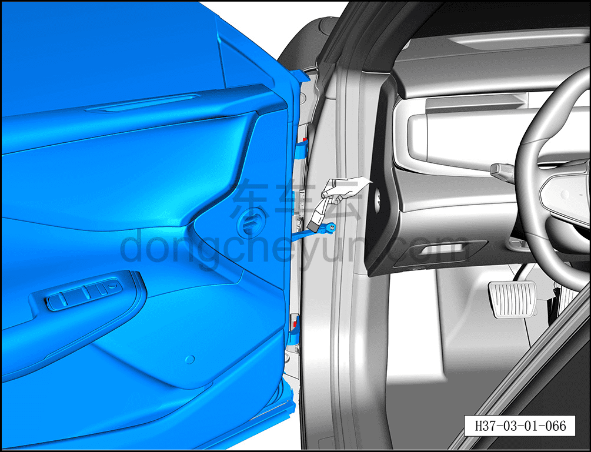
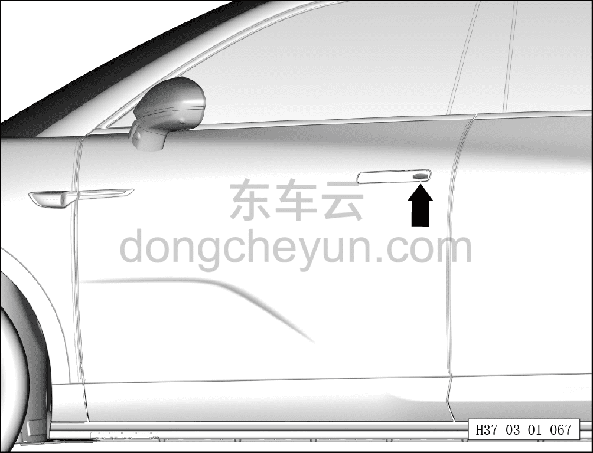

# Проверка ограничителя двери, замка двери, петель

> Техническое обслуживание › Техническое обслуживание › Работы в салоне автомобиля  
> Оригинал: `检查车门限位器、门锁、铰链` · [dongcheyun 56746](https://dongcheyun.com/p/56746), страница `64b18e8809de40d7a1c786a143a96a7e` · [оглавление](../README.md)

1. Проверьте ограничитель двери.

a. Многократно открывая и закрывая дверь, проверьте, не возникает ли посторонний шум в ограничителе двери.

2. Смажьте ограничитель двери.

a. Откройте дверь до максимального положения.

b. Мягкой хлопчатобумажной тканью удалите загрязнения с поверхности чёрной тяги ограничителя.

**Внимание:**

**-Категорически запрещается смазывать ограничитель двери моторным маслом, маслом редуктора и другими смазочными материалами, не указанными производителем.**

c. Небольшой кисточкой нанесите указанную смазку на скользящую поверхность рычага ограничителя сверху и снизу.

3. Проверьте личинку замка.

a. Потяните дверную ручку.

b. Вставьте ключ в замок двери и поверните его влево и вправо; личинка замка должна поворачиваться плавно.
