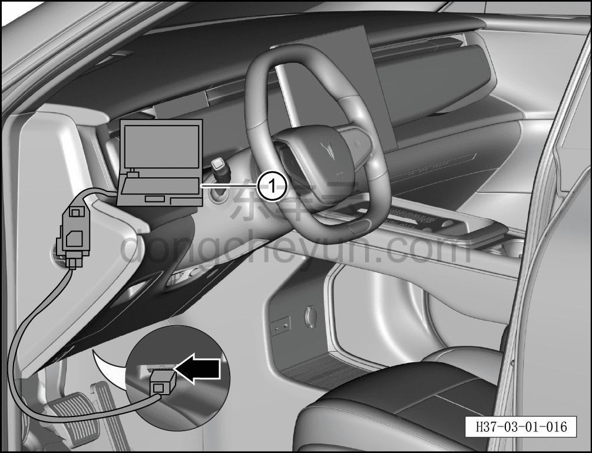

# Самодиагностика: проверка кодов неисправностей

> Техническое обслуживание › Техническое обслуживание › Работы в салоне автомобиля  
> Оригинал: `自诊断：检查故障码` · [dongcheyun 56746](https://dongcheyun.com/p/56746), страница `85366e30bca6402d93277884e8bfd17d` · [оглавление](../README.md)

**Примечание:**

**-При проведении дорожных испытаний диагностическое оборудование необходимо всегда размещать на заднем сиденье.**

**-Во время дорожных испытаний диагностическим оборудованием должен управлять другой технический специалист.**

a. Подключите диагностический сканер к автомобилю.

b. Включите питание автомобиля и, следуя указаниям диагностического сканера ①, запросите информацию о неисправностях.

c. Если отображается текущий код неисправности, необходимо устранить неисправность.

d. Удалите информацию о неисправностях, очистив историю неисправностей.

e. Отключите питание автомобиля и подождите 1 минуту.

f. Снова включите питание автомобиля и повторно считайте информацию о неисправностях, чтобы убедиться в отсутствии текущих кодов неисправностей и в том, что неисправность полностью устранена.
