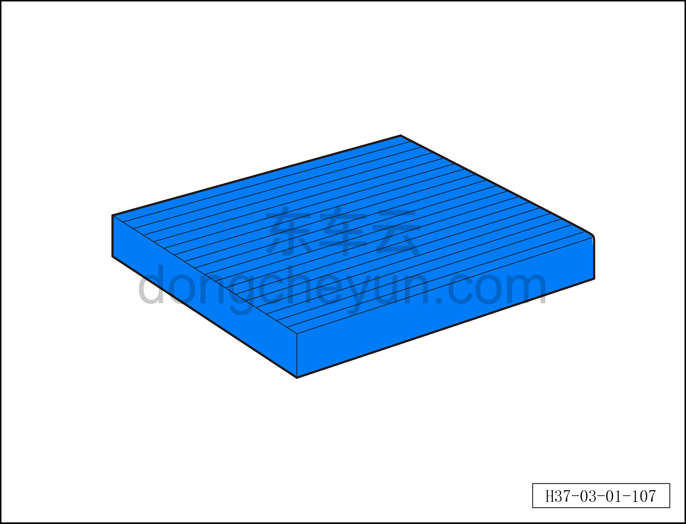

# Очистка фильтрующего элемента фильтра кондиционера

> Техническое обслуживание › Техническое обслуживание › Работы в салоне автомобиля  
> Оригинал: `清理空调滤清器滤芯` · [dongcheyun 56746](https://dongcheyun.com/p/56746), страница `5d9785ad13d04da68d75e0cdc8f74b33` · [оглавление](../README.md)

**Примечание:**

**-При достижении периодичности технического обслуживания выполните процедуру замены фильтрующего элемента фильтра кондиционера.**

**Порядок снятия**

1. Выключить все электроприборы, обесточить автомобиль.

2. Снимите фильтрующий элемент воздушного фильтра. См. [10.1.5.9 Снятие и установка фильтра кондиционера](../10-кондиционер/018-снятие-и-установка-салонного-фильтра.md)

3. Проверьте фильтрующий элемент фильтра кондиционера, очистите его сжатым воздухом.

4. Если загрязнение сильное или имеются повреждения, замените фильтрующий элемент фильтра кондиционера новым.

**Порядок установки**

Установка выполняется в обратном порядке.

**Внимание:**

**-При замене фильтра кондиционера используйте оригинальный фильтр кондиционера.**

**-Перед установкой фильтра кондиционера тщательно очистите корпус фильтра кондиционера от посторонних предметов.**

**-При очистке сжатым воздухом держите пневмопистолет на подходящем расстоянии от фильтра кондиционера и используйте небольшой поток воздуха, чтобы не повредить фильтр кондиционера.**
