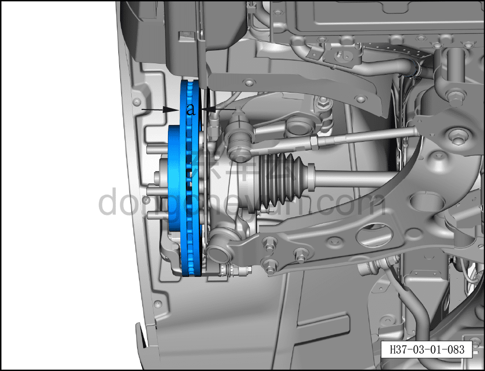
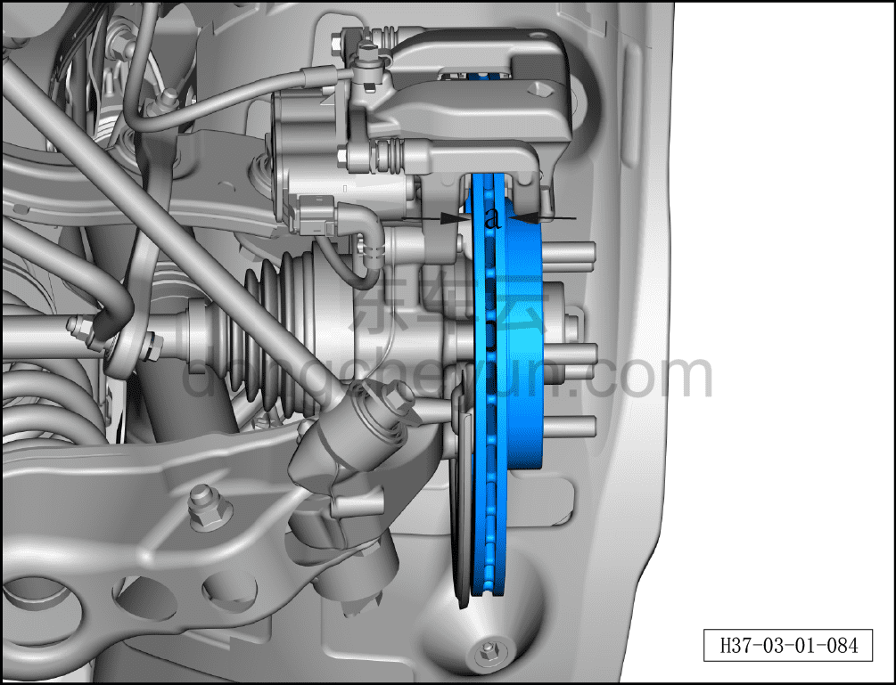

# Проверка тормозного диска

> Техническое обслуживание › Техническое обслуживание › Работы снаружи автомобиля  
> Оригинал: `检查制动盘` · [dongcheyun 56746](https://dongcheyun.com/p/56746), страница `8e05db8ef33a4423b609766ced44521c` · [оглавление](../README.md)

1. Снимите колесо.

2. Проверьте передний тормозной диск.

a. Измерьте толщину a переднего тормозного диска.

Толщина переднего тормозного диска: 30мм.

Предельный размер по ремонту: 28мм.

3. Проверьте задний тормозной диск.

a. Измерьте толщину a заднего тормозного диска.

Толщина заднего тормозного диска: 20мм.

Предельный размер по ремонту: 18мм.

**Внимание:**

**-Если износ тормозного диска превышает установленное значение, тормозной диск необходимо заменить.**
