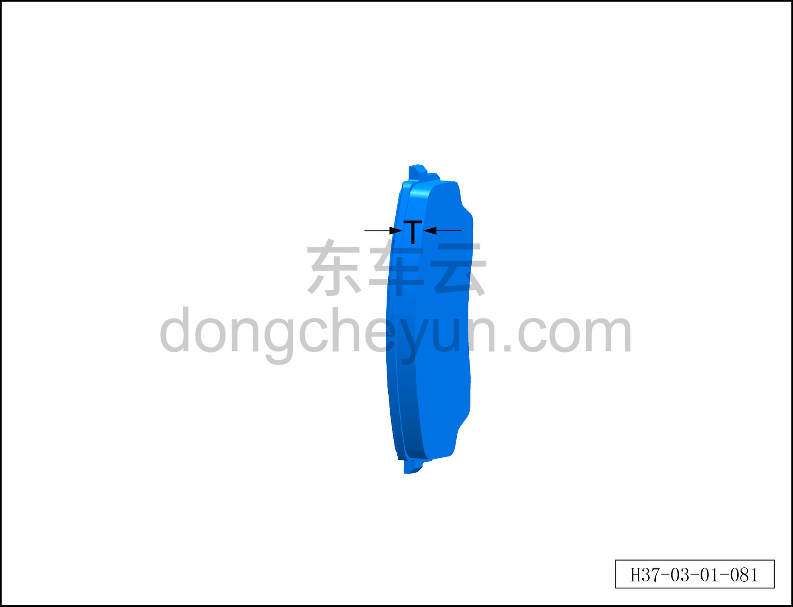

# Проверка тормозных колодок

> Техническое обслуживание › Техническое обслуживание › Работы снаружи автомобиля  
> Оригинал: `检查制动片` · [dongcheyun 56746](https://dongcheyun.com/p/56746), страница `e206235f68bc44ce8a9331712904f2d0` · [оглавление](../README.md)

**Внимание:**

**-Если толщина тормозного диска и тормозных колодок достигла предела износа, необходимо сообщить об этом клиенту и произвести замену.**

1. Проверьте состояние тормозных колодок.

a. Снимите тормозные колодки.

b. Проверьте рабочую поверхность тормозных колодок на наличие ржавчины, следов масла и других загрязнений; при их наличии удалите.

**Внимание**

**-Если тормозная колодка пропитана маслом, её необходимо заменить.**

c. Проверьте рабочую поверхность тормозных колодок на наличие трещин, расколов или повреждений; при их наличии замените.

d. Проверьте, не ослаблена ли направляющая пластина тормозной колодки; при необходимости установите её заново или замените.

e. Измерьте толщину тормозной колодки (без опорной пластины) T; при превышении предельной толщины износа замените.

Предельная толщина износа: 2мм.
