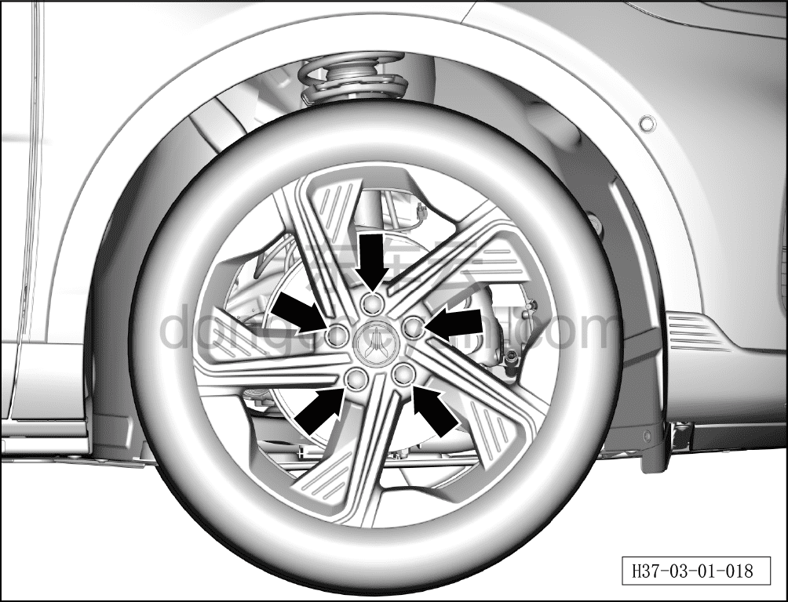

# Проверка болтов крепления колеса

> Техническое обслуживание › Техническое обслуживание › Работы снаружи автомобиля  
> Оригинал: `检查车轮固定螺栓` · [dongcheyun 56746](https://dongcheyun.com/p/56746), страница `541562feca614f63b008cf139c2de012` · [оглавление](../README.md)

1. Проверьте болты крепления колеса.

a. Проверьте 5 болтов колеса на отсутствие или повреждение.

b. Затяните болты колеса по диагональной схеме.

Момент затяжки болтов: 160±10 Н·м.
