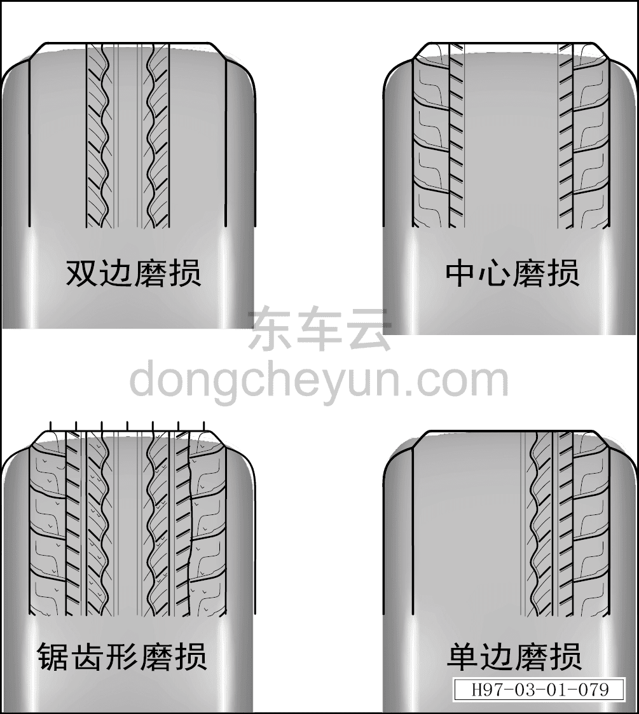
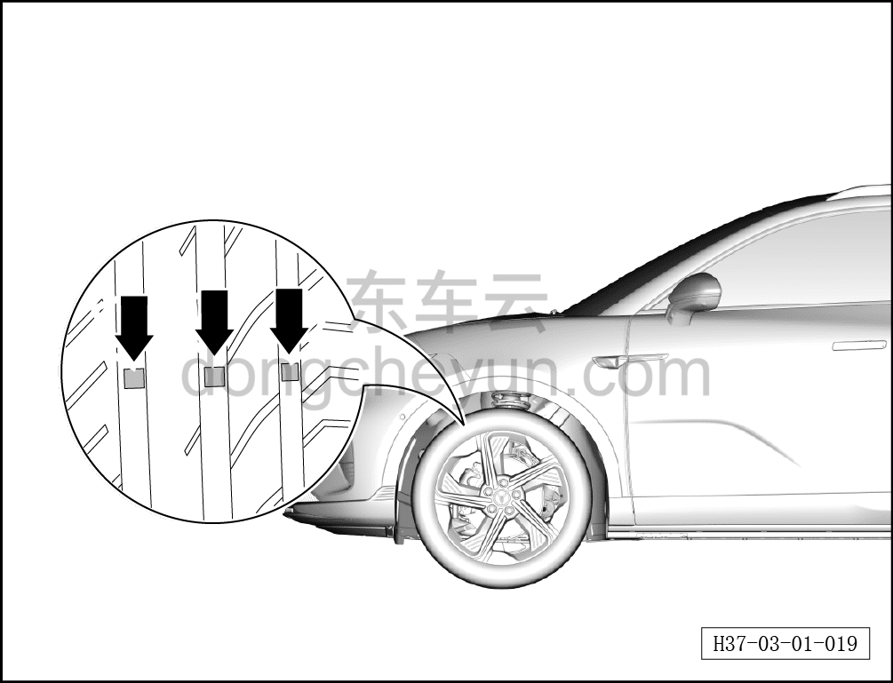

# Проверка шин

> Техническое обслуживание › Техническое обслуживание › Работы снаружи автомобиля  
> Оригинал: `检查轮胎` · [dongcheyun 56746](https://dongcheyun.com/p/56746), страница `9fadc891df53429d9aa791f7abfdf781` · [оглавление](../README.md)

1. Поднять автомобиль на подъёмнике.

2. Проверьте шины.

a. Проверьте шины на наличие неравномерного износа.

b. Проверьте протектор шины на наличие повреждений и посторонних предметов.

c. Если обнаружен износ протектора шины по краям или по центру, отрегулируйте давление в шинах.

d. Если обнаружен односторонний или пилообразный износ протектора шины, проверьте схождение передних колёс и развал колёс, при необходимости отрегулируйте, см. [1.3.5 Параметры развал-схождения](../01-обзор/017-параметры-развал-схождения.md)

| Типоразмер шин | Передние колёса | Задние колёса |
|---|---|---|
| 255/45R20 | 250kPa | 250kPa |

**Внимание:**

**-Если обнаружено, что шина достигла предела износа или повреждение влияет на безопасность движения, необходимо сообщить об этом клиенту и рекомендовать замену шины.**

1. Проверьте беговую дорожку и боковину шины на наличие повреждений и посторонних предметов, а боковину — на рыхлость, пористость, порезы и проколы посторонними предметами.

2. Проверьте глубину рисунка протектора шины, убедившись, что глубина канавок протектора превышает высоту индикатора износа, как показано на рисунке — треугольный индикатор износа на боковине шины (указанный стрелкой) не должен быть полностью стёрт.
