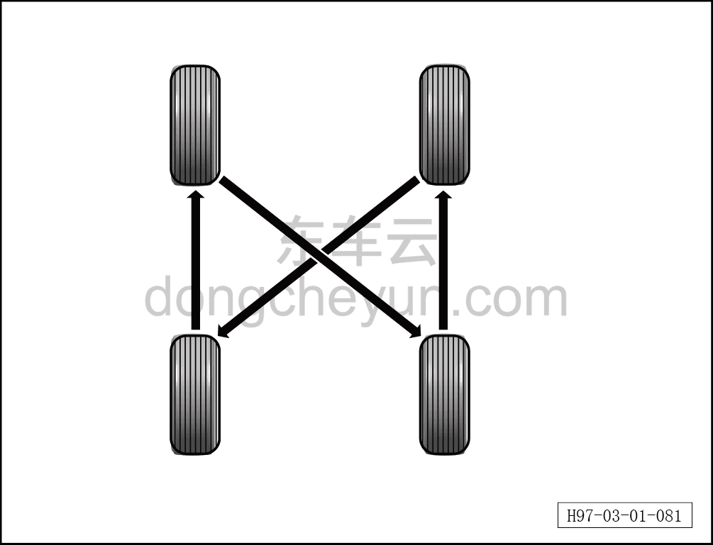

# Перестановка шин

> Техническое обслуживание › Техническое обслуживание › Работы снаружи автомобиля  
> Оригинал: `轮胎换位` · [dongcheyun 56746](https://dongcheyun.com/p/56746), страница `5044881e23f94e20acca6e5495d0bb68` · [оглавление](../README.md)

**Внимание:**

**-Если наблюдается явно неравномерный износ шин, необходимо устранить причину неисправности, вызывающую такой износ. При перестановке шин рекомендуется одновременно проверить балансировку колёс; для автомобилей с системой контроля давления в шинах после перестановки шин требуется повторная калибровка.**

1. Поскольку передние и задние колёса автомобиля испытывают разную нагрузку при движении, характер их износа также значительно различается. Поэтому, чтобы избежать износа шины в одном направлении, необходимо регулярно и своевременно переставлять шины — это обеспечивает равномерный износ шин и продлевает срок их службы. Рекомендуется выполнять перестановку каждые 10000км. Основные цели перестановки шин:

a. Обеспечить равномерный износ шин, гарантируя устойчивость и экономичность.

b. При перестановке проверить состояние шин, своевременно выявить повреждения и предотвратить возникновение аварийных ситуаций.

2. Переставьте колёса в сборе в соответствии со следующей схемой.

**Внимание:**

**-Как показано ниже, выполните перекрёстную перестановку шин без направления вращения.**

