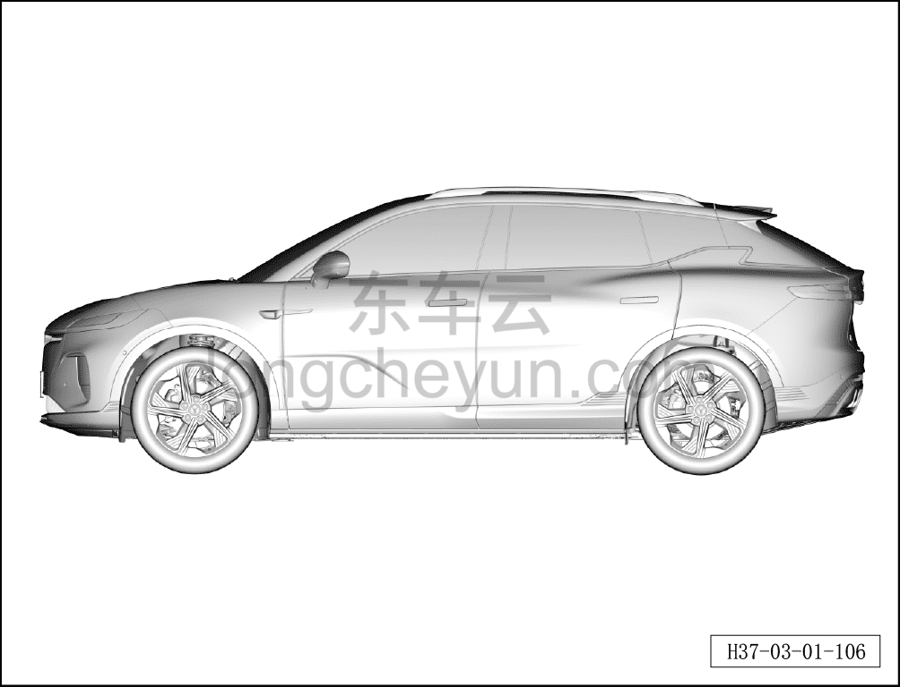

# Проверка внешнего вида автомобиля

> Техническое обслуживание › Техническое обслуживание › Работы снаружи автомобиля  
> Оригинал: `检查整车外观` · [dongcheyun 56746](https://dongcheyun.com/p/56746), страница `0c479e41ddde4714be07a53f16c69d3c` · [оглавление](../README.md)

1. Проверьте внешний вид автомобиля.

a. Проверьте кузов автомобиля на наличие потёртостей, царапин, трещин и других повреждений.
