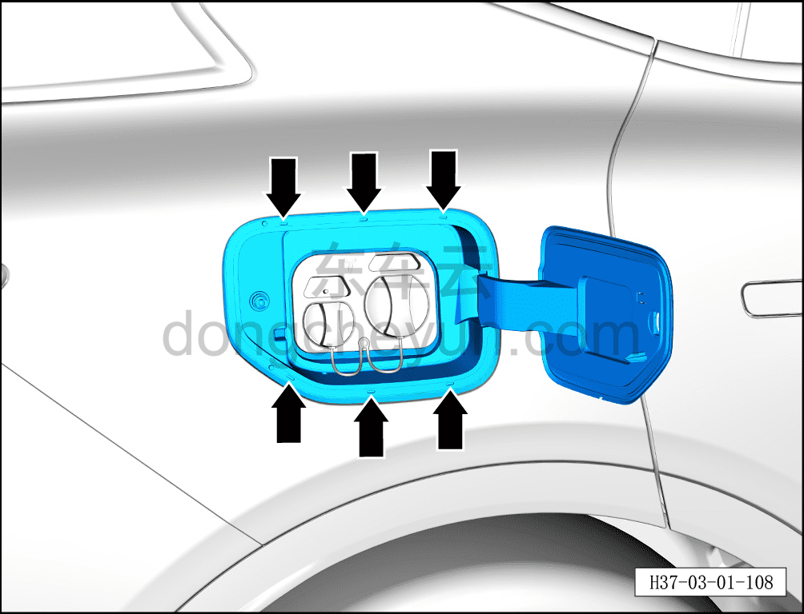

# Проверка зарядного разъёма

> Техническое обслуживание › Техническое обслуживание › Работы снаружи автомобиля  
> Оригинал: `检查充电插座` · [dongcheyun 56746](https://dongcheyun.com/p/56746), страница `27c8b319cd5546ceb605ab63d2f8e17c` · [оглавление](../README.md)

1. Проверьте зарядный разъём.

a. Проверьте, чтобы зарядный разъём был чистым, без посторонних предметов и жидкости.
