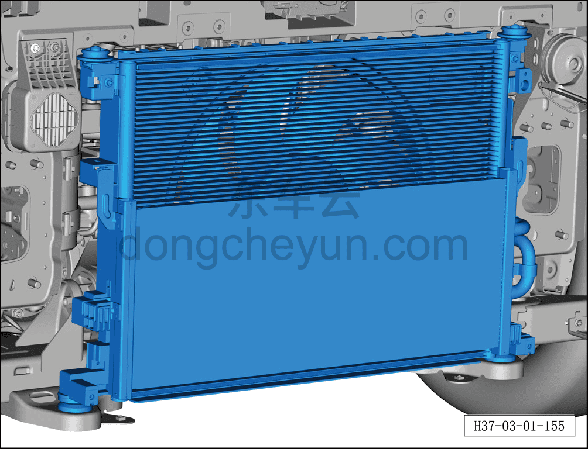

# Проверка конденсатора, радиатора

> Техническое обслуживание › Техническое обслуживание › Работы снаружи автомобиля  
> Оригинал: `检查冷凝器、散热器` · [dongcheyun 56746](https://dongcheyun.com/p/56746), страница `87016e6a4a484c62a5e83d4529ed50bd` · [оглавление](../README.md)

**Внимание:**

**-При длительной эксплуатации автомобиля в неблагоприятных условиях проверьте, не покрыты ли конденсатор и радиатор загрязнениями; при их наличии немедленно очистите — своевременная очистка способствует повышению эффективности охлаждения кондиционера, дополнительному охлаждению электродвигателя и предотвращению перегрева автомобиля.**

1. Выключить все электроприборы, обесточить автомобиль.

2. Проверьте конденсатор, радиатор.

a. Визуально проверьте ребра поверхности конденсатора и радиатора на наличие посторонних предметов, перекрывающих их (например, тополиного пуха, грязи и других загрязнений):

-Если посторонних предметов нет, используйте пневмопистолет высокого давления, чтобы выдуть пыль из ребер радиатора и конденсатора и повысить эффективность теплоотдачи.

-Если посторонние предметы есть, необходимо снять передний бампер и промыть радиатор или конденсатор струёй воды низкого давления; порядок снятия переднего бампера см. [8.6.3.3 Снятие и установка переднего бампера в сборе](../08-внутренняя-и-внешняя-отделка/163-снятие-и-установка-переднего-бампера-в-сборе.md)
