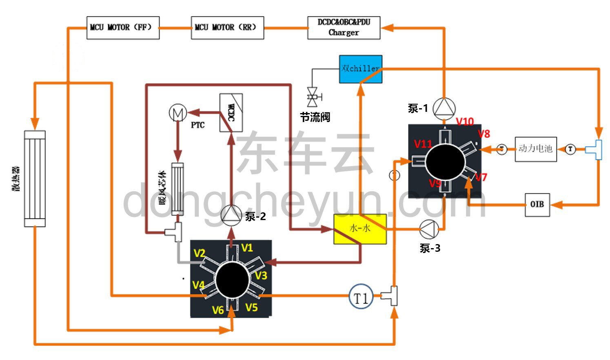
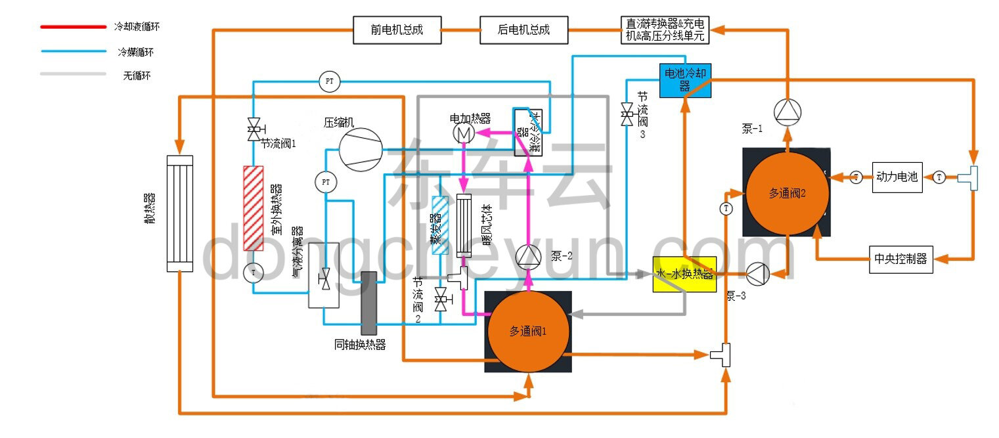

# Описание конструкции и принципа работы

> Интегрированная силовая система › Система охлаждения  
> Оригинал: `结构与原理介绍` · [dongcheyun 56746](https://dongcheyun.com/p/56746), страница `0d31913307d94aed8cabf747052e8b5c` · [оглавление](../README.md)

**Обзор системы охлаждения**

- Система охлаждения делится на контур охлаждения электропривода, контур охлаждения аккумуляторной батареи и контур отопителя; каждый контур имеет свой собственный привод — электрический водяной насос, который приводит в движение поток охлаждающей жидкости через радиатор, охладитель батареи, PTC-нагреватель и др., обеспечивая соответственно охлаждение электропривода и контроллера, нагрев или охлаждение батареи, а также подачу тепла к теплообменнику отопителя. Контуры охлаждения через пятиходовой и шестиходовой клапаны в интегрированном блоке системы терморегулирования могут соединяться последовательно или параллельно, обеспечивая различные функции.

- Система охлаждения аккумуляторной батареи и система отопления не различаются для заднеприводной и полноприводной версий; только система охлаждения электродвигателя различается для заднеприводной и полноприводной версий.

- У заднеприводной версии есть только задний электродвигатель, поэтому система охлаждения электродвигателя охлаждает только задний электродвигатель; у полноприводного автомобиля есть передний и задний электродвигатели, и система охлаждения электродвигателя охлаждает как передний, так и задний электродвигатель.

**Схема циркуляции охлаждающей жидкости**

**Схема терморегулирования автомобиля**

