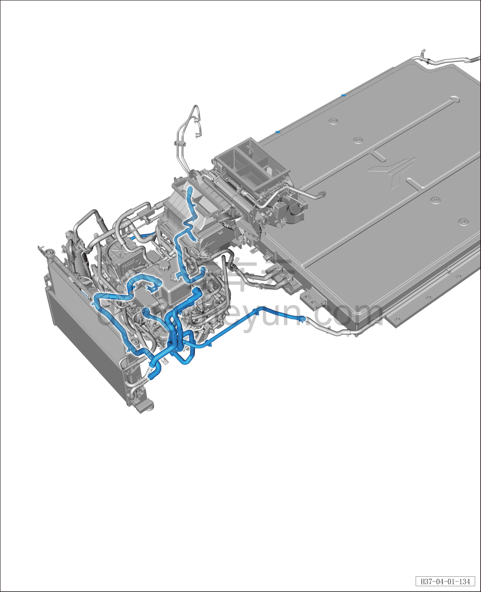

# Передний контур охлаждения (полный привод)

> Интегрированная силовая система › Система охлаждения › Расположение компонентов  
> Оригинал: `前冷却管路（四驱）` · [dongcheyun 56746](https://dongcheyun.com/p/56746), страница `ea457982977442c390c3eaecbe356197` · [оглавление](../README.md)

