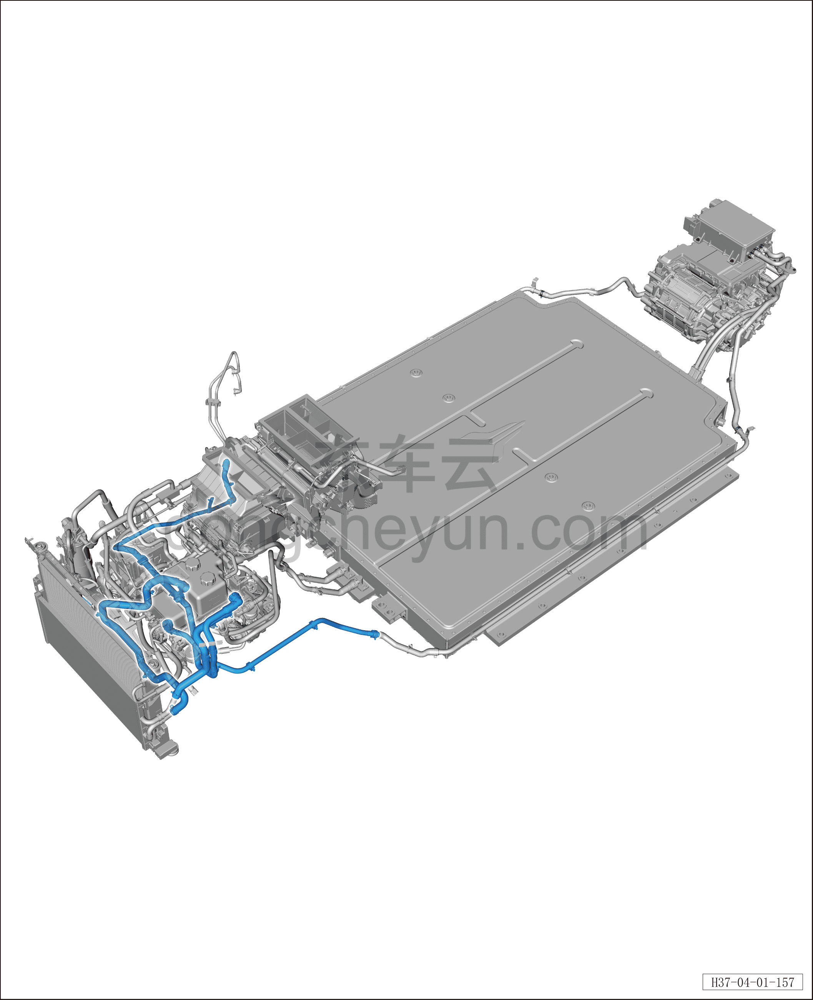

# Передний контур охлаждения (задний привод)

> Интегрированная силовая система › Система охлаждения › Расположение компонентов  
> Оригинал: `前冷却管路（后驱）` · [dongcheyun 56746](https://dongcheyun.com/p/56746), страница `7f2eb567b3cd42ee90840bcedeb871b7` · [оглавление](../README.md)

