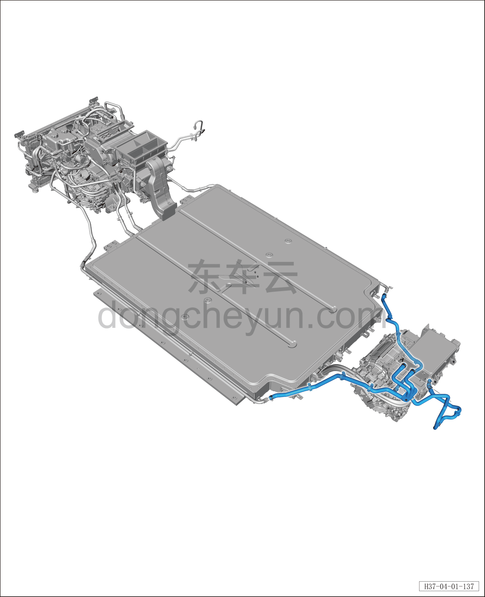

# Задний контур охлаждения

> Интегрированная силовая система › Система охлаждения › Расположение компонентов  
> Оригинал: `后冷却管路` · [dongcheyun 56746](https://dongcheyun.com/p/56746), страница `15bc50132f044000a1629fcac97f8654` · [оглавление](../README.md)

