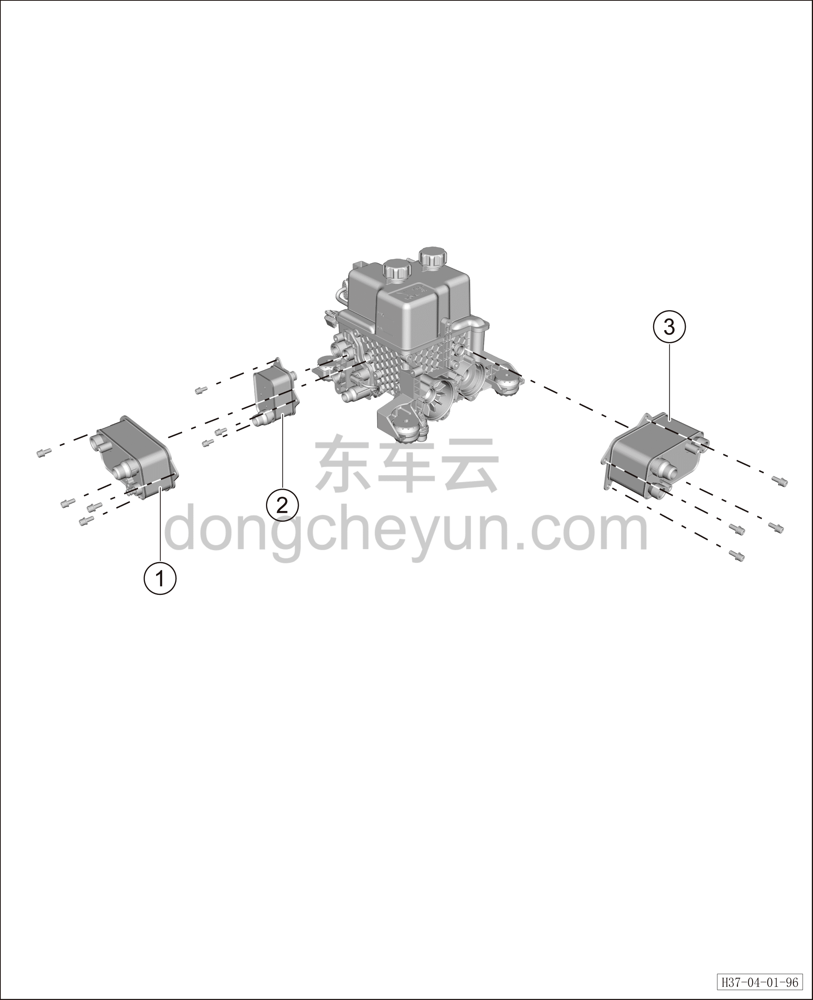

# Расширительный бачок

> Интегрированная силовая система › Система охлаждения › Покомпонентный вид (деталировка)  
> Оригинал: `蓄水瓶` · [dongcheyun 56746](https://dongcheyun.com/p/56746), страница `a3e0aa3b76894823b7a63e6667ca6ca0` · [оглавление](../README.md)

| № | Наименование детали | Кол-во на автомобиль | Примечание |
|---|---|---|---|
| 1 | Охладитель батареи | 1 | - |
| 2 | Водо-водяной теплообменник | 1 | - |
| 3 | Конденсатор | 1 | - |
