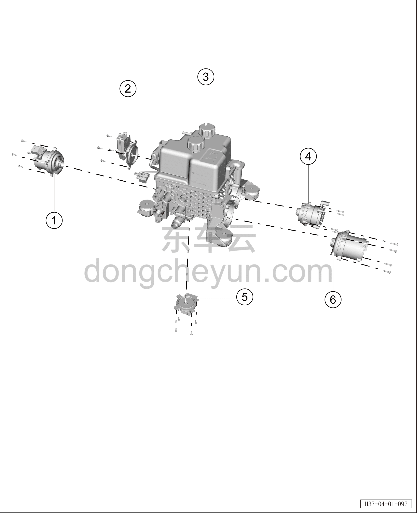

# Водяной насос и корпус клапана

> Интегрированная силовая система › Система охлаждения › Покомпонентный вид (деталировка)  
> Оригинал: `水泵及阀体` · [dongcheyun 56746](https://dongcheyun.com/p/56746), страница `7c0589614f2c4f189d51d5ebf9fc1c3b` · [оглавление](../README.md)

| № | Наименование детали | Кол-во на автомобиль | Примечание |
|---|---|---|---|
| 1 | Электрический водяной насос контура батареи | 1 | - |
| 2 | Шестиходовой клапан | 1 | - |
| 3 | Интегрированный расширительный бачок | 1 | - |
| 4 | Электрический водяной насос контура отопителя | 1 | - |
| 5 | Пятиходовой клапан | 1 | - |
| 6 | Водяной насос электродвигателя в сборе | 1 | - |
