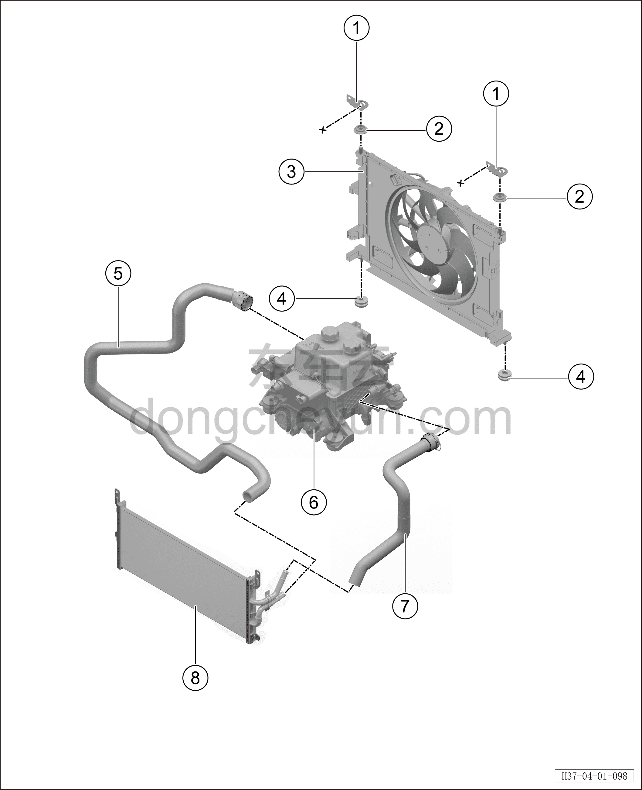

# Радиатор

> Интегрированная силовая система › Система охлаждения › Покомпонентный вид (деталировка)  
> Оригинал: `散热器` · [dongcheyun 56746](https://dongcheyun.com/p/56746), страница `0d462d3fca2841b59a85eef815f16094` · [оглавление](../README.md)

| № | Наименование детали | Кол-во на автомобиль | Примечание |
|---|---|---|---|
| 1 | Верхний кронштейн радиатора | 2 | - |
| 2 | Верхняя амортизирующая подушка радиатора | 2 | - |
| 3 | Вентилятор радиатора | 1 | - |
| 4 | Нижняя амортизирующая подушка радиатора | 2 | - |
| 5 | Выходная трубка низкотемпературного радиатора | 1 | - |
| 6 | Интегрированный расширительный бачок | 1 | - |
| 7 | Входная трубка низкотемпературного радиатора | 1 | - |
| 8 | Низкотемпературный радиатор | 1 | - |
