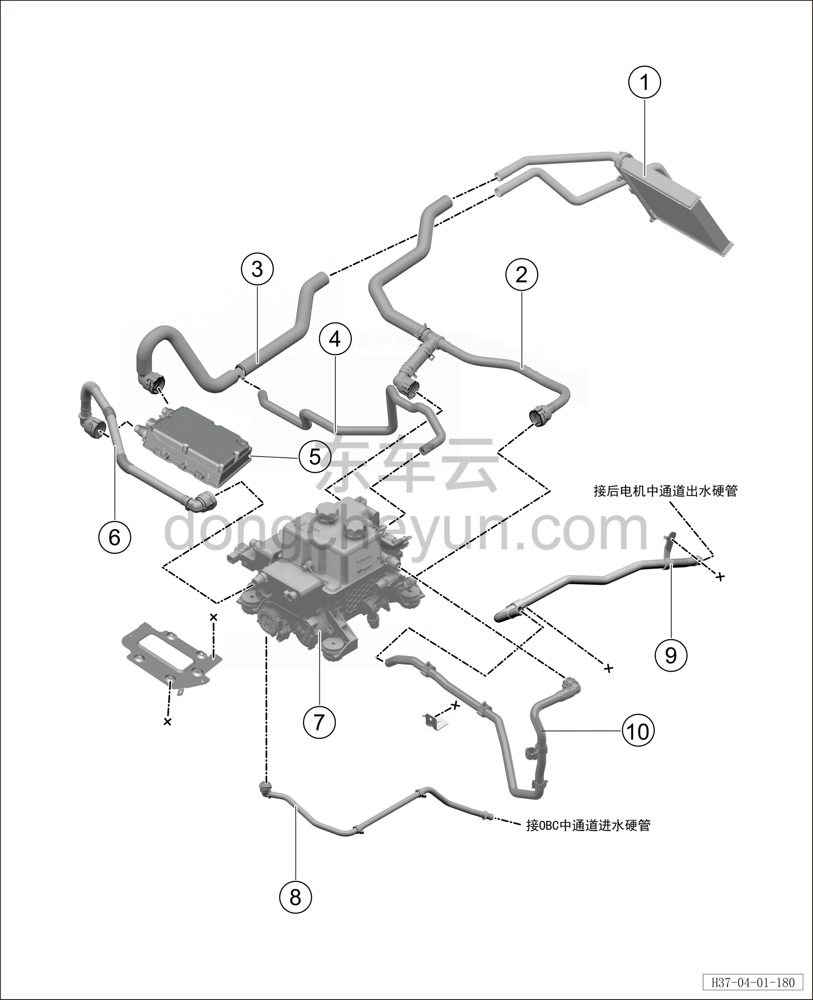

# Передний контур охлаждения (задний привод, 800В)

> Интегрированная силовая система › Система охлаждения › Покомпонентный вид (деталировка)  
> Оригинал: `前冷却管路（后驱800V）` · [dongcheyun 56746](https://dongcheyun.com/p/56746), страница `98e52eeb2b3049b785d0e03d066fbff1` · [оглавление](../README.md)

| № | Наименование детали | Кол-во на автомобиль | Примечание |
|---|---|---|---|
| 1 | Теплообменник отопителя | 1 | - |
| 2 | Обратная трубка отопителя | 1 | - |
| 3 | Водяная трубка от PTC-нагревателя к переднему теплообменнику отопителя | 1 | - |
| 4 | Шланг сброса воздуха контура отопителя | 1 | - |
| 5 | PTC водяной нагреватель | 1 | - |
| 6 | Водяная трубка от WCDC к PTC-нагревателю | 1 | - |
| 7 | Интегрированный расширительный бачок | 1 | - |
| 8 | Выходная трубка водяного насоса электродвигателя | 1 | - |
| 9 | Выходная трубка заднего электродвигателя | 1 | Заднеприводная версия |
| 10 | Входная трубка водяного насоса электродвигателя | 1 | Заднеприводная версия |
