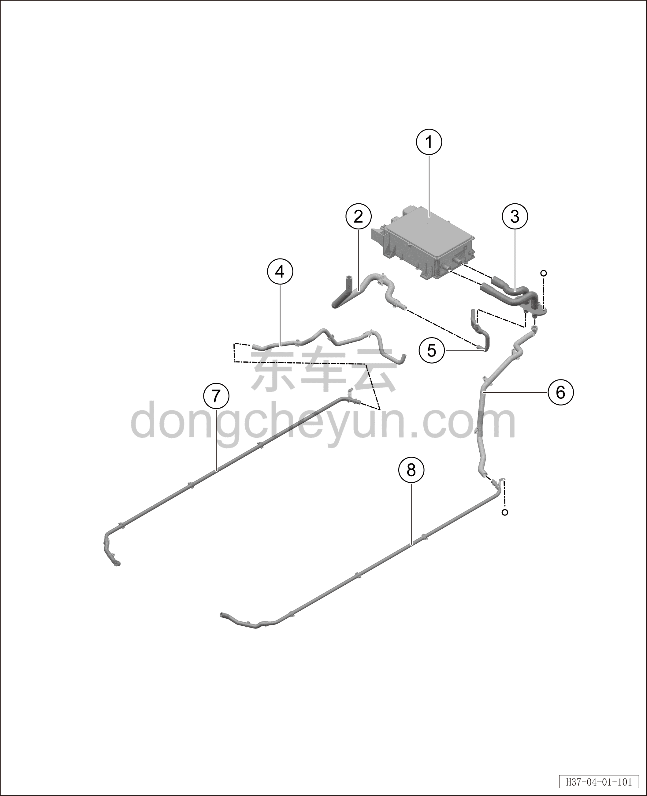

# Задний контур охлаждения

> Интегрированная силовая система › Система охлаждения › Покомпонентный вид (деталировка)  
> Оригинал: `后冷却管路` · [dongcheyun 56746](https://dongcheyun.com/p/56746), страница `03877ef7d17c430d89da2a5284314657` · [оглавление](../README.md)

| № | Наименование детали | Кол-во на автомобиль | Примечание |
|---|---|---|---|
| 1 | Бортовое зарядное устройство (OBC) | 1 | - |
| 2 | Входная трубка заднего электродвигателя | 1 | - |
| 3 | Входная/выходная трубка OBC | 1 | - |
| 4 | Выходная трубка заднего электродвигателя | 1 | Подключение к заднему электродвигателю |
| 5 | Выходная трубка OBC | 1 | - |
| 6 | Водяная трубка от водяного насоса к зарядному устройству | 1 | - |
| 7 | Жёсткая выходная трубка заднего электродвигателя (центральный тоннель) | 1 | - |
| 8 | Жёсткая входная трубка OBC (центральный тоннель) | 1 | - |
