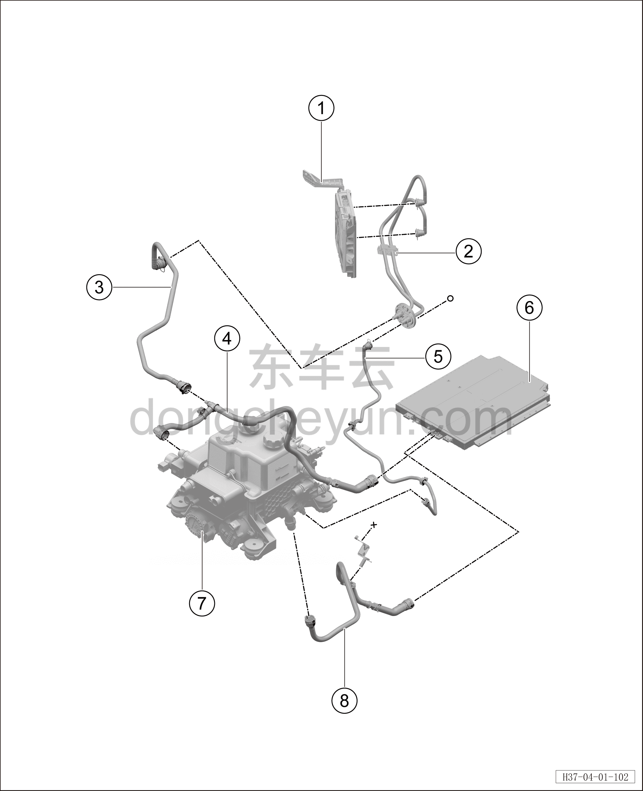

# Система термостатирования батареи

> Интегрированная силовая система › Система охлаждения › Покомпонентный вид (деталировка)  
> Оригинал: `电池恒温系统` · [dongcheyun 56746](https://dongcheyun.com/p/56746), страница `98769a18d90b4132adcdae37de087caa` · [оглавление](../README.md)

| № | Наименование детали | Кол-во на автомобиль | Примечание |
|---|---|---|---|
| 1 | Центральный контроллер | 1 | - |
| 2 | Входная/выходная трубка OIB | 1 | - |
| 3 | Водяная трубка от трёхходового клапана к OIB | 1 | - |
| 4 | Входная трубка аккумуляторной батареи | 1 | - |
| 5 | Выходная трубка от OIB к аккумуляторной батарее | 1 | - |
| 6 | Тяговая батарея | 1 | - |
| 7 | Интегрированный расширительный бачок | 1 | - |
| 8 | Выходная трубка аккумуляторной батареи | 1 | - |
