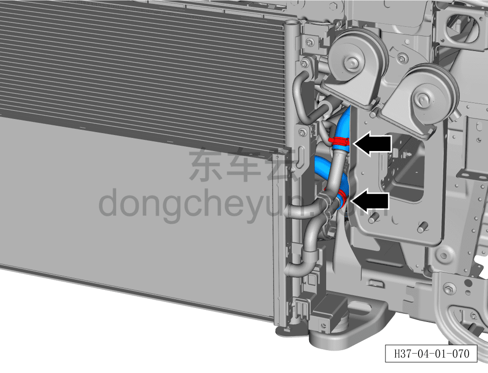
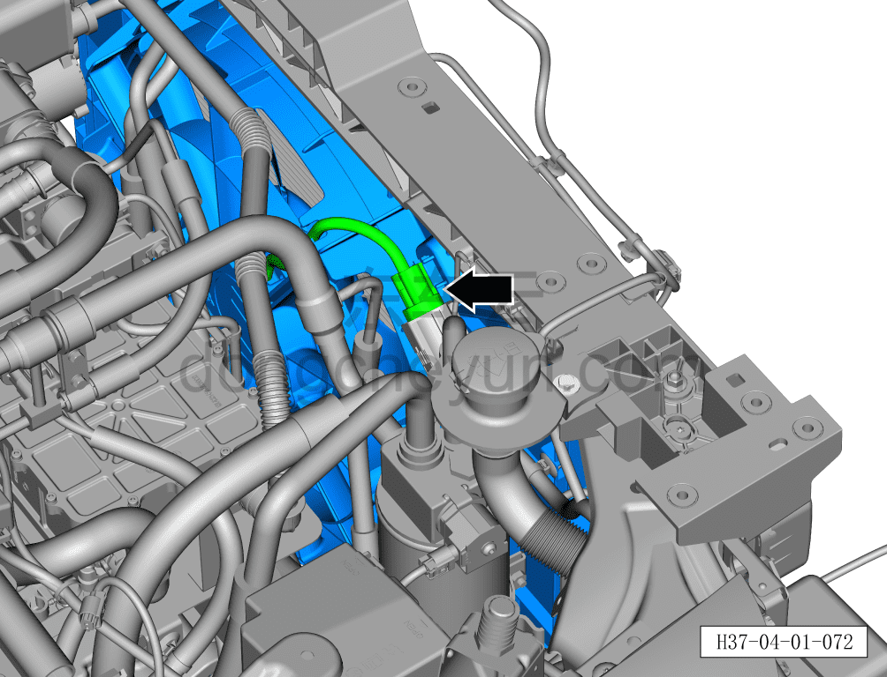
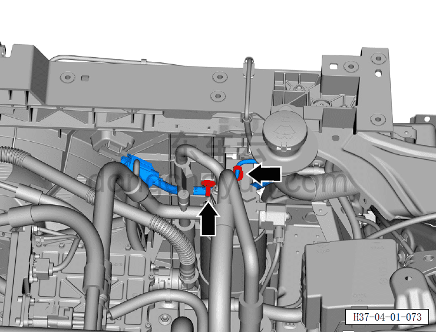
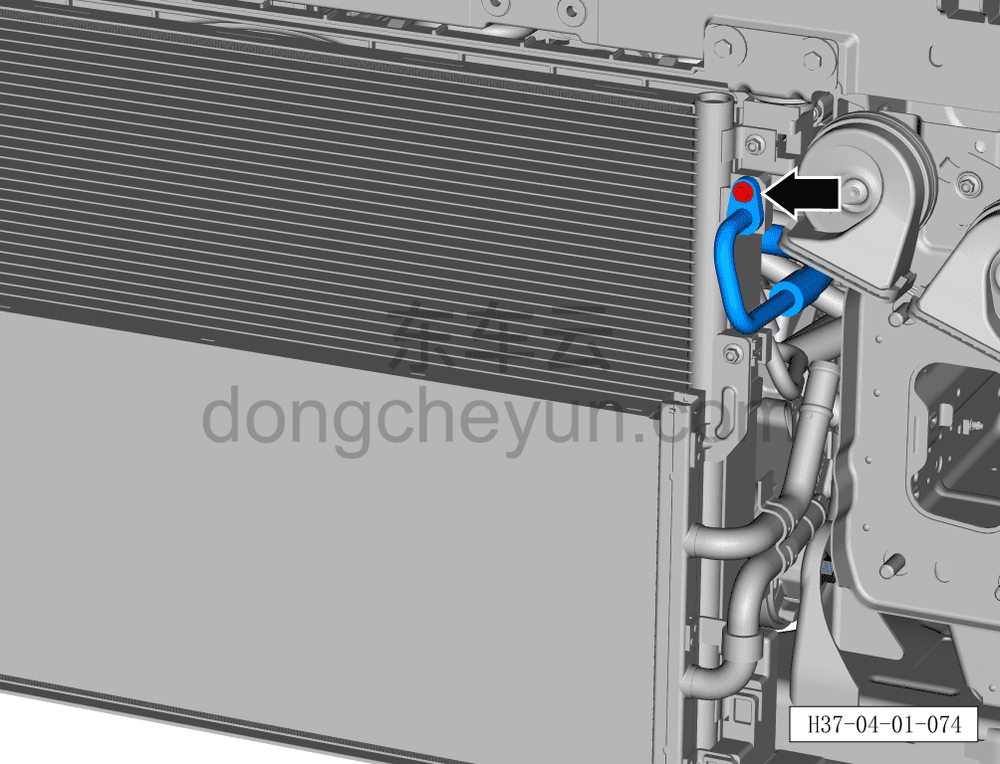
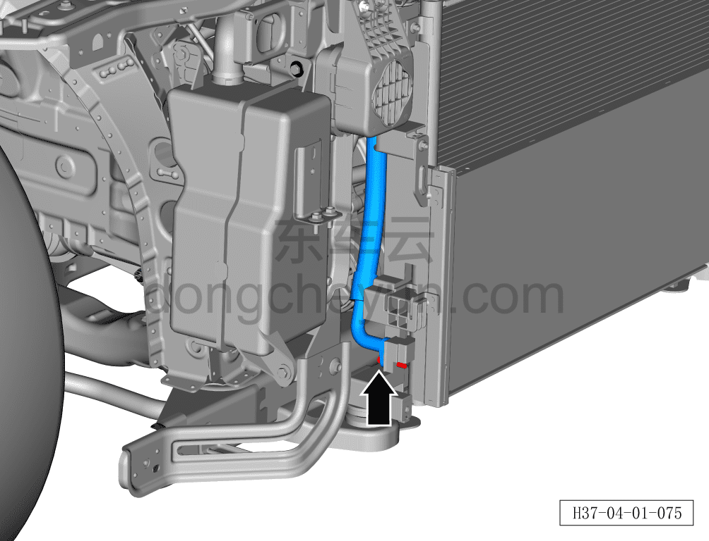
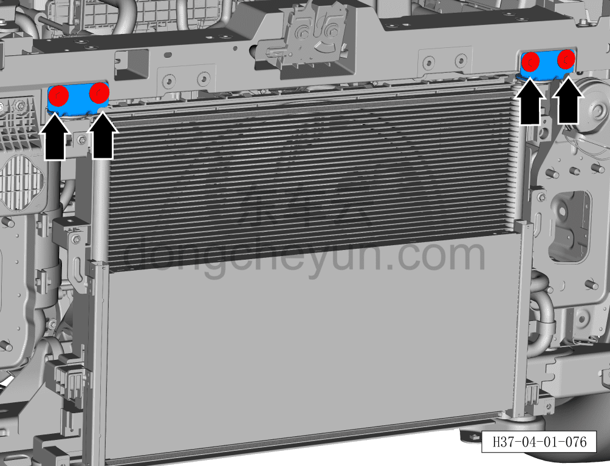
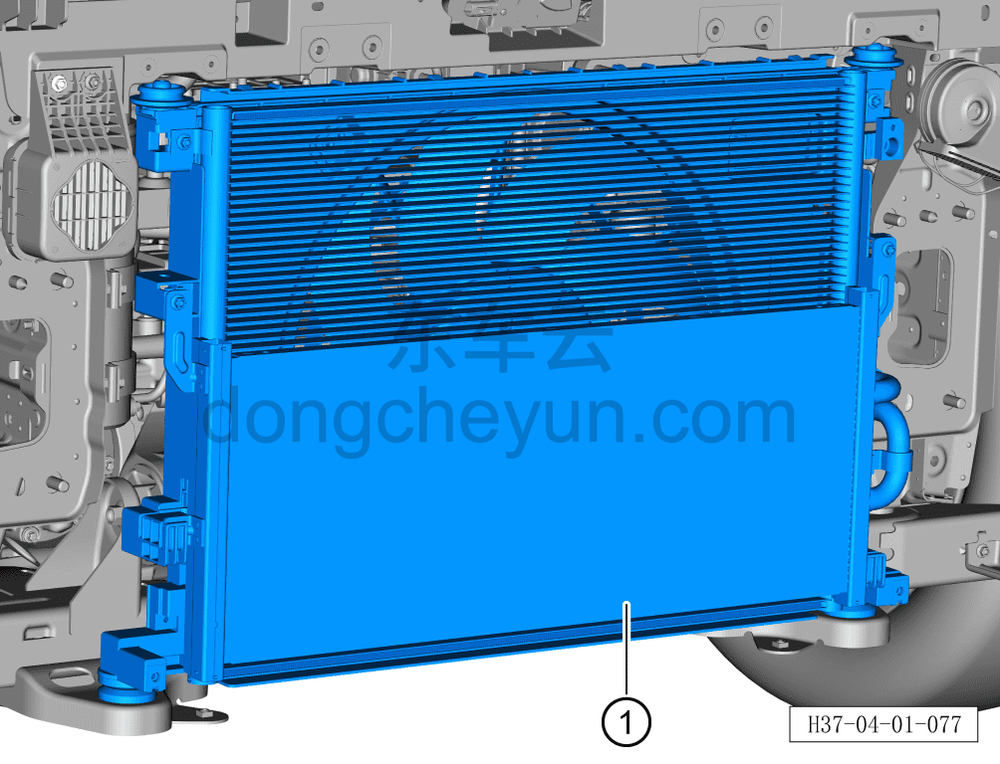

# Снятие и установка переднего модуля в сборе

> Интегрированная силовая система › Система охлаждения › Трубопроводы системы охлаждения  
> Оригинал: `拆卸与安装前端模块总成` · [dongcheyun 56746](https://dongcheyun.com/p/56746), страница `f06a40a0798543d38addb7dad8c2d7ff` · [оглавление](../README.md)

**Порядок снятия**

**Внимание:**

**- Перед выполнением ремонтных работ подождите, пока температура охлаждающей жидкости снизится ниже 60°C.**

1. Выключите все электроприборы, отключите питание.

2. Откройте капот моторного отсека.

3. Выполните обесточивание автомобиля для ремонта. См. [3.1.4.1 Обесточивание автомобиля](../03-техническое-обслуживание/005-обесточивание-автомобиля.md)

4. Снимите декоративную накладку моторного отсека. См. [8.6.6.10 Снятие и установка декоративной накладки моторного отсека](../08-внутренняя-и-внешняя-отделка/223-снятие-и-установка-декоративной-накладки-моторного.md)

5. Соберите/откачайте/заправьте хладагент. См. [10.1.6.12 Сбор/откачка/заправка хладагента](../10-кондиционер/045-сбор-вакуумирование-заправка-хладагента.md)

6. Слейте охлаждающую жидкость тягового электродвигателя и тяговой батареи. См. [3.1.5.1 Замена охлаждающей жидкости тягового электродвигателя и тяговой батареи](../03-техническое-обслуживание/006-замена-охлаждающей-жидкости-тягового-электродвигателя.md)

7. Снимите передний бампер в сборе. См. [8.6.3.3 Снятие и установка переднего бампера в сборе](../08-внутренняя-и-внешняя-отделка/163-снятие-и-установка-переднего-бампера-в-сборе.md)

8. Снимите активную решётку воздухозаборника. См. [8.6.3.23 Снятие и установка активной решётки воздухозаборника](../08-внутренняя-и-внешняя-отделка/183-снятие-и-установка-активной-решётки-воздухозаборника.md)

9. Снимите передний усилитель бампера в сборе. См. [12.1.9.1 Снятие и установка переднего усилителя бампера в сборе](../12-кузовные-жестяные-работы-окраска/034-снятие-и-установка-переднего-противоударного-бруса-в.md)

10. Снимите передний модуль в сборе.

a. С помощью клещей для хомутов снимите крепёжный хомут, поворачивая влево-вправо отсоедините трубку от низкотемпературного радиатора.

**Внимание:**

**- Перед отсоединением трубки подставьте ёмкость для сбора жидкости, чтобы собрать остатки охлаждающей жидкости в трубопроводе.**

**- После отсоединения трубки вытрите ветошью вытекшую вокруг трубопровода охлаждающую жидкость, чтобы после завершения установки можно было проверить трубопровод на наличие подтеканий.**

b. Нажмите на фиксатор разъёма и отсоедините разъём вентилятора радиатора.

c. С помощью съёмника обивки отсоедините 2 крепёжных клипсы жгута проводов моторного отсека.

d. Головкой на 8мм выверните крепёжный болт всасывающего трубопровода наружного теплообменника в сборе.

Момент затяжки болта: 8±1 Н·м

e. Отсоедините всасывающий трубопровод наружного теплообменника от наружного теплообменника.

**Внимание:**

**- Утилизируйте старое уплотнительное кольцо всасывающего трубопровода наружного теплообменника в сборе, установите новое уплотнительное кольцо и нанесите на него небольшое количество масла для компрессора кондиционера.**

**- Если трубопровод не может быть сразу установлен обратно, оберните или заглушите соединения трубопровода нетканым материалом, чтобы избежать загрязнения трубопровода и попадания посторонних предметов.**

f. Головкой на 8мм выверните крепёжный болт нагнетательного трубопровода наружного теплообменника.

Момент затяжки болта: 8±1 Н·м

g. Отсоедините нагнетательный трубопровод наружного теплообменника от наружного теплообменника.

**Внимание:**

**- Утилизируйте старое уплотнительное кольцо нагнетательного трубопровода наружного теплообменника, установите новое уплотнительное кольцо и нанесите на него небольшое количество масла для компрессора кондиционера.**

**- Если трубопровод не может быть сразу установлен обратно, оберните или заглушите соединения трубопровода нетканым материалом, чтобы избежать загрязнения трубопровода и попадания посторонних предметов.**

h. Головкой на 8мм выверните 4 крепёжных болта верхнего кронштейна радиатора.

Момент затяжки болта: 8±1 Н·м

i. Снимите верхний кронштейн радиатора.

j. Снимите передний модуль в сборе ①.

**Внимание:**

**- При снятии переднего модуля в сборе избегайте ударов о другие детали, иначе это может привести к их повреждению.**

**Порядок установки**

Установка выполняется в обратном порядке.

**Внимание:**

**- После завершения установки проверьте надёжность соединения патрубков.**

**- После завершения установки залейте охлаждающую жидкость указанной производителем марки в соответствии с требованиями и удалите воздух из системы охлаждения.**

**- После завершения установки заправьте хладагент указанной производителем марки в соответствии с требованиями и проверьте эффективность охлаждения кондиционера.**

**- После завершения установки проверьте соединения патрубков на наличие подтеканий и других дефектов.**
