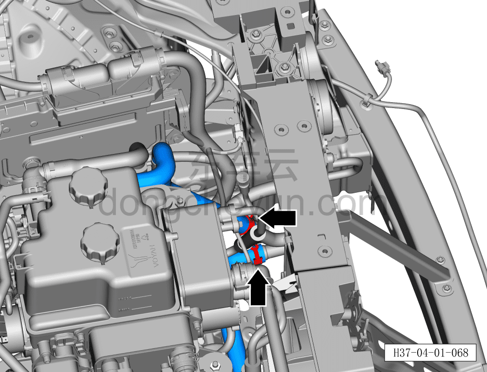
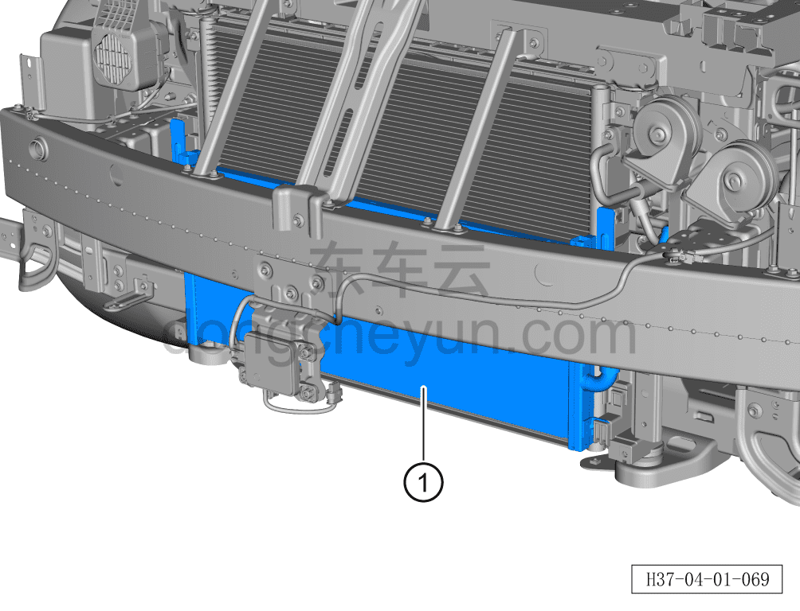

# Снятие и установка низкотемпературного радиатора

> Интегрированная силовая система › Система охлаждения › Трубопроводы системы охлаждения  
> Оригинал: `拆卸与安装低温散热器` · [dongcheyun 56746](https://dongcheyun.com/p/56746), страница `81571869b90a4c988e52ae666af2e0a8` · [оглавление](../README.md)

**Порядок снятия**

**Внимание:**

**- Перед выполнением ремонтных работ подождите, пока температура охлаждающей жидкости снизится ниже 60°C.**

1. Выключите все электроприборы, отключите питание.

2. Откройте капот моторного отсека.

3. Выполните обесточивание автомобиля для ремонта. См. [3.1.4.1 Обесточивание автомобиля](../03-техническое-обслуживание/005-обесточивание-автомобиля.md)

4. Снимите декоративную накладку моторного отсека. См. [8.6.6.10 Снятие и установка декоративной накладки моторного отсека](../08-внутренняя-и-внешняя-отделка/223-снятие-и-установка-декоративной-накладки-моторного.md)

5. Слейте охлаждающую жидкость тягового электродвигателя и тяговой батареи. См. [3.1.5.1 Замена охлаждающей жидкости тягового электродвигателя и тяговой батареи](../03-техническое-обслуживание/006-замена-охлаждающей-жидкости-тягового-электродвигателя.md)

6. Снимите передний бампер в сборе. См. [8.6.3.3 Снятие и установка переднего бампера в сборе](../08-внутренняя-и-внешняя-отделка/163-снятие-и-установка-переднего-бампера-в-сборе.md)

7. Снимите активную решётку воздухозаборника. См. [8.6.3.23 Снятие и установка активной решётки воздухозаборника](../08-внутренняя-и-внешняя-отделка/183-снятие-и-установка-активной-решётки-воздухозаборника.md)

8. Снимите низкотемпературный радиатор.

a. С помощью клещей для хомутов снимите крепёжные хомуты, отсоедините трубку от низкотемпературного радиатора в двух местах соединения.

**Внимание:**

**- Перед отсоединением трубки подставьте ёмкость для сбора жидкости, чтобы собрать остатки охлаждающей жидкости в трубопроводе.**

**- После отсоединения трубки вытрите ветошью вытекшую вокруг трубопровода охлаждающую жидкость, чтобы после завершения установки можно было проверить трубопровод на наличие подтеканий.**

b. Сначала сдвиньте низкотемпературный радиатор вверх, чтобы вывести его из точек крепления, затем снимите низкотемпературный радиатор ①.

**Внимание:**

**- При снятии низкотемпературного радиатора избегайте ударов о другие детали, иначе это может привести к их повреждению.**

**Порядок установки**

Установка выполняется в обратном порядке.

**Внимание:**

**- После завершения установки проверьте надёжность соединения патрубков.**

**- После завершения установки залейте охлаждающую жидкость указанной производителем марки в соответствии с требованиями и удалите воздух из системы охлаждения.**

**- После завершения установки проверьте соединения патрубков на наличие подтеканий и других дефектов.**
