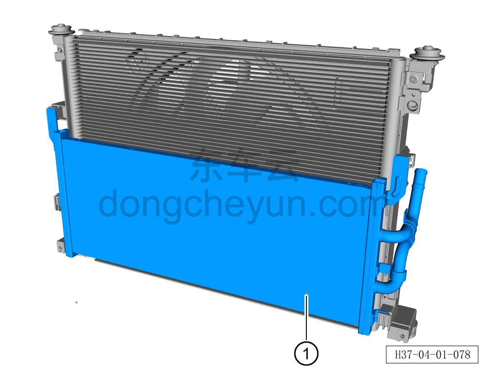
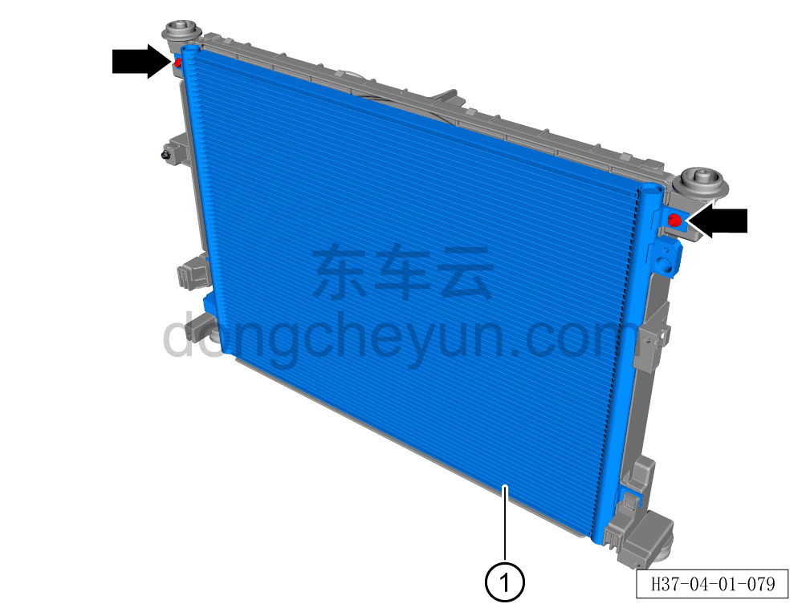
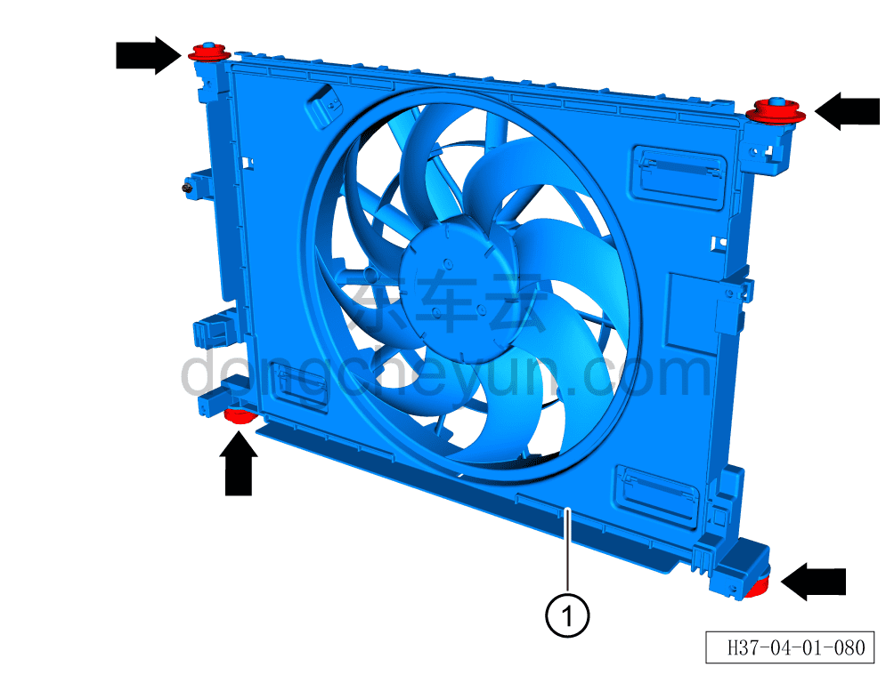
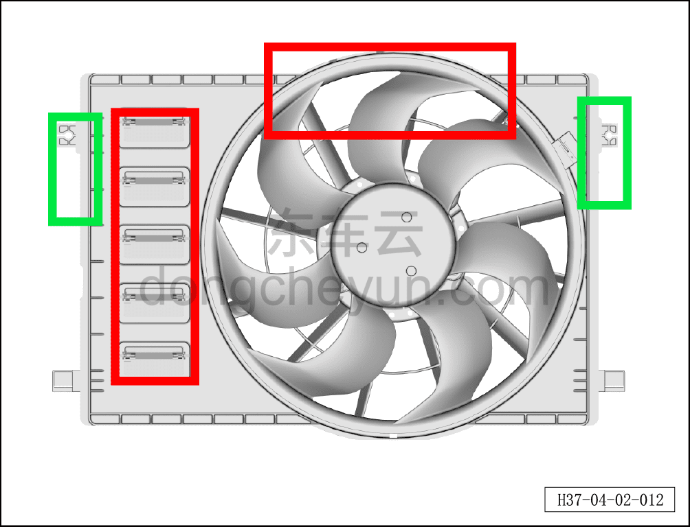

# Снятие и установка вентилятора радиатора

> Интегрированная силовая система › Система охлаждения › Трубопроводы системы охлаждения  
> Оригинал: `拆卸与安装散热器风扇` · [dongcheyun 56746](https://dongcheyun.com/p/56746), страница `b164893e9bc1407d9e0963f429bcbccc` · [оглавление](../README.md)

**Порядок снятия**

**Внимание:**

**- Перед выполнением ремонтных работ подождите, пока температура охлаждающей жидкости снизится ниже 60°C.**

1. Выключите все электроприборы, отключите питание.

2. Откройте капот моторного отсека.

3. Выполните обесточивание автомобиля для ремонта. См. [3.1.4.1 Обесточивание автомобиля](../03-техническое-обслуживание/005-обесточивание-автомобиля.md)

4. Снимите декоративную накладку моторного отсека. См. [8.6.6.10 Снятие и установка декоративной накладки моторного отсека](../08-внутренняя-и-внешняя-отделка/223-снятие-и-установка-декоративной-накладки-моторного.md)

5. Соберите/откачайте/заправьте хладагент. См. [10.1.6.12 Сбор/откачка/заправка хладагента](../10-кондиционер/045-сбор-вакуумирование-заправка-хладагента.md)

6. Слейте охлаждающую жидкость тягового электродвигателя и тяговой батареи. См. [3.1.5.1 Замена охлаждающей жидкости тягового электродвигателя и тяговой батареи](../03-техническое-обслуживание/006-замена-охлаждающей-жидкости-тягового-электродвигателя.md)

7. Снимите передний бампер в сборе. См. [8.6.3.3 Снятие и установка переднего бампера в сборе](../08-внутренняя-и-внешняя-отделка/163-снятие-и-установка-переднего-бампера-в-сборе.md)

8. Снимите передний модуль в сборе. См. [4.1.7.1 Снятие и установка переднего модуля в сборе](020-снятие-и-установка-переднего-модуля-в-сборе.md)

9. Снимите вентилятор радиатора.

a. Сначала сдвиньте низкотемпературный радиатор вверх, чтобы вывести его из точек крепления, затем снимите низкотемпературный радиатор ①.

b. Головкой на 8мм выверните 2 крепёжных болта наружного теплообменника.

Момент затяжки болта: 6±1 Н·м

c. Сначала сдвиньте наружный радиатор в сборе вверх, чтобы вывести его из точек крепления, затем снимите наружный теплообменник ①.

d. Отсоедините всего 4 верхние и нижние амортизирующие подушки радиатора.

e. Снимите вентилятор радиатора ①.

**Внимание:**

**- Проверьте амортизирующие подушки на наличие повреждений, старения, трещин; при их обнаружении установите новые амортизирующие подушки.**

**Внимание:**

**- Чтобы не нарушить балансировку вентилятора и не вызвать посторонний шум после установки, при переноске вентилятора запрещается прилагать усилие к лопастям вентилятора или жалюзи (область в красной рамке); переносить вентилятор следует, держа его за кронштейны с обеих сторон (область в зелёной рамке).**

**Порядок установки**

Установка выполняется в обратном порядке.

**Внимание:**

**- После завершения установки проверьте надёжность соединения патрубков.**

**- После завершения установки залейте охлаждающую жидкость указанной производителем марки в соответствии с требованиями и удалите воздух из системы охлаждения.**

**- После завершения установки заправьте хладагент указанной производителем марки в соответствии с требованиями и проверьте эффективность охлаждения кондиционера.**

**- После завершения установки включите питание автомобиля, включите кондиционер, проверьте и убедитесь, что модуль электровентилятора радиатора работает нормально.**

**- После завершения установки проверьте соединения патрубков на наличие подтеканий и других дефектов.**
