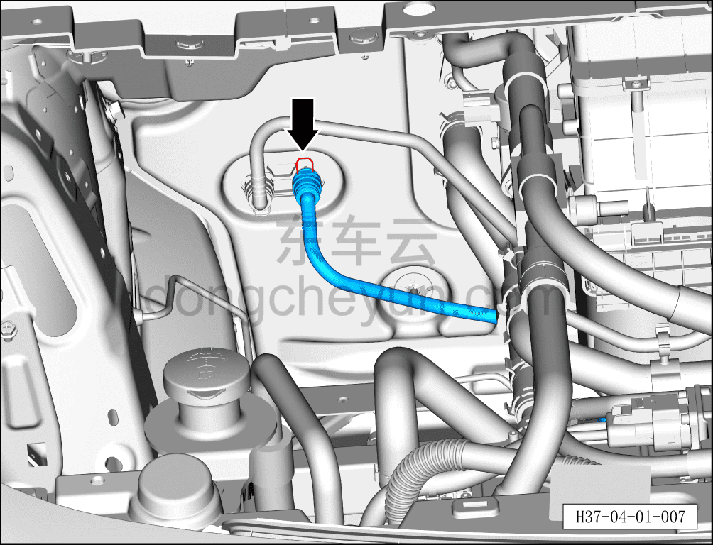
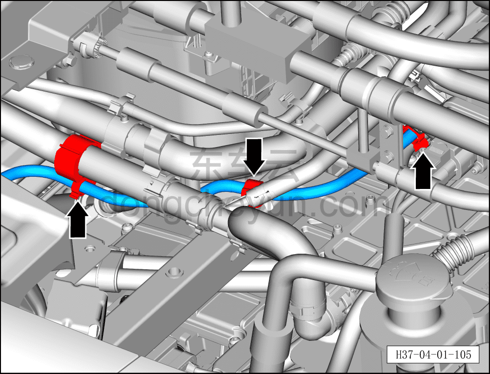
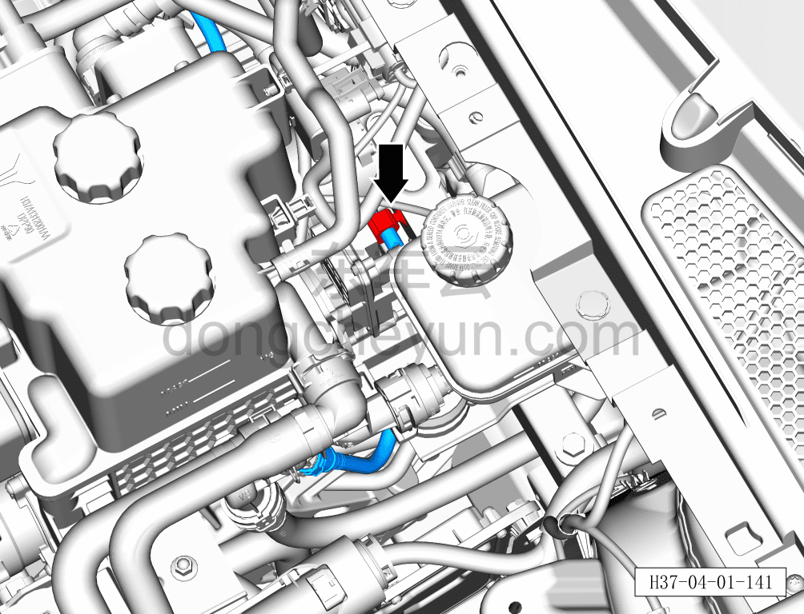
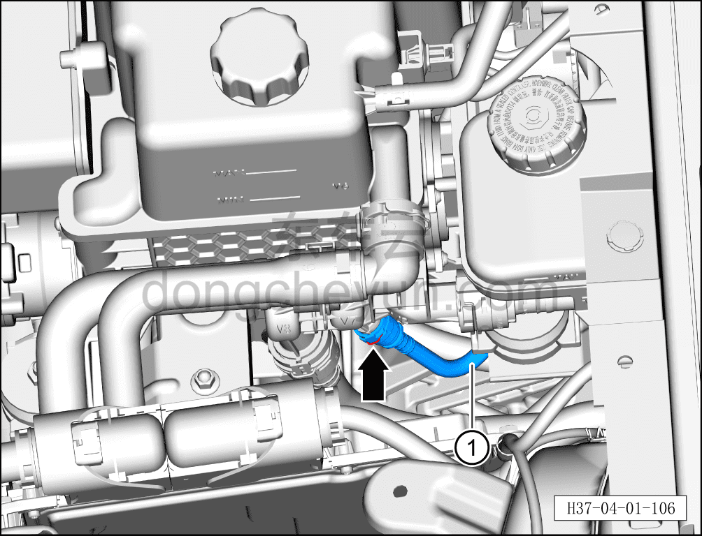

# Снятие и установка выходной трубки от OIB к аккумуляторной батарее

> Интегрированная силовая система › Система охлаждения › Трубопроводы системы охлаждения  
> Оригинал: `拆卸与安装OIB到电池包出水管` · [dongcheyun 56746](https://dongcheyun.com/p/56746), страница `d04cfc85218f49eea9643a31c3384f76` · [оглавление](../README.md)

**Порядок снятия**

**Внимание:**

**- Перед выполнением ремонтных работ подождите, пока температура охлаждающей жидкости снизится ниже 60°C.**

1. Выключите все электроприборы, отключите питание.

2. Откройте капот моторного отсека.

3. Снимите декоративную накладку моторного отсека. См. [8.6.6.10 Снятие и установка декоративной накладки моторного отсека](../08-внутренняя-и-внешняя-отделка/223-снятие-и-установка-декоративной-накладки-моторного.md)

4. Выполните обесточивание автомобиля для ремонта. См. [3.1.4.1 Обесточивание автомобиля](../03-техническое-обслуживание/005-обесточивание-автомобиля.md)

5. Снимите аккумуляторную батарею 12 В. См. [9.4.4.1 Снятие и установка аккумуляторной батареи 12 В](../09-электрическая-и-электронная-система/029-снятие-и-установка-аккумуляторной-батареи-12-в.md)

6. Слейте охлаждающую жидкость тягового электродвигателя и тяговой батареи. См. [3.1.5.1 Замена охлаждающей жидкости тягового электродвигателя и тяговой батареи](../03-техническое-обслуживание/006-замена-охлаждающей-жидкости-тягового-электродвигателя.md)

7. Снимите выходную трубку от OIB к аккумуляторной батарее.

a. Небольшой плоской отвёрткой сдвиньте вверх фиксатор быстроразъёмного соединения выходной трубки от OIB к аккумуляторной батарее и отсоедините быстроразъёмное соединение.

**Внимание:**

**- Перед отсоединением трубки подставьте ёмкость для сбора жидкости, чтобы собрать остатки охлаждающей жидкости в трубопроводе.**

**- После отсоединения трубки вытрите ветошью вытекшую вокруг трубопровода охлаждающую жидкость, чтобы после завершения установки можно было проверить трубопровод на наличие подтеканий.**

b. Плоской отвёрткой отсоедините 3 крепёжные клипсы выходной трубки от OIB к аккумуляторной батарее.

c. Плоской отвёрткой отсоедините крепёжную клипсу выходной трубки от OIB к аккумуляторной батарее.

d. Небольшой плоской отвёрткой сдвиньте наружу фиксатор быстроразъёмного соединения выходной трубки от OIB к аккумуляторной батарее и отсоедините быстроразъёмное соединение.

e. Снимите выходную трубку от OIB к аккумуляторной батарее ①.

**Порядок установки**

Установка выполняется в обратном порядке.

**Внимание:**

**- После завершения установки проверьте надёжность соединения патрубков.**

**- После завершения установки залейте охлаждающую жидкость указанной производителем марки в соответствии с требованиями и удалите воздух из системы охлаждения.**

**- После завершения установки проверьте соединения патрубков на наличие подтеканий и других дефектов.**
