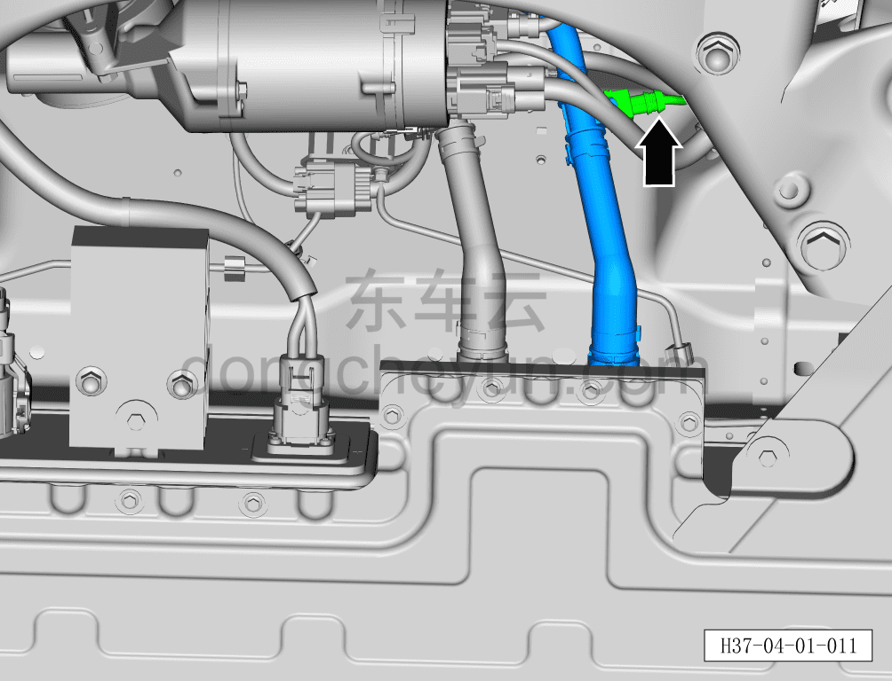
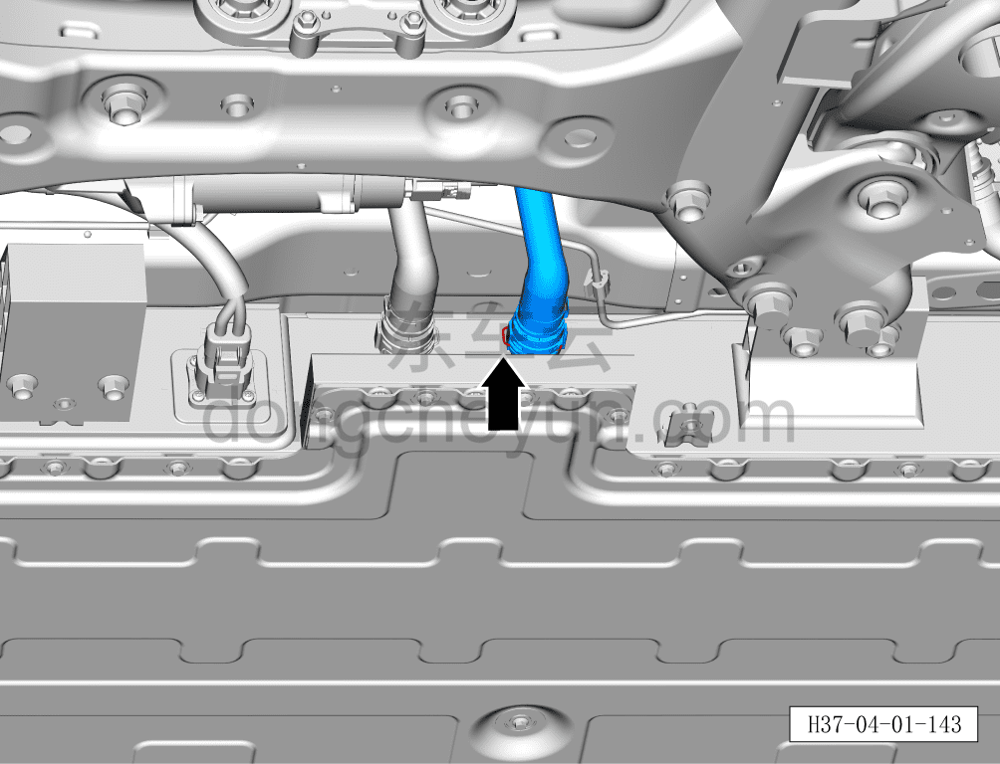
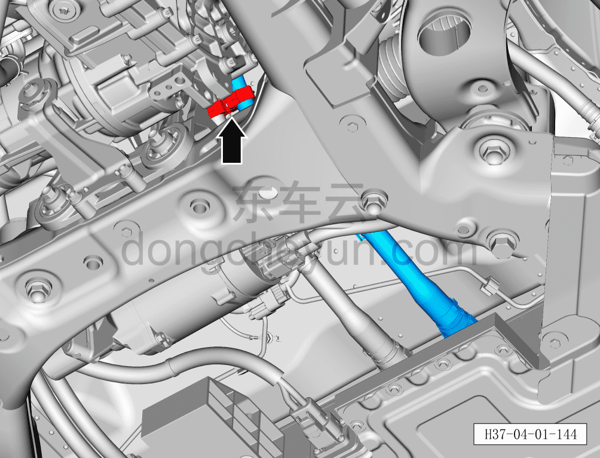
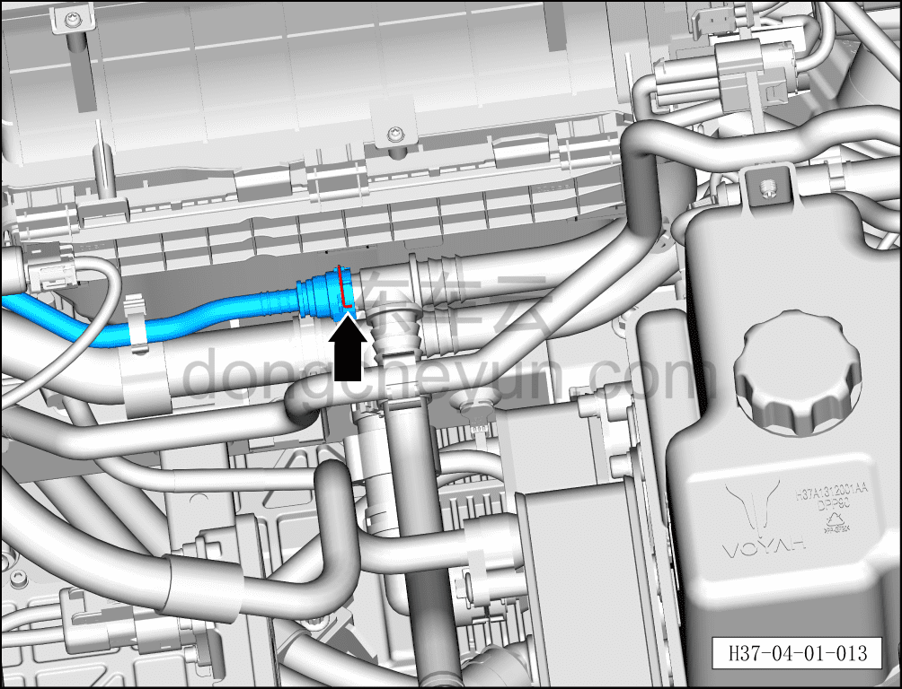
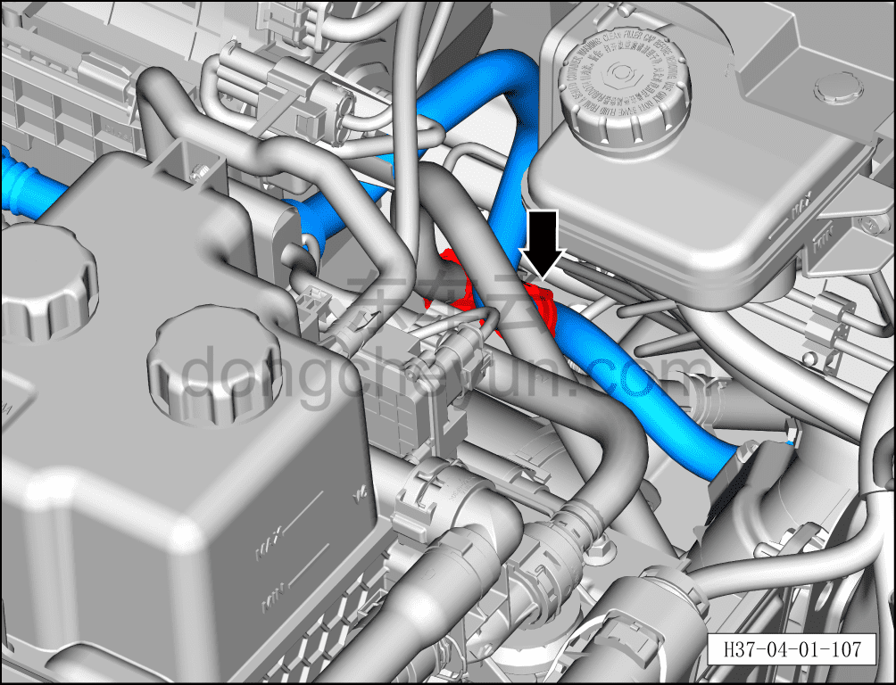
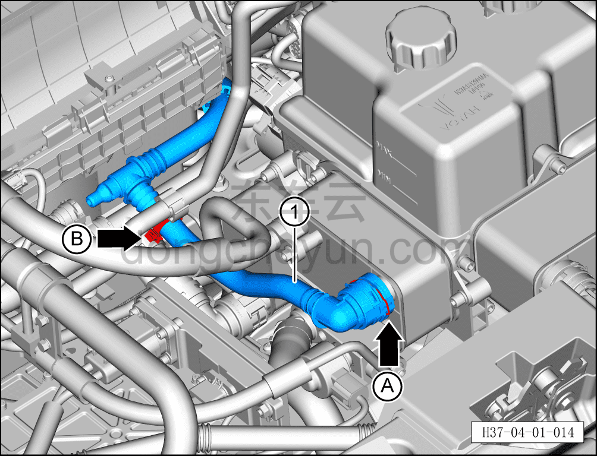

# Снятие и установка входной трубки аккумуляторной батареи

> Интегрированная силовая система › Система охлаждения › Трубопроводы системы охлаждения  
> Оригинал: `拆卸与安装电池包进水管` · [dongcheyun 56746](https://dongcheyun.com/p/56746), страница `e811e7e2e8fc4e02a14e5e285992ddbd` · [оглавление](../README.md)

**Порядок снятия**

**Внимание:**

**- Перед выполнением ремонтных работ подождите, пока температура охлаждающей жидкости снизится ниже 60°C.**

1. Выключите все электроприборы, отключите питание.

2. Откройте капот моторного отсека.

3. Снимите декоративную накладку моторного отсека. См. [8.6.6.10 Снятие и установка декоративной накладки моторного отсека](../08-внутренняя-и-внешняя-отделка/223-снятие-и-установка-декоративной-накладки-моторного.md)

4. Выполните обесточивание автомобиля для ремонта. См. [3.1.4.1 Обесточивание автомобиля](../03-техническое-обслуживание/005-обесточивание-автомобиля.md)

5. Слейте охлаждающую жидкость тягового электродвигателя и тяговой батареи. См. [3.1.5.1 Замена охлаждающей жидкости тягового электродвигателя и тяговой батареи](../03-техническое-обслуживание/006-замена-охлаждающей-жидкости-тягового-электродвигателя.md)

6. Снимите входную трубку аккумуляторной батареи.

a. Нажмите на фиксатор разъёма и отсоедините 1 разъём на входной трубке аккумуляторной батареи.

b. Небольшой плоской отвёрткой сдвиньте влево фиксатор быстроразъёмного соединения входной трубки аккумуляторной батареи в сборе и отсоедините быстроразъёмное соединение.

**Внимание:**

**- Перед отсоединением трубки подставьте ёмкость для сбора жидкости, чтобы собрать остатки охлаждающей жидкости в трубопроводе.**

**- После отсоединения трубки вытрите ветошью вытекшую вокруг трубопровода охлаждающую жидкость, чтобы после завершения установки можно было проверить трубопровод на наличие подтеканий.**

c. Плоской отвёрткой отсоедините крепёжную клипсу входной трубки аккумуляторной батареи.

d. Небольшой плоской отвёрткой сдвиньте вверх фиксатор быстроразъёмного соединения водяной трубки от трёхходового клапана к OIB и отсоедините быстроразъёмное соединение.

e. Плоской отвёрткой отсоедините крепёжный зажим входной трубки аккумуляторной батареи.

f. Небольшой плоской отвёрткой сдвиньте наружу фиксатор быстроразъёмного соединения A входной трубки аккумуляторной батареи и отсоедините быстроразъёмное соединение.

g. Плоской отвёрткой отсоедините крепёжную клипсу B входной трубки аккумуляторной батареи.

h. Снимите входную трубку аккумуляторной батареи ①.

**Порядок установки**

Установка выполняется в обратном порядке.

**Внимание:**

**- После завершения установки проверьте надёжность соединения патрубков.**

**- После завершения установки залейте охлаждающую жидкость указанной производителем марки в соответствии с требованиями и удалите воздух из системы охлаждения.**

**- После завершения установки проверьте соединения патрубков на наличие подтеканий и других дефектов.**
