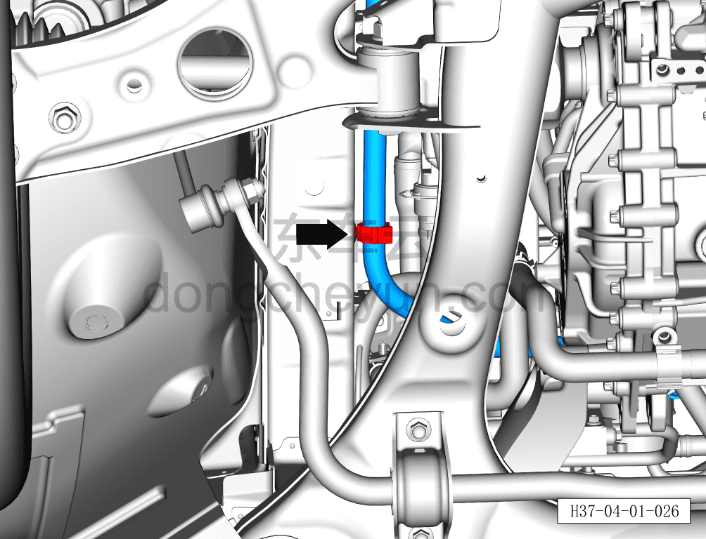
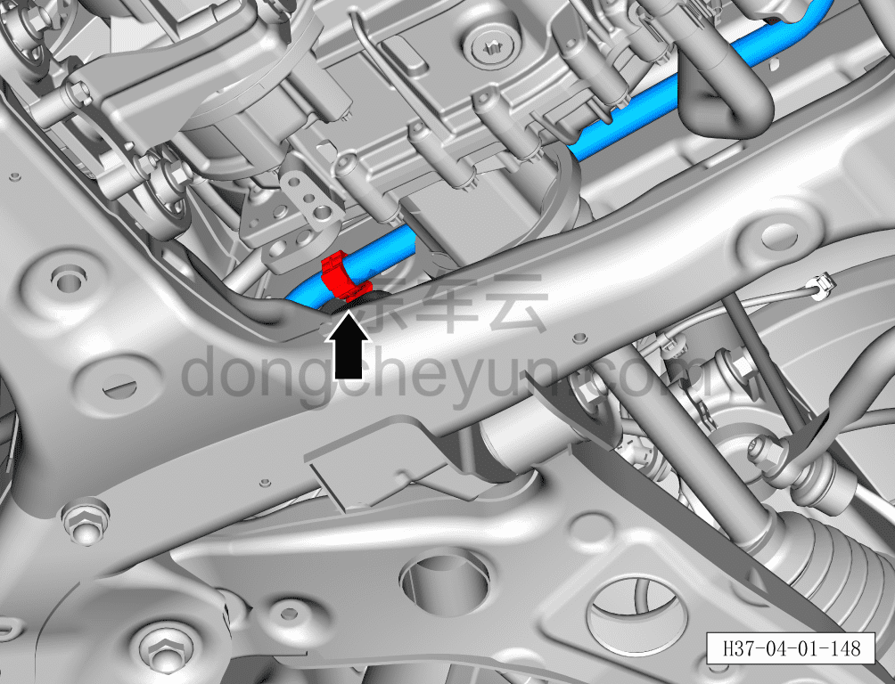
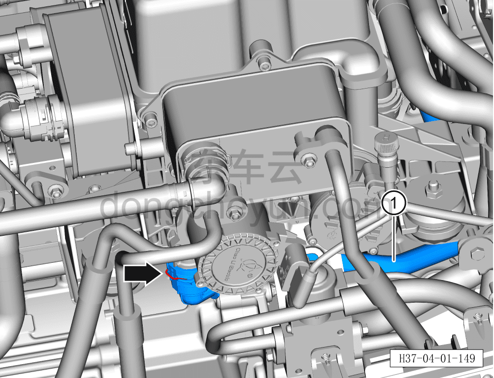

# Снятие и установка выходной трубки водяного насоса электродвигателя

> Интегрированная силовая система › Система охлаждения › Трубопроводы системы охлаждения  
> Оригинал: `拆卸与安装电机水泵出水管` · [dongcheyun 56746](https://dongcheyun.com/p/56746), страница `d0554528fc69419cbd6a391f492fa829` · [оглавление](../README.md)

**Порядок снятия**

**Внимание:**

**- Перед выполнением ремонтных работ подождите, пока температура охлаждающей жидкости снизится ниже 60°C.**

1. Выключите все электроприборы, отключите питание.

2. Откройте капот моторного отсека.

3. Снимите декоративную накладку моторного отсека. См. [8.6.6.10 Снятие и установка декоративной накладки моторного отсека](../08-внутренняя-и-внешняя-отделка/223-снятие-и-установка-декоративной-накладки-моторного.md)

4. Выполните обесточивание автомобиля для ремонта. См. [3.1.4.1 Обесточивание автомобиля](../03-техническое-обслуживание/005-обесточивание-автомобиля.md)

5. Слейте охлаждающую жидкость тягового электродвигателя и тяговой батареи. См. [3.1.5.1 Замена охлаждающей жидкости тягового электродвигателя и тяговой батареи](../03-техническое-обслуживание/006-замена-охлаждающей-жидкости-тягового-электродвигателя.md)

6. Снимите выходную трубку водяного насоса электродвигателя.

a. Съёмником обивки отсоедините крепёжную клипсу A жёсткой входной трубки OBC (центральный тоннель).

b. Клещами для хомутов снимите крепёжный хомут B, поворачивая влево-вправо отсоедините соединение жёсткой входной трубки OBC (центральный тоннель) с выходной трубкой водяного насоса электродвигателя.

**Внимание:**

**- Перед отсоединением трубки подставьте ёмкость для сбора жидкости, чтобы собрать остатки охлаждающей жидкости в трубопроводе.**

**- После отсоединения трубки вытрите ветошью вытекшую вокруг трубопровода охлаждающую жидкость, чтобы после завершения установки можно было проверить трубопровод на наличие подтеканий.**

c. Плоской отвёрткой отсоедините крепёжную клипсу выходной трубки водяного насоса электродвигателя.

d. Плоской отвёрткой отсоедините крепёжную клипсу выходной трубки водяного насоса электродвигателя.

e. Небольшой плоской отвёрткой сдвиньте наружу фиксатор быстроразъёмного соединения выходной трубки водяного насоса электродвигателя и отсоедините быстроразъёмное соединение выходной трубки водяного насоса электродвигателя с интегрированным расширительным бачком.

f. Снимите выходную трубку водяного насоса электродвигателя ①.

**Порядок установки**

Установка выполняется в обратном порядке.

**Внимание:**

**- После завершения установки проверьте надёжность соединения патрубков.**

**- После завершения установки залейте охлаждающую жидкость указанной производителем марки в соответствии с требованиями и удалите воздух из системы охлаждения.**

**- После завершения установки проверьте соединения патрубков на наличие подтеканий и других дефектов.**
