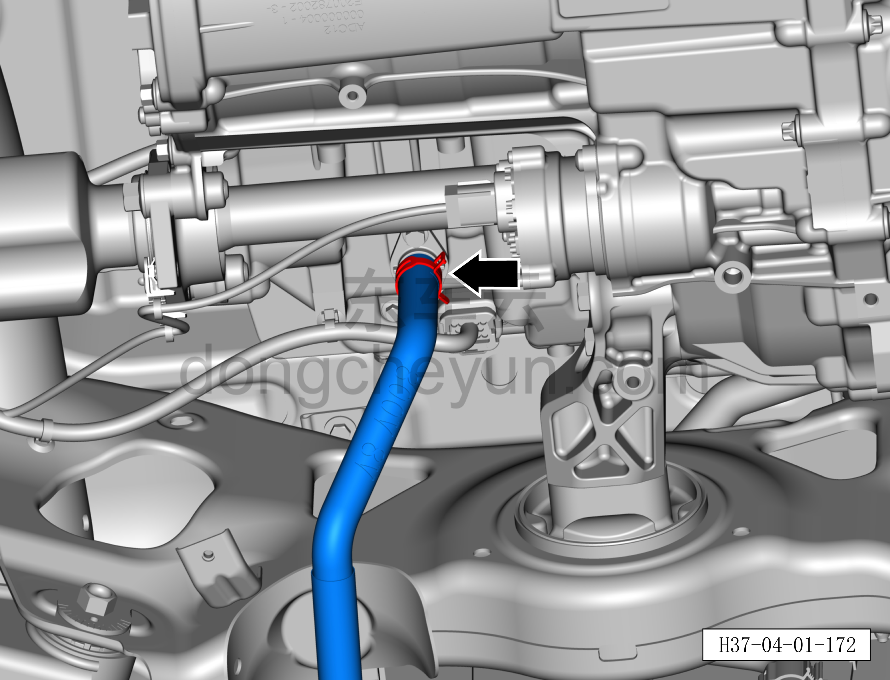
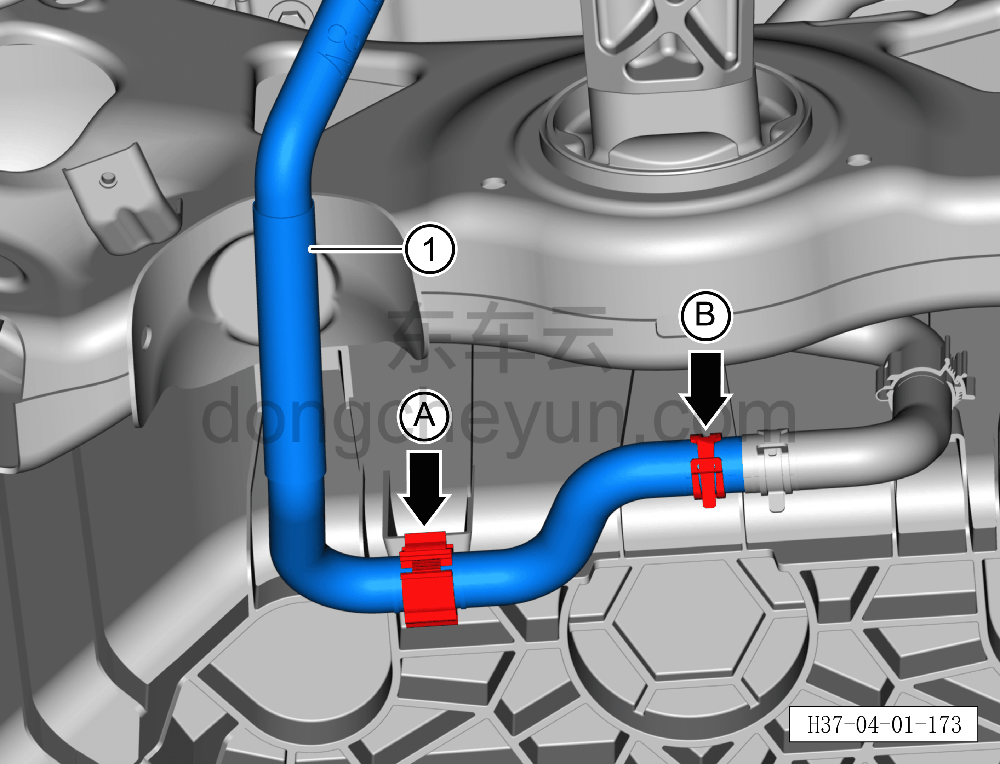

# Снятие и установка входной трубки заднего электродвигателя

> Интегрированная силовая система › Система охлаждения › Трубопроводы системы охлаждения  
> Оригинал: `拆卸与安装后电机进水管` · [dongcheyun 56746](https://dongcheyun.com/p/56746), страница `63d64d5602b24a3d8db238da14cfcf46` · [оглавление](../README.md)

**Порядок снятия**

**Внимание:**

**- Перед выполнением ремонтных работ подождите, пока температура охлаждающей жидкости снизится ниже 60°C.**

1. Выключите все электроприборы, отключите питание.

2. Откройте капот моторного отсека.

3. Снимите декоративную накладку моторного отсека. См. [8.6.6.10 Снятие и установка декоративной накладки моторного отсека](../08-внутренняя-и-внешняя-отделка/223-снятие-и-установка-декоративной-накладки-моторного.md)

4. Выполните обесточивание автомобиля для ремонта. См. [3.1.4.1 Обесточивание автомобиля](../03-техническое-обслуживание/005-обесточивание-автомобиля.md)

5. Слейте охлаждающую жидкость тягового электродвигателя и тяговой батареи. См. [3.1.5.1 Замена охлаждающей жидкости тягового электродвигателя и тяговой батареи](../03-техническое-обслуживание/006-замена-охлаждающей-жидкости-тягового-электродвигателя.md)

6. Снимите заднюю нижнюю защитную панель. См. [8.6.4.4 Снятие и установка задней нижней защитной панели](../08-внутренняя-и-внешняя-отделка/194-снятие-и-установка-заднего-нижнего-защитного-щитка.md)

7. Снимите входную трубку заднего электродвигателя.

a. Клещами для хомутов снимите крепёжный хомут входной трубки заднего электродвигателя, поворачивая влево-вправо отсоедините соединение входной трубки заднего электродвигателя с задним электродвигателем.

**Внимание:**

**- Перед отсоединением трубки подставьте ёмкость для сбора жидкости, чтобы собрать остатки охлаждающей жидкости в трубопроводе.**

**- После отсоединения трубки вытрите ветошью вытекшую вокруг трубопровода охлаждающую жидкость, чтобы после завершения установки можно было проверить трубопровод на наличие подтеканий.**

b. Плоской отвёрткой отсоедините крепёжную клипсу A входной трубки заднего электродвигателя.

c. Клещами для хомутов снимите крепёжный хомут B входной трубки заднего электродвигателя, поворачивая влево-вправо отсоедините входную трубку заднего электродвигателя.

d. Снимите входную трубку заднего электродвигателя ①.

**Порядок установки**

Установка выполняется в обратном порядке.

**Внимание:**

**- После завершения установки несколько раз рукой вставьте и выньте соединение патрубка, чтобы проверить и убедиться в надёжности его соединения.**

**- После завершения установки залейте охлаждающую жидкость указанной производителем марки в соответствии с требованиями и удалите воздух из системы охлаждения.**

**- После завершения установки проверьте соединения патрубков на наличие подтеканий и других дефектов.**
