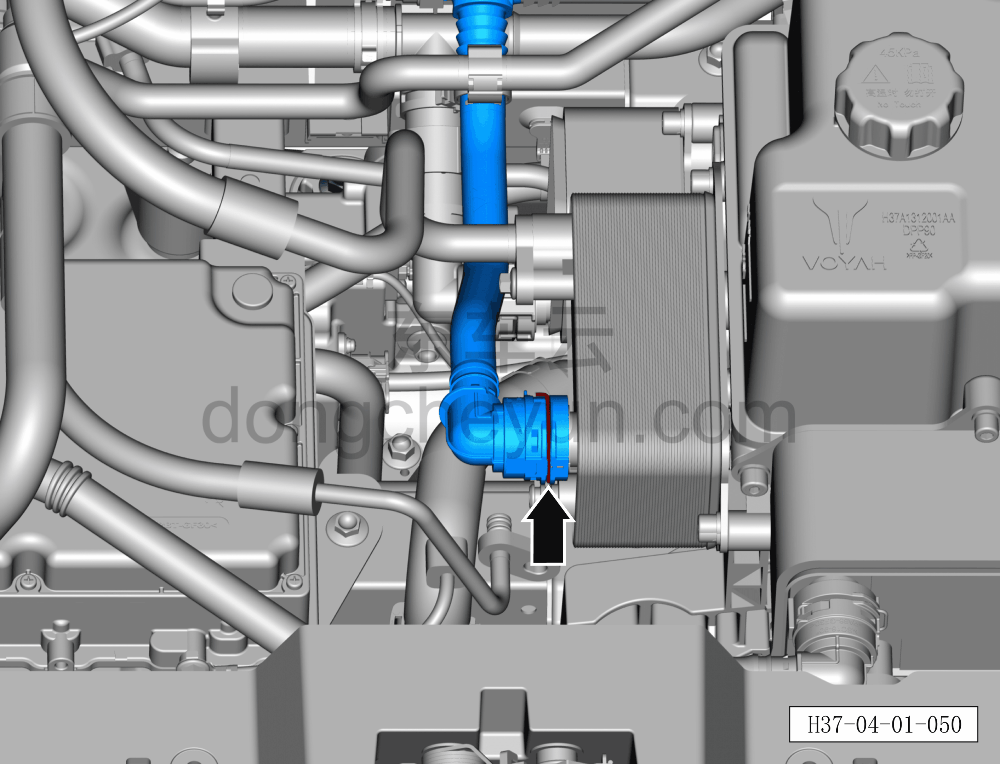
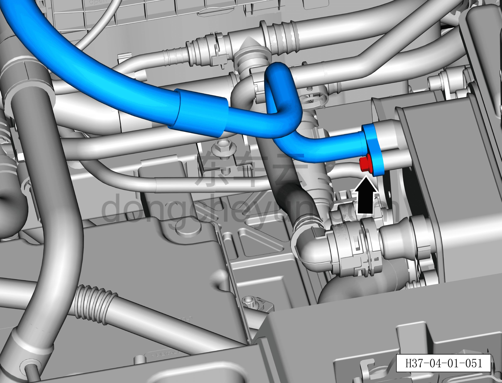
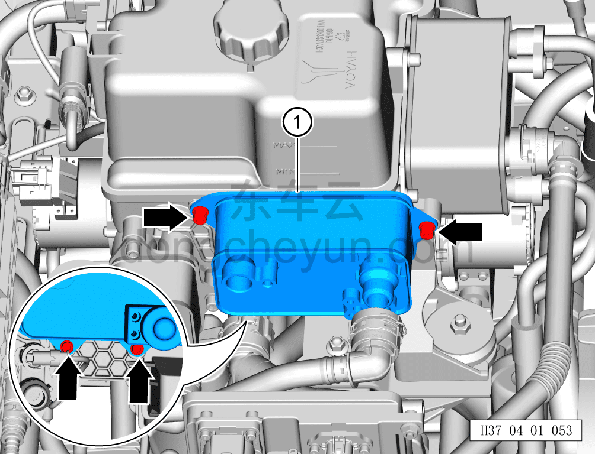

# Снятие и установка охладителя батареи

> Интегрированная силовая система › Система охлаждения › Трубопроводы системы охлаждения  
> Оригинал: `拆卸与安装电池冷却器` · [dongcheyun 56746](https://dongcheyun.com/p/56746), страница `f21c69f35a914f1ba8ec0a20542d997a` · [оглавление](../README.md)

**Порядок снятия**

**Внимание:**

**- Перед выполнением ремонтных работ подождите, пока температура охлаждающей жидкости снизится ниже 60°C.**

1. Выключите все электроприборы, отключите питание.

2. Откройте капот моторного отсека.

3. Снимите декоративную накладку моторного отсека. См. [8.6.6.10 Снятие и установка декоративной накладки моторного отсека](../08-внутренняя-и-внешняя-отделка/223-снятие-и-установка-декоративной-накладки-моторного.md)

4. Выполните обесточивание автомобиля для ремонта. См. [3.1.4.1 Обесточивание автомобиля](../03-техническое-обслуживание/005-обесточивание-автомобиля.md)

5. Соберите/откачайте/заправьте хладагент. См. [10.1.6.12 Сбор/откачка/заправка хладагента](../10-кондиционер/045-сбор-вакуумирование-заправка-хладагента.md)

6. Слейте охлаждающую жидкость тягового электродвигателя и тяговой батареи. См. [3.1.5.1 Замена охлаждающей жидкости тягового электродвигателя и тяговой батареи](../03-техническое-обслуживание/006-замена-охлаждающей-жидкости-тягового-электродвигателя.md)

7. Снимите электронный ТРВ в сборе. См. [10.1.5.17 Снятие и установка ТРВ (соединённого с охладителем батареи)](../10-кондиционер/026-снятие-и-установка-трв-подключён-к-охладителю-батареи.md)

8. Снимите охладитель батареи.

a. Небольшой плоской отвёрткой сдвиньте фиксатор быстроразъёмного соединения входной трубки аккумуляторной батареи и отсоедините быстроразъёмное соединение входной трубки аккумуляторной батареи с охладителем батареи.

**Внимание:**

**- Перед отсоединением трубки подставьте ёмкость для сбора жидкости, чтобы собрать остатки охлаждающей жидкости в трубопроводе.**

**- После отсоединения трубки вытрите ветошью вытекшую вокруг трубопровода охлаждающую жидкость, чтобы после завершения установки можно было проверить трубопровод на наличие подтеканий.**

b. Головкой на 8мм выверните крепёжный болт трубки кондиционера.

Момент затяжки болта: 8±1 Н·м

c. Отсоедините трубку кондиционера от охладителя батареи.

**Внимание:**

**- Утилизируйте старое уплотнительное кольцо трубки кондиционера, установите новое уплотнительное кольцо.**

**- Если трубопровод не может быть сразу установлен обратно, оберните или заглушите соединения трубопровода нетканым материалом, чтобы избежать загрязнения трубопровода и попадания посторонних предметов.**

d. Шестигранным ключом на 5мм выверните 4 крепёжных болта охладителя батареи.

e. Снимите охладитель батареи ①.

**Внимание:**

**- Утилизируйте старое уплотнительное кольцо охладителя батареи, установите новое уплотнительное кольцо.**

**Порядок установки**

Установка выполняется в обратном порядке.

**Внимание:**

**- После завершения установки проверьте надёжность соединения патрубков.**

**- После завершения установки залейте охлаждающую жидкость указанной производителем марки в соответствии с требованиями и удалите воздух из системы охлаждения.**

**- После завершения установки заправьте хладагент указанной производителем марки в соответствии с требованиями и проверьте эффективность охлаждения кондиционера.**

**- После завершения установки проверьте соединения патрубков на наличие подтеканий и других дефектов.**
