# Снятие и установка интегрированного расширительного бачка с электрическим водяным насосом в сборе

> Интегрированная силовая система › Система охлаждения › Трубопроводы системы охлаждения  
> Оригинал: `拆卸与安装集成水壶带电子水泵总成` · [dongcheyun 56746](https://dongcheyun.com/p/56746), страница `6f03939658a1477cad59cec3b5cd1882` · [оглавление](../README.md)

**Порядок снятия**

**Внимание:**

**- Перед выполнением ремонтных работ подождите, пока температура охлаждающей жидкости снизится ниже 60°C.**

1. Выключите все электроприборы, отключите питание.

2. Откройте капот моторного отсека.

3. Снимите декоративную накладку моторного отсека. См. [8.6.6.10 Снятие и установка декоративной накладки моторного отсека](../08-внутренняя-и-внешняя-отделка/223-снятие-и-установка-декоративной-накладки-моторного.md)

4. Выполните обесточивание автомобиля для ремонта. См. [3.1.4.1 Обесточивание автомобиля](../03-техническое-обслуживание/005-обесточивание-автомобиля.md)

5. Соберите/откачайте/заправьте хладагент. См. [10.1.6.12 Сбор/откачка/заправка хладагента](../10-кондиционер/045-сбор-вакуумирование-заправка-хладагента.md)

6. Слейте охлаждающую жидкость тягового электродвигателя и тяговой батареи. См. [3.1.5.1 Замена охлаждающей жидкости тягового электродвигателя и тяговой батареи](../03-техническое-обслуживание/006-замена-охлаждающей-жидкости-тягового-электродвигателя.md)

7. Слейте охлаждающую жидкость HVAC. См. [3.1.5.2 Замена охлаждающей жидкости HVAC](../03-техническое-обслуживание/007-замена-охлаждающей-жидкости-hvac.md)

8. Снятие и установка интегрированного расширительного бачка с электрическим водяным насосом в сборе.

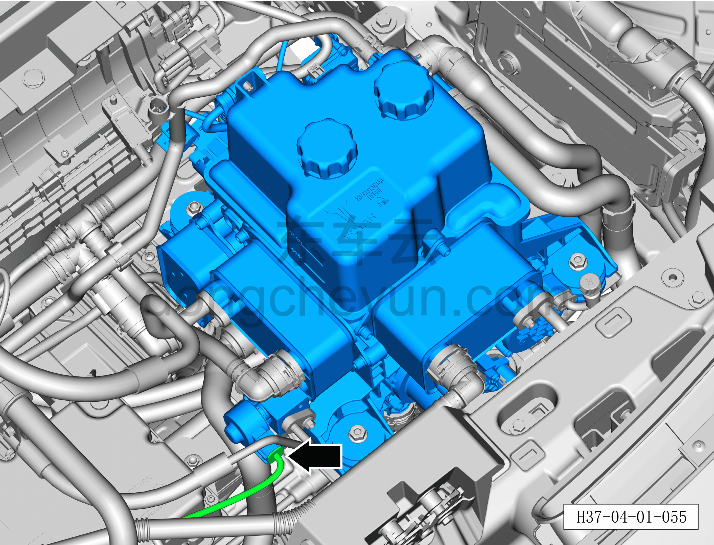

a. Нажмите на фиксатор разъёма и отсоедините разъём электронного ТРВ.

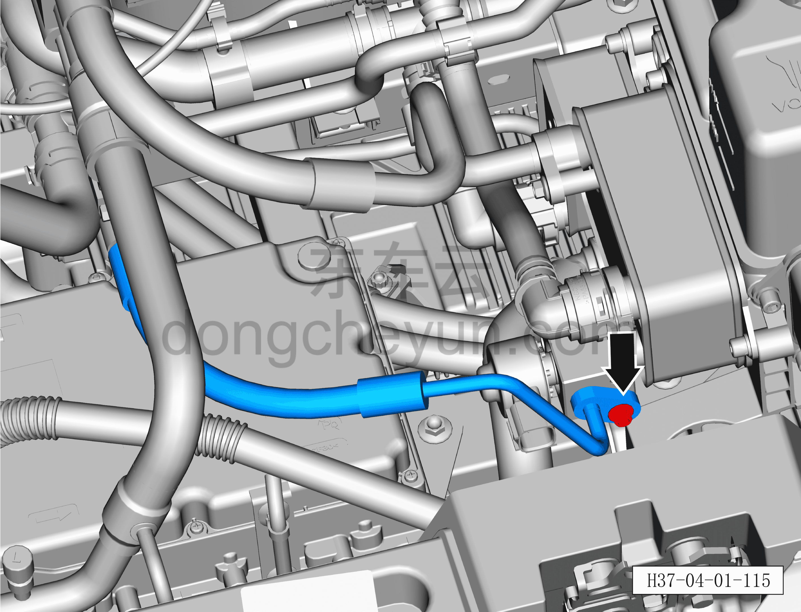

b. Головкой на 8мм выверните крепёжный болт коаксиального трубопровода кондиционера, отсоедините соединение коаксиального трубопровода кондиционера с электронным ТРВ.

Момент затяжки болта: 8±1 Н·м

**Внимание:**

**- Утилизируйте старое уплотнительное кольцо трубки кондиционера, установите новое уплотнительное кольцо.**

**- Если трубопровод не может быть сразу установлен обратно, оберните или заглушите соединения трубопровода нетканым материалом, чтобы избежать загрязнения трубопровода и попадания посторонних предметов.**

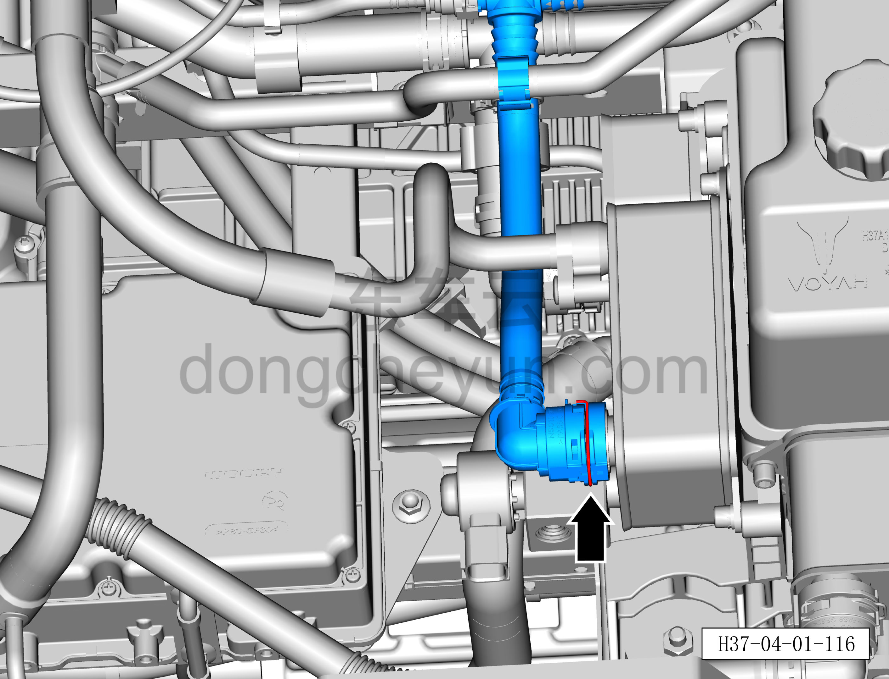

c. Небольшой плоской отвёрткой сдвиньте фиксатор быстроразъёмного соединения трубки в сборе и отсоедините быстроразъёмное соединение входной трубки аккумуляторной батареи с охладителем батареи.

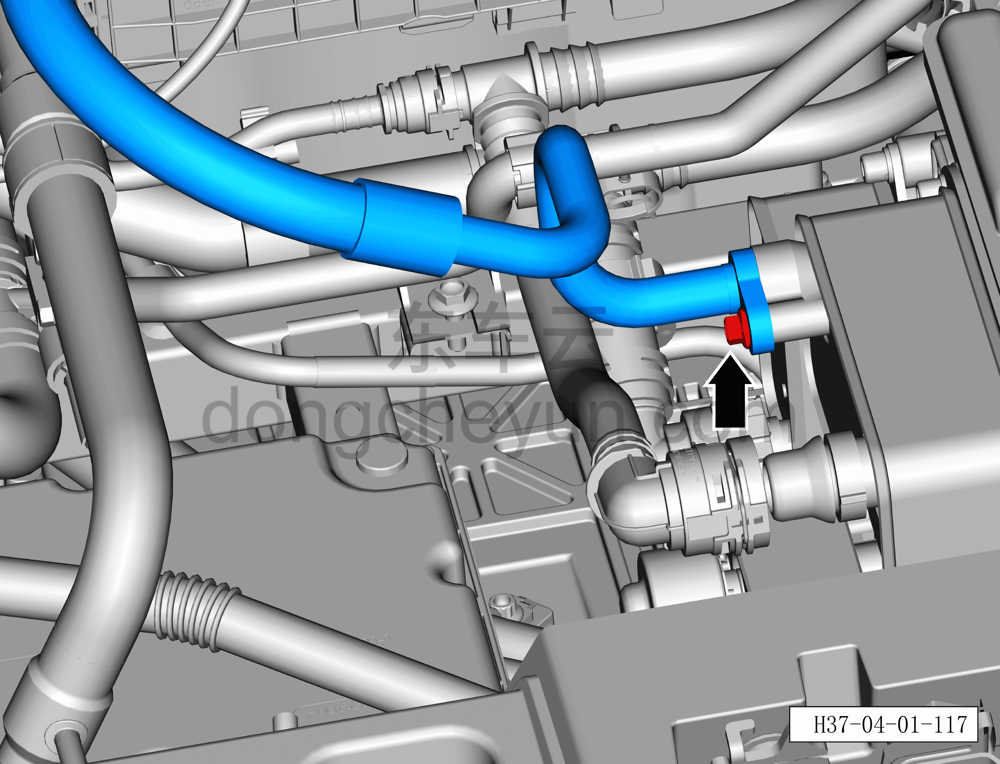

d. Головкой на 8мм выверните крепёжный болт коаксиального трубопровода кондиционера, отсоедините соединение коаксиального трубопровода кондиционера с охладителем батареи.

Момент затяжки болта: 8±1 Н·м

**Внимание:**

**- Утилизируйте старое уплотнительное кольцо трубки кондиционера, установите новое уплотнительное кольцо.**

**- Если трубопровод не может быть сразу установлен обратно, оберните или заглушите соединения трубопровода нетканым материалом, чтобы избежать загрязнения трубопровода и попадания посторонних предметов.**

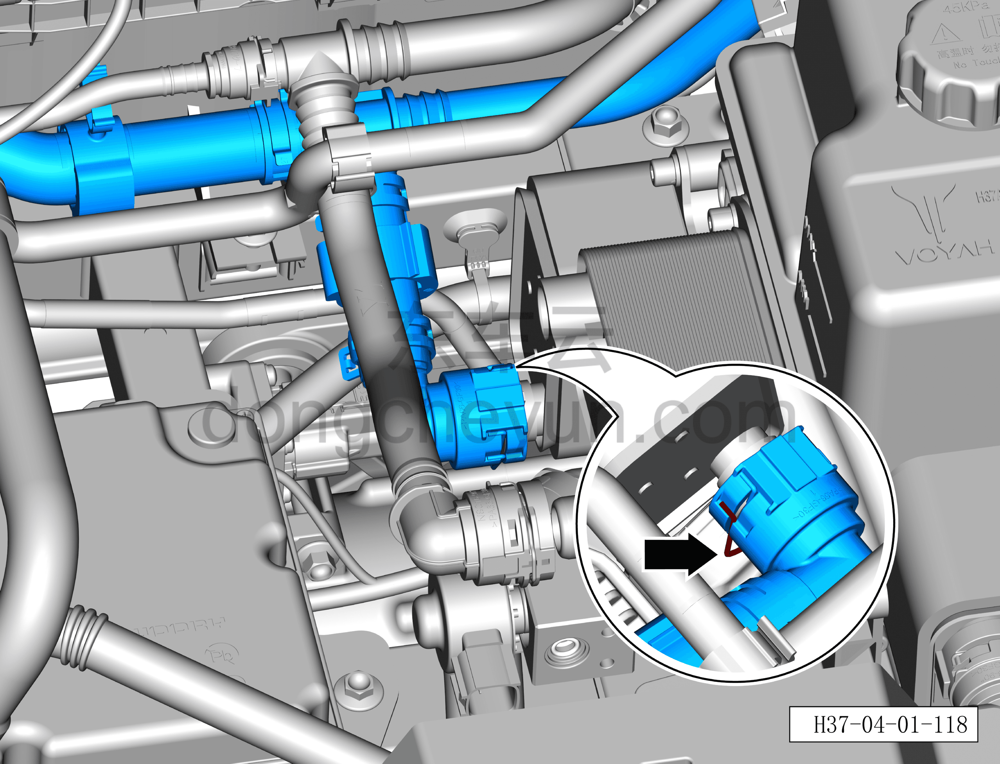

e. Небольшой плоской отвёрткой сдвиньте вниз фиксатор быстроразъёмного соединения обратной трубки отопителя и отсоедините быстроразъёмное соединение обратной трубки отопителя с водо-водяным теплообменником.

**Внимание:**

**- Перед отсоединением трубки подставьте ёмкость для сбора жидкости, чтобы собрать остатки охлаждающей жидкости в трубопроводе.**

**- После отсоединения трубки вытрите ветошью вытекшую вокруг трубопровода охлаждающую жидкость, чтобы после завершения установки можно было проверить трубопровод на наличие подтеканий.**

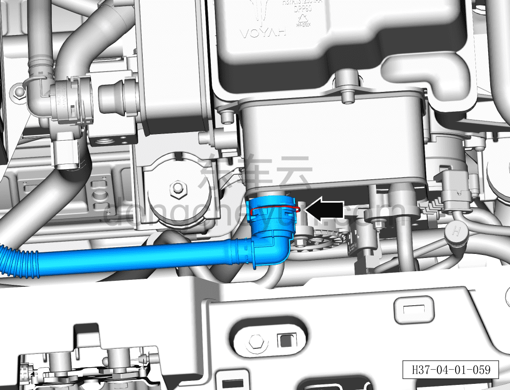

f. Небольшой плоской отвёрткой сдвиньте фиксатор быстроразъёмного соединения водяной трубки от WCDC к PTC-нагревателю и отсоедините быстроразъёмное соединение водяной трубки от WCDC к PTC-нагревателю с конденсатором.

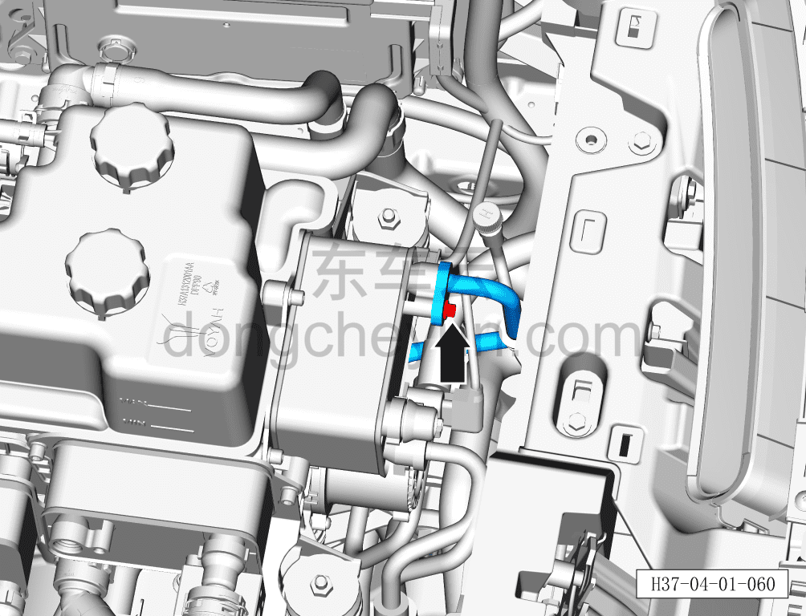

g. Головкой на 8мм выверните крепёжный болт нагнетательного трубопровода конденсатора, отсоедините соединение нагнетательного трубопровода конденсатора с конденсатором.

Момент затяжки болта: 8±1 Н·м

**Внимание:**

**- Утилизируйте старое уплотнительное кольцо трубки кондиционера, установите новое уплотнительное кольцо.**

**- Если трубопровод не может быть сразу установлен обратно, оберните или заглушите соединения трубопровода нетканым материалом, чтобы избежать загрязнения трубопровода и попадания посторонних предметов.**

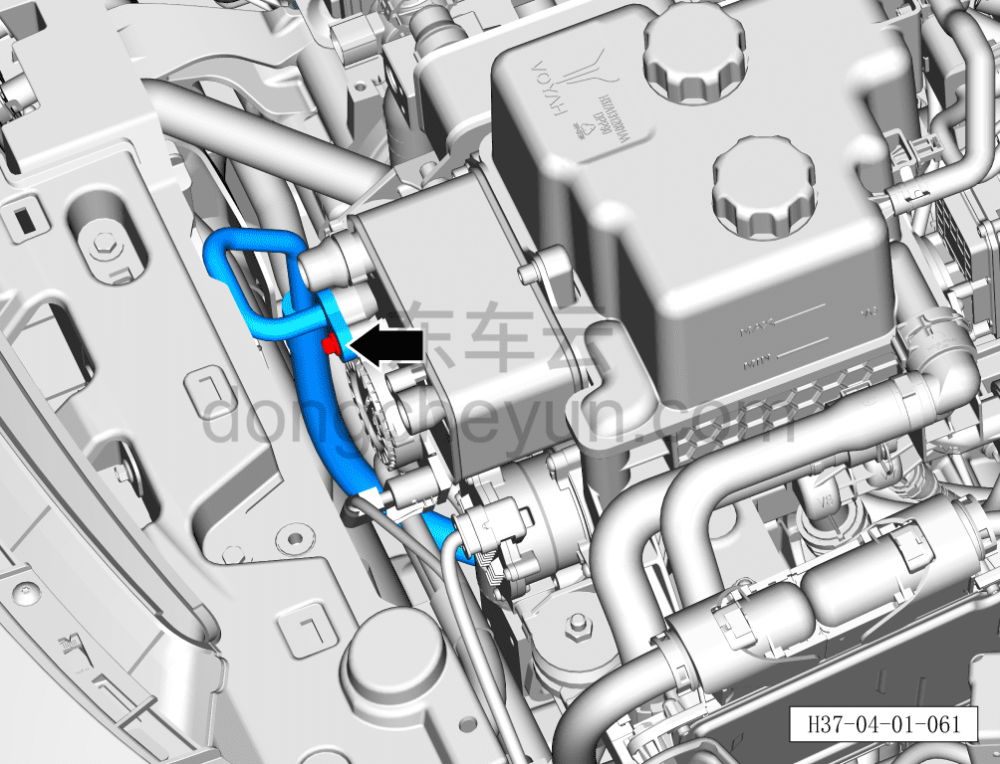

h. Головкой на 8мм выверните крепёжный болт нагнетательной трубки компрессора, отсоедините соединение нагнетательной трубки компрессора с конденсатором.

Момент затяжки болта: 8±1 Н·м

**Внимание:**

**- Утилизируйте старое уплотнительное кольцо трубки кондиционера, установите новое уплотнительное кольцо.**

**- Если трубопровод не может быть сразу установлен обратно, оберните или заглушите соединения трубопровода нетканым материалом, чтобы избежать загрязнения трубопровода и попадания посторонних предметов.**

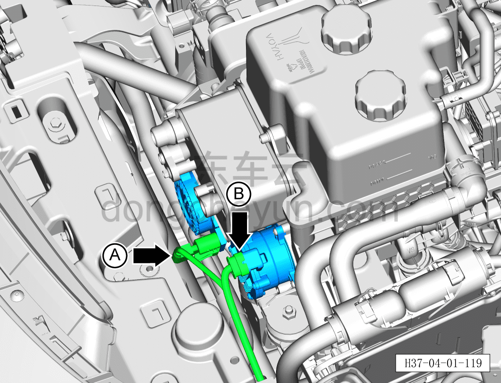

i. Извлеките наружу фиксирующую скобу разъёма, нажмите на фиксатор разъёма и отсоедините разъём A водяного насоса электродвигателя в сборе.

j. Извлеките наружу фиксирующую скобу разъёма, нажмите на фиксатор разъёма и отсоедините разъём B электрического водяного насоса контура отопителя.

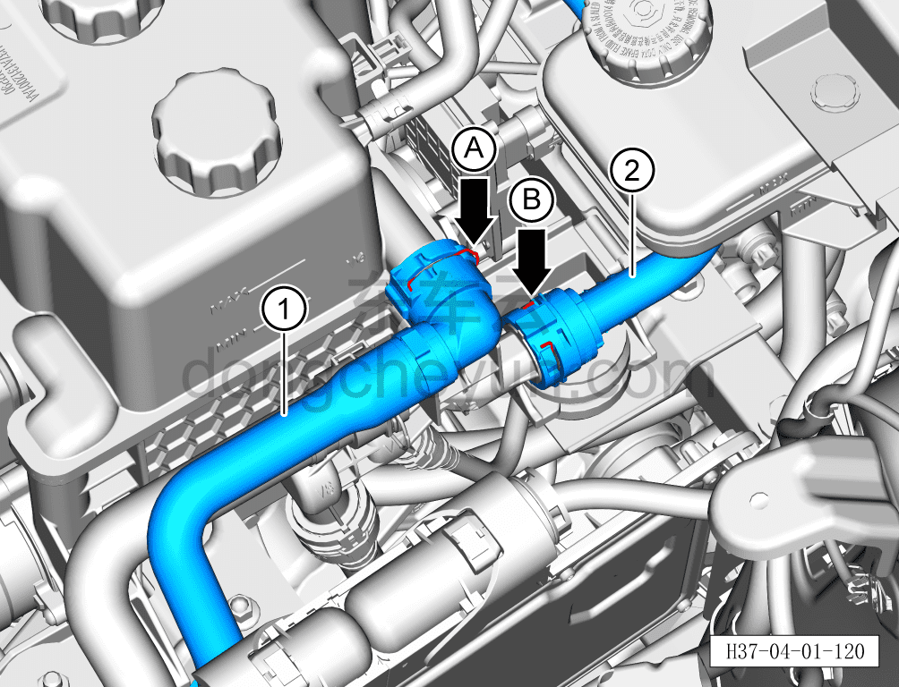

k. Небольшой плоской отвёрткой сдвиньте фиксатор A быстроразъёмного соединения входной трубки водяного насоса электродвигателя и отсоедините быстроразъёмное соединение, переместите входную трубку водяного насоса электродвигателя в сборе ① в положение, не создающее помех.

l. Небольшой плоской отвёрткой сдвиньте фиксатор B быстроразъёмного соединения обратной трубки отопителя и отсоедините быстроразъёмное соединение, переместите обратную трубку отопителя ② в положение, не создающее помех.

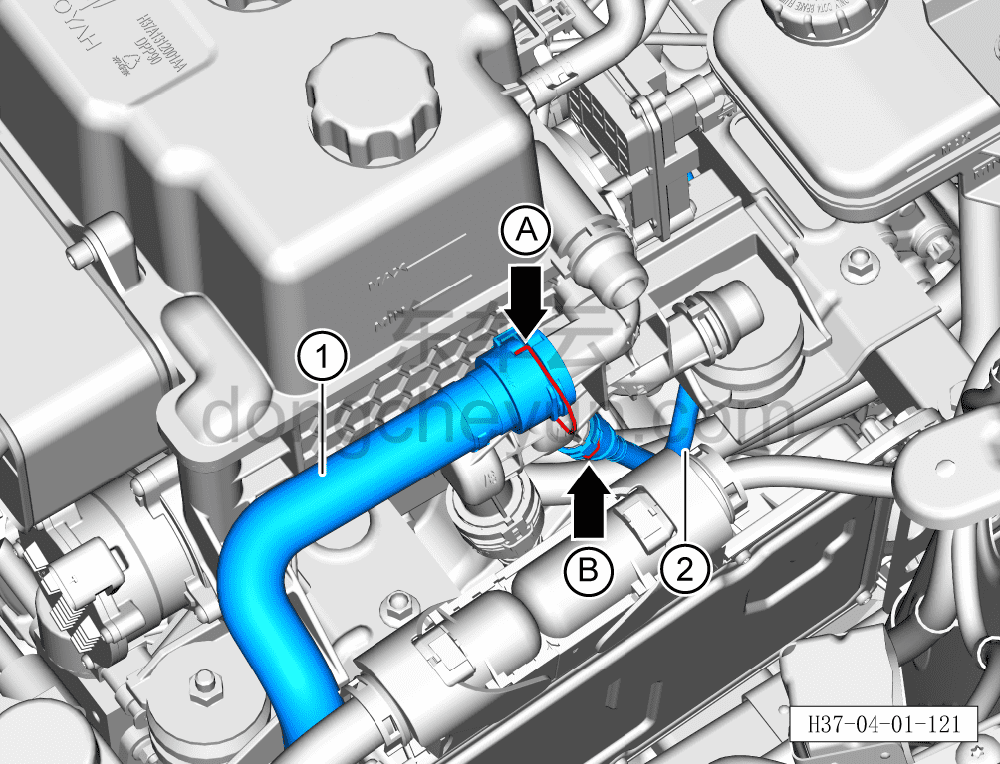

m. Небольшой плоской отвёрткой сдвиньте фиксатор A быстроразъёмного соединения входной трубки низкотемпературного радиатора и отсоедините быстроразъёмное соединение, переместите входную трубку низкотемпературного радиатора ① в положение, не создающее помех.

n. Небольшой плоской отвёрткой сдвиньте фиксатор B быстроразъёмного соединения выходной трубки от OIB к аккумуляторной батарее и отсоедините быстроразъёмное соединение, переместите выходную трубку от OIB к аккумуляторной батарее ② в положение, не создающее помех.

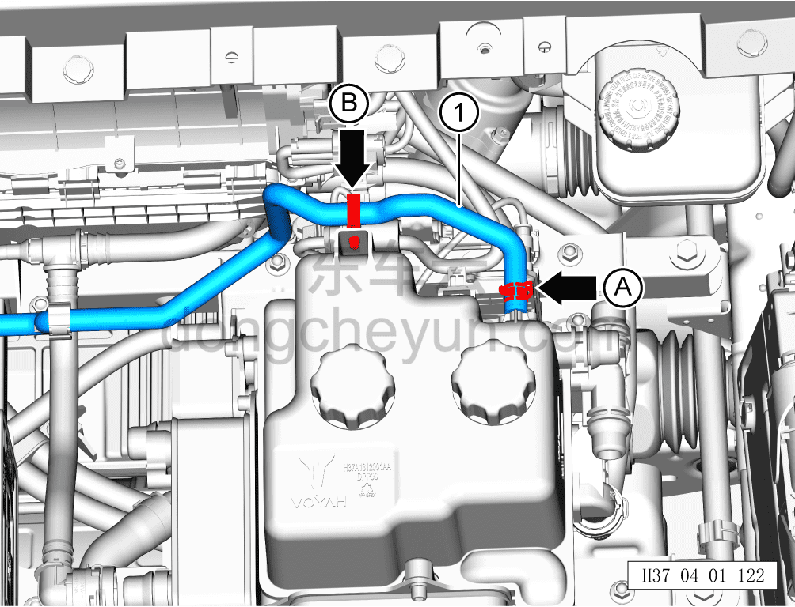

o. Клещами для хомутов снимите крепёжный хомут A, поворачивая влево-вправо отсоедините соединение шланга сброса воздуха контура отопителя с интегрированным расширительным бачком.

p. Плоской отвёрткой отсоедините крепёжную клипсу B шланга сброса воздуха контура отопителя, переместите шланг сброса воздуха контура отопителя ① в положение, не создающее помех.

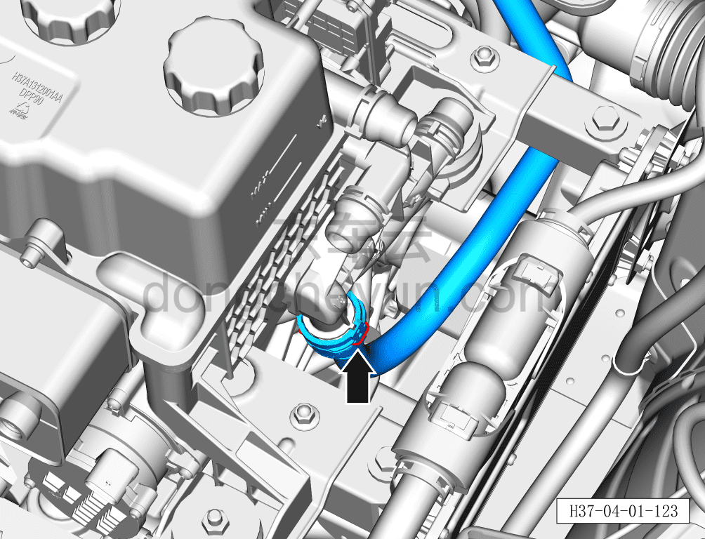

q. Небольшой плоской отвёрткой сдвиньте фиксатор быстроразъёмного соединения выходной трубки аккумуляторной батареи и отсоедините быстроразъёмное соединение, переместите выходную трубку аккумуляторной батареи в положение, не создающее помех.

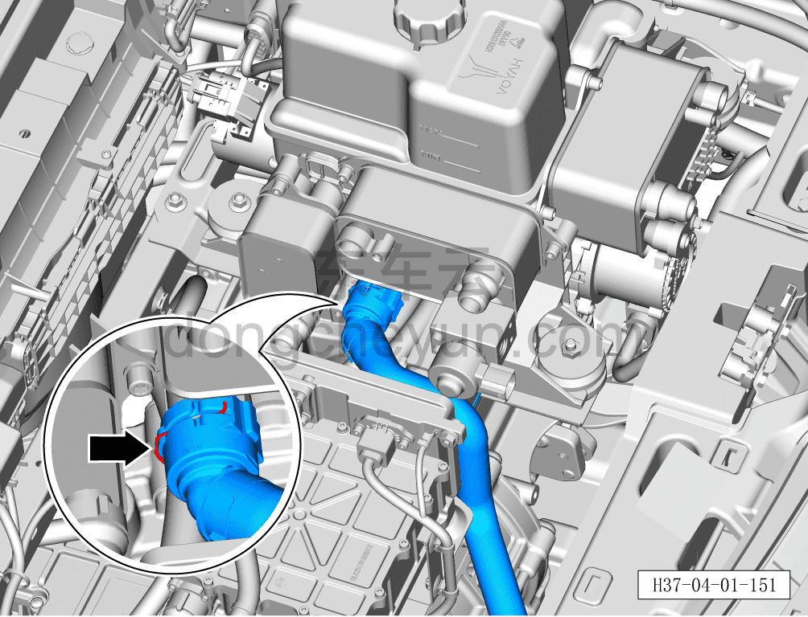

r. Небольшой плоской отвёрткой сдвиньте фиксатор быстроразъёмного соединения выходной трубки низкотемпературного радиатора и отсоедините быстроразъёмное соединение, переместите выходную трубку низкотемпературного радиатора в положение, не создающее помех.

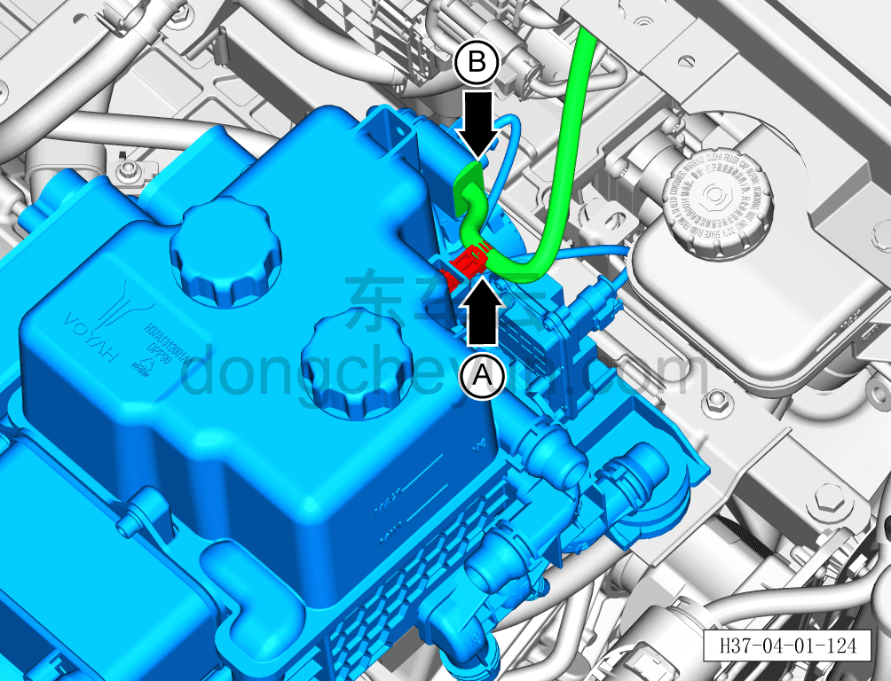

s. Съёмником обивки отсоедините крепёжную клипсу A разъёма жгута проводов интегрированного расширительного бачка.

t. Нажмите на фиксатор разъёма и отсоедините разъём B интегрированного расширительного бачка.

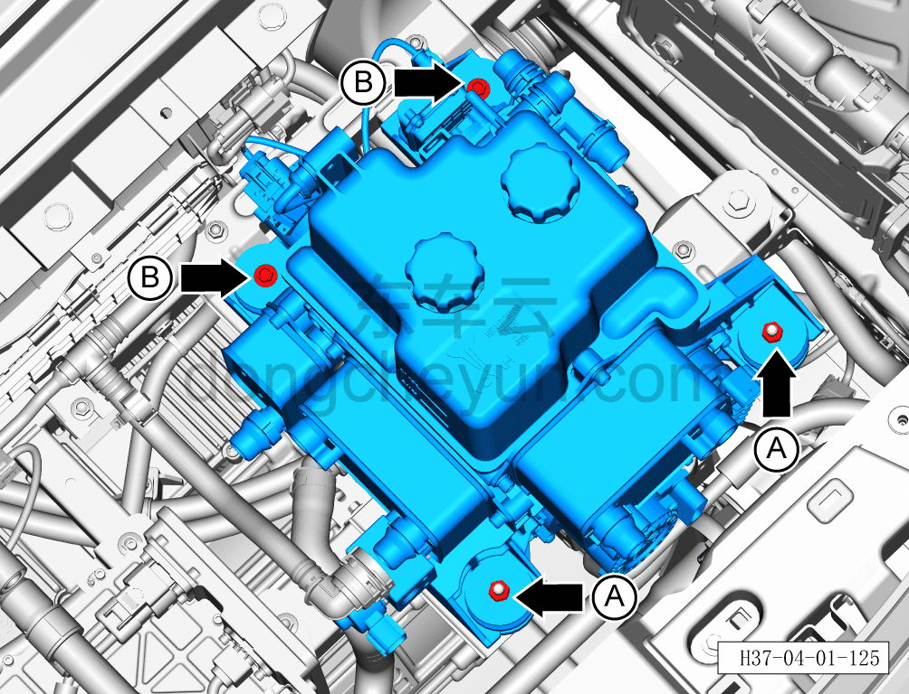

u. Головкой на 13мм выверните 2 крепёжные гайки A интегрированного расширительного бачка.

Момент затяжки гайки: 20±3 Н·м

v. Головкой на 13мм выверните 2 крепёжных болта B интегрированного расширительного бачка.

Момент затяжки болта: 20±3 Н·м

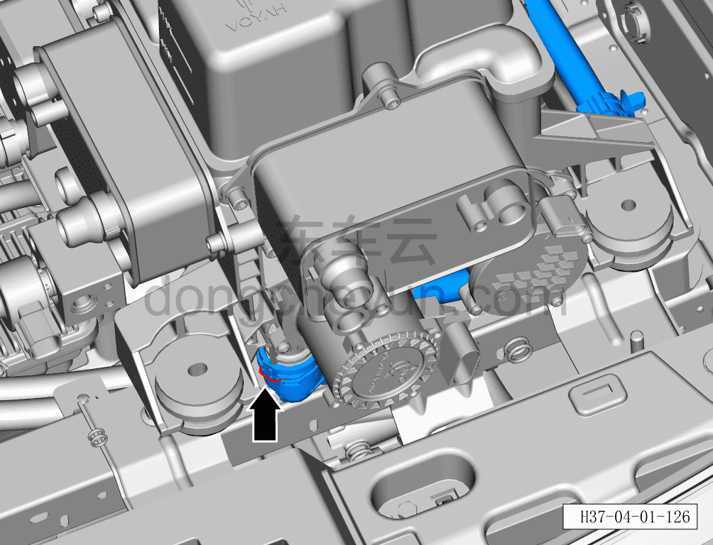

w. Проверьте и отведите детали, расположенные вокруг интегрированного расширительного бачка, медленно поднимите интегрированный расширительный бачок вверх.

x. Небольшой плоской отвёрткой сдвиньте фиксатор быстроразъёмного соединения выходной трубки водяного насоса электродвигателя и отсоедините соединение выходной трубки водяного насоса электродвигателя с интегрированным расширительным бачком.

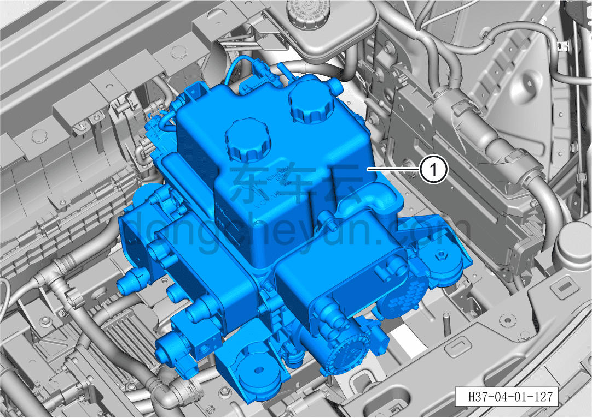

y. Снимите интегрированный расширительный бачок с электрическим водяным насосом в сборе ①.

**Порядок установки**

Установка выполняется в обратном порядке.

**Внимание:**

**- После завершения установки проверьте надёжность соединения патрубков.**

**- После завершения установки залейте охлаждающую жидкость указанной производителем марки в соответствии с требованиями и удалите воздух из системы охлаждения.**

**- После завершения установки заправьте хладагент указанной производителем марки в соответствии с требованиями и проверьте эффективность охлаждения кондиционера.**

**- После завершения установки проверьте соединения патрубков на наличие подтеканий и других дефектов.**
