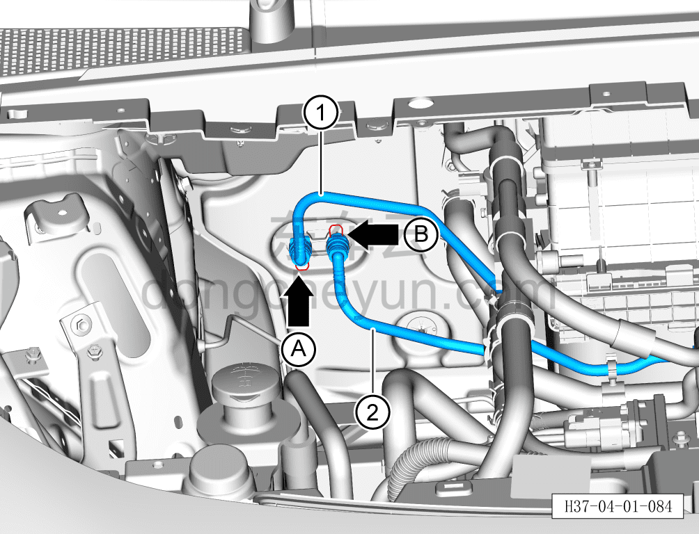
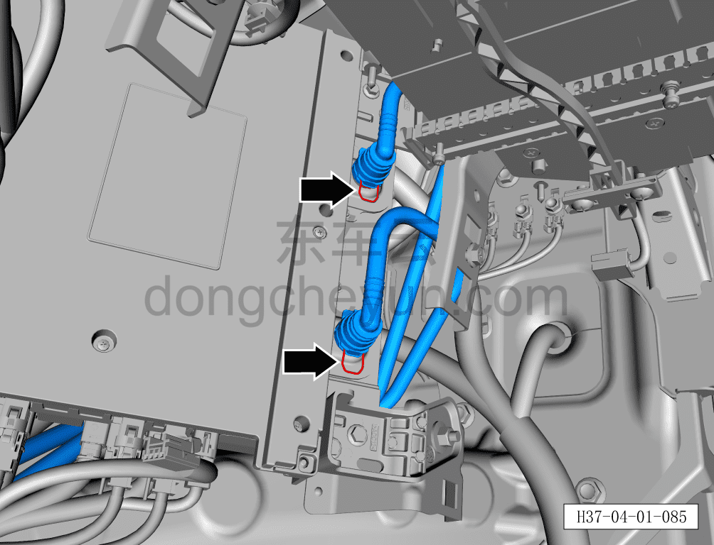
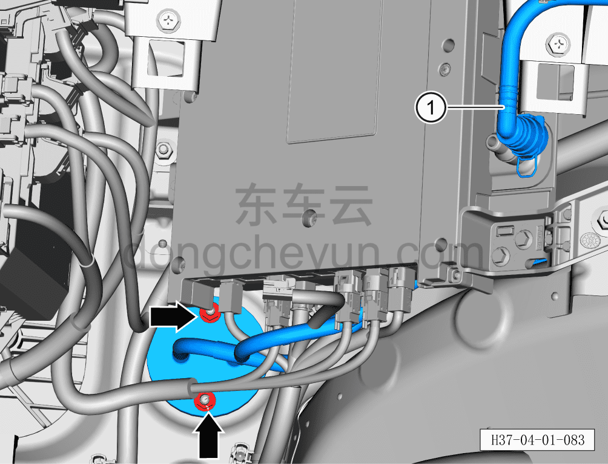

# Снятие и установка входной/выходной трубки OIB

> Интегрированная силовая система › Система охлаждения › Трубопроводы системы охлаждения  
> Оригинал: `拆卸与安装OIB进出水管` · [dongcheyun 56746](https://dongcheyun.com/p/56746), страница `fd75c591cfbc4d11a34df53b7489a35f` · [оглавление](../README.md)

**Порядок снятия**

**Внимание:**

**- Перед выполнением ремонтных работ подождите, пока температура охлаждающей жидкости снизится ниже 60°C.**

1. Выключите все электроприборы, отключите питание.

2. Откройте капот моторного отсека.

3. Снимите декоративную накладку моторного отсека. См. [8.6.6.10 Снятие и установка декоративной накладки моторного отсека](../08-внутренняя-и-внешняя-отделка/223-снятие-и-установка-декоративной-накладки-моторного.md)

4. Выполните обесточивание автомобиля для ремонта. См. [3.1.4.1 Обесточивание автомобиля](../03-техническое-обслуживание/005-обесточивание-автомобиля.md)

5. Слейте охлаждающую жидкость тягового электродвигателя и тяговой батареи. См. [3.1.5.1 Замена охлаждающей жидкости тягового электродвигателя и тяговой батареи](../03-техническое-обслуживание/006-замена-охлаждающей-жидкости-тягового-электродвигателя.md)

6. Снимите аккумуляторную батарею 12 В. См. [9.4.4.1 Снятие и установка аккумуляторной батареи 12 В](../09-электрическая-и-электронная-система/029-снятие-и-установка-аккумуляторной-батареи-12-в.md)

7. Снимите центральную консоль в сборе. См. [8.3.4.13 Снятие и установка центральной консоли в сборе](../08-внутренняя-и-внешняя-отделка/098-снятие-и-установка-центральной-консоли-в-сборе.md)

8. Снимите перчаточный ящик. См. [8.2.4.7 Снятие и установка перчаточного ящика](../08-внутренняя-и-внешняя-отделка/060-снятие-и-установка-перчаточного-ящика.md)

9. Снимите входную/выходную трубку OIB.

a. Небольшой плоской отвёрткой сдвиньте фиксатор A быстроразъёмного соединения водяной трубки от трёхходового клапана к OIB и отсоедините водяную трубку от трёхходового клапана к OIB ①.

b. Небольшой плоской отвёрткой сдвиньте фиксатор B быстроразъёмного соединения выходной трубки от OIB к аккумуляторной батарее и отсоедините выходную трубку от OIB к аккумуляторной батарее ②.

**Внимание:**

**- Перед отсоединением трубки подставьте ёмкость для сбора жидкости, чтобы собрать остатки охлаждающей жидкости в трубопроводе.**

**- После отсоединения трубки вытрите ветошью вытекшую вокруг трубопровода охлаждающую жидкость, чтобы после завершения установки можно было проверить трубопровод на наличие подтеканий.**

c. Небольшой плоской отвёрткой сдвиньте 2 фиксатора быстроразъёмных соединений входной/выходной трубки OIB и отсоедините 2 быстроразъёмных соединения входной/выходной трубки OIB с центральным контроллером.

d. Головкой на 10мм выверните 2 крепёжные гайки входной/выходной трубки OIB.

Момент затяжки гайки: 6±1 Н·м

e. Снимите входную/выходную трубку OIB ①.

**Порядок установки**

Установка выполняется в обратном порядке.

**Внимание:**

**- После завершения установки проверьте надёжность соединения патрубков.**

**- После завершения установки залейте охлаждающую жидкость указанной производителем марки в соответствии с требованиями и удалите воздух из системы охлаждения.**

**- После завершения установки проверьте соединения патрубков на наличие подтеканий и других дефектов.**
