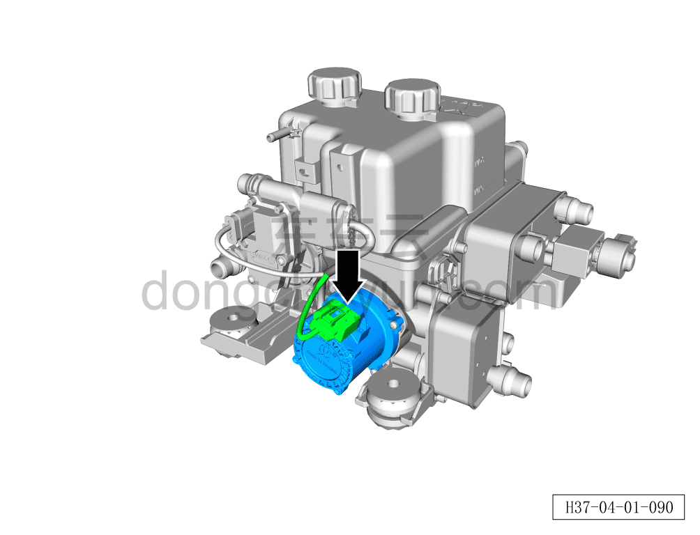
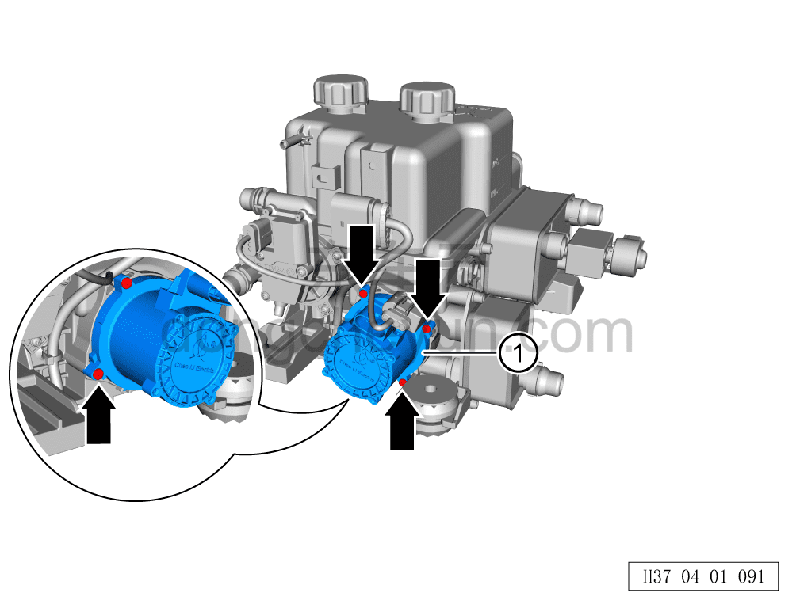

# Снятие и установка электрического водяного насоса II контура батареи

> Интегрированная силовая система › Система охлаждения › Трубопроводы системы охлаждения  
> Оригинал: `拆卸与安装电池包回路电子水泵II` · [dongcheyun 56746](https://dongcheyun.com/p/56746), страница `b1a8e654f6e042bc9f4d6dcb3522b317` · [оглавление](../README.md)

**Порядок снятия**

**Внимание:**

**- Перед выполнением ремонтных работ подождите, пока температура охлаждающей жидкости снизится ниже 60°C.**

1. Выключите все электроприборы, отключите питание.

2. Откройте капот моторного отсека.

3. Снимите декоративную накладку моторного отсека. См. [8.6.6.10 Снятие и установка декоративной накладки моторного отсека](../08-внутренняя-и-внешняя-отделка/223-снятие-и-установка-декоративной-накладки-моторного.md)

4. Выполните обесточивание автомобиля для ремонта. См. [3.1.4.1 Обесточивание автомобиля](../03-техническое-обслуживание/005-обесточивание-автомобиля.md)

5. Соберите/откачайте/заправьте хладагент. См. [10.1.6.12 Сбор/откачка/заправка хладагента](../10-кондиционер/045-сбор-вакуумирование-заправка-хладагента.md)

6. Слейте охлаждающую жидкость тягового электродвигателя и тяговой батареи. См. [3.1.5.1 Замена охлаждающей жидкости тягового электродвигателя и тяговой батареи](../03-техническое-обслуживание/006-замена-охлаждающей-жидкости-тягового-электродвигателя.md)

7. Слейте охлаждающую жидкость HVAC. См. [3.1.5.2 Замена охлаждающей жидкости HVAC](../03-техническое-обслуживание/007-замена-охлаждающей-жидкости-hvac.md)

8. Снимите интегрированный расширительный бачок с электрическим водяным насосом в сборе. См. [4.1.7.26 Снятие и установка интегрированного расширительного бачка с электрическим водяным насосом в сборе](045-снятие-и-установка-интегрированного-расширительного.md)

9. Снимите электрический водяной насос II контура батареи.

a. Нажмите на фиксатор разъёма и отсоедините разъём электрического водяного насоса II контура батареи.

b. Отвёрткой с насадкой T20 выверните 4 крепёжных винта электрического водяного насоса II контура батареи.

c. Снимите электрический водяной насос II контура батареи ①.

**Порядок установки**

Установка выполняется в обратном порядке.

**Внимание:**

**- После завершения установки проверьте надёжность соединения патрубков.**

**- После завершения установки залейте охлаждающую жидкость указанной производителем марки в соответствии с требованиями и удалите воздух из системы охлаждения.**

**- После завершения установки проверьте соединения патрубков на наличие подтеканий и других дефектов.**
