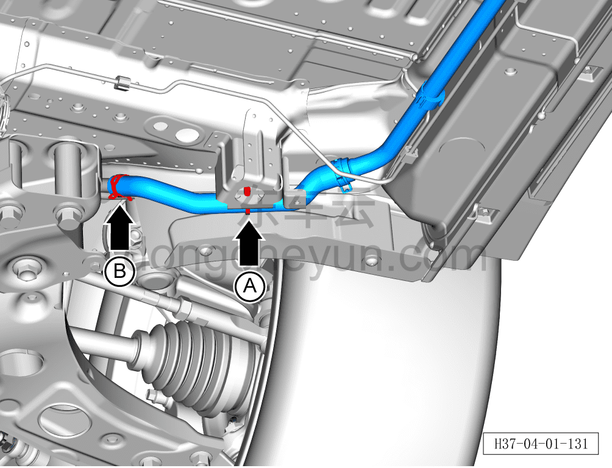
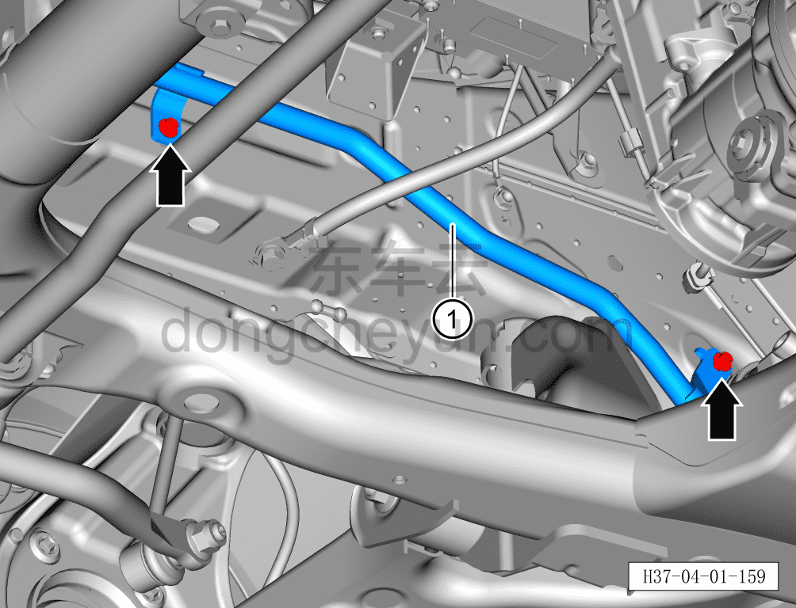

# Снятие и установка выходной трубки заднего электродвигателя (задний привод)

> Интегрированная силовая система › Система охлаждения › Трубопроводы системы охлаждения  
> Оригинал: `拆卸与安装后电机出水管（后驱）` · [dongcheyun 56746](https://dongcheyun.com/p/56746), страница `11a5a84da4ae495683473dc193a515c0` · [оглавление](../README.md)

**Порядок снятия**

**Внимание:**

- Подождите, пока температура охлаждающей жидкости снизится ниже 60°C, затем приступайте к ремонтным работам.

1. Выключите все электроприборы, отключите питание.

2. Откройте капот моторного отсека.

3. Снимите декоративную накладку моторного отсека. См. [8.6.6.10 Снятие и установка декоративной накладки моторного отсека](../08-внутренняя-и-внешняя-отделка/223-снятие-и-установка-декоративной-накладки-моторного.md)

4. Выполните обесточивание автомобиля для ремонта. См. [3.1.4.1 Обесточивание автомобиля](../03-техническое-обслуживание/005-обесточивание-автомобиля.md)

5. Слейте охлаждающую жидкость тягового электродвигателя и тяговой батареи. См. [3.1.5.1 Замена охлаждающей жидкости тягового электродвигателя и тяговой батареи](../03-техническое-обслуживание/006-замена-охлаждающей-жидкости-тягового-электродвигателя.md)

6. Снимите выходную трубку заднего электродвигателя.

a. Съёмником обивки отсоедините крепёжную клипсу A жёсткой выходной трубки заднего электродвигателя (центральный тоннель).

b. Клещами для хомутов снимите крепёжный хомут B, поворачивая влево-вправо отсоедините соединение жёсткой выходной трубки заднего электродвигателя (центральный тоннель) с выходной трубкой заднего электродвигателя.

**Внимание:**

**- Перед отсоединением трубки подставьте ёмкость для сбора жидкости, чтобы собрать остатки охлаждающей жидкости в трубопроводе.**

**- После отсоединения трубки вытрите ветошью вытекшую вокруг трубопровода охлаждающую жидкость, чтобы после завершения установки можно было проверить трубопровод на наличие подтеканий.**

c. Клещами для хомутов снимите крепёжный хомут, поворачивая влево-вправо отсоедините соединение выходной трубки заднего электродвигателя с входной трубкой водяного насоса электродвигателя.

d. Головкой на 8мм выверните 2 крепёжных болта выходной трубки заднего электродвигателя.

Момент затяжки болта: 8±1 Н·м

e. Снимите выходную трубку заднего электродвигателя ①.

**Порядок установки**

Установка выполняется в обратном порядке.

**Внимание:**

**- После завершения установки проверьте надёжность соединения патрубков.**

**- После завершения установки залейте охлаждающую жидкость указанной производителем марки в соответствии с требованиями и удалите воздух из системы охлаждения.**

**- После завершения установки проверьте соединения патрубков на наличие подтеканий и других дефектов.**
