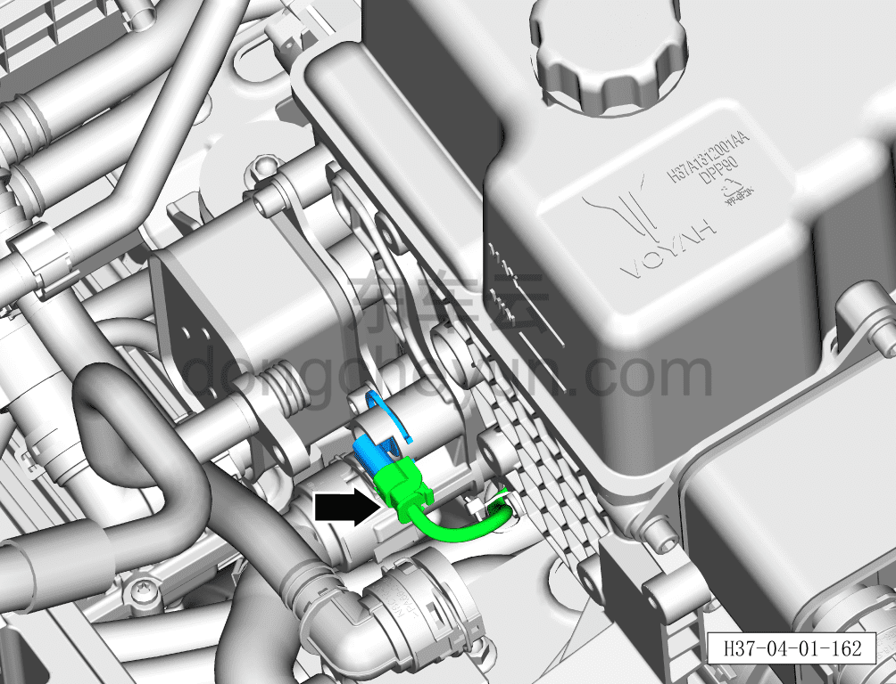
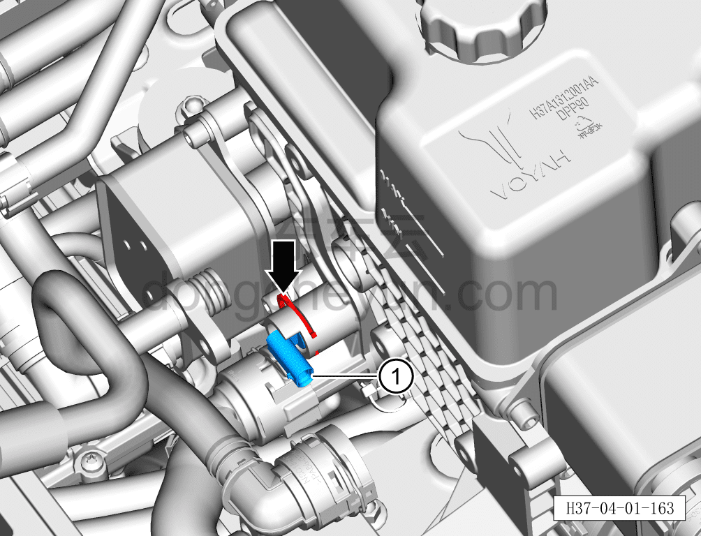

# Снятие и установка датчика температуры охлаждающей жидкости радиатора

> Интегрированная силовая система › Система охлаждения › Трубопроводы системы охлаждения  
> Оригинал: `拆卸与安装散热器水温传感器` · [dongcheyun 56746](https://dongcheyun.com/p/56746), страница `0f2883cb4c424558b29fc88f41173915` · [оглавление](../README.md)

**Порядок снятия**

**Внимание:**

**- Подождите, пока температура охлаждающей жидкости снизится ниже 60°C, затем приступайте к ремонтным работам.**

1. Выключите все электроприборы, отключите питание.

2. Откройте капот моторного отсека.

3. Снимите декоративную накладку моторного отсека. См. [8.6.6.10 Снятие и установка декоративной накладки моторного отсека](../08-внутренняя-и-внешняя-отделка/223-снятие-и-установка-декоративной-накладки-моторного.md)

4. Выполните обесточивание автомобиля для ремонта. См. [3.1.4.1 Обесточивание автомобиля](../03-техническое-обслуживание/005-обесточивание-автомобиля.md)

5. Соберите/откачайте/заправьте хладагент. См. [10.1.6.12 Сбор/откачка/заправка хладагента](../10-кондиционер/045-сбор-вакуумирование-заправка-хладагента.md)

6. Слейте охлаждающую жидкость тягового электродвигателя и тяговой батареи. См. [3.1.5.1 Замена охлаждающей жидкости тягового электродвигателя и тяговой батареи](../03-техническое-обслуживание/006-замена-охлаждающей-жидкости-тягового-электродвигателя.md)

7. Снимите ТРВ (соединённый с охладителем батареи). См. [10.1.5.17 Снятие и установка ТРВ (соединённого с охладителем батареи)](../10-кондиционер/026-снятие-и-установка-трв-подключён-к-охладителю-батареи.md)

8. Снимите охладитель батареи. См. [4.1.7.25 Снятие и установка охладителя батареи](044-снятие-и-установка-охладителя-батареи.md)

9. Снимите датчик температуры охлаждающей жидкости радиатора.

a. Сначала извлеките наружу фиксирующую скобу разъёма датчика температуры охлаждающей жидкости радиатора, затем нажмите на фиксатор разъёма и отсоедините разъём датчика температуры охлаждающей жидкости радиатора.

b. Плоской отвёрткой сдвиньте наружу крепёжную клипсу датчика температуры охлаждающей жидкости радиатора.

c. Снимите датчик температуры охлаждающей жидкости радиатора ①.

**Внимание:**

**- Перед отсоединением датчика температуры охлаждающей жидкости радиатора подставьте под него ёмкость для сбора жидкости, чтобы собрать остатки охлаждающей жидкости в трубопроводе.**

**- После отсоединения датчика температуры охлаждающей жидкости радиатора вытрите ветошью вытекшую вокруг охлаждающую жидкость, чтобы после завершения установки можно было проверить трубопровод на наличие подтеканий.**

**Порядок установки**

Установка выполняется в обратном порядке.

**Внимание:**

**- После завершения установки подключите диагностический сканер, проверьте автомобиль на наличие кодов неисправностей; при их наличии считайте и удалите коды неисправностей.**

**- После завершения установки залейте охлаждающую жидкость указанной производителем марки в соответствии с требованиями и удалите воздух из системы охлаждения.**

**- После завершения установки проверьте соединения патрубков на наличие подтеканий и других дефектов.**
