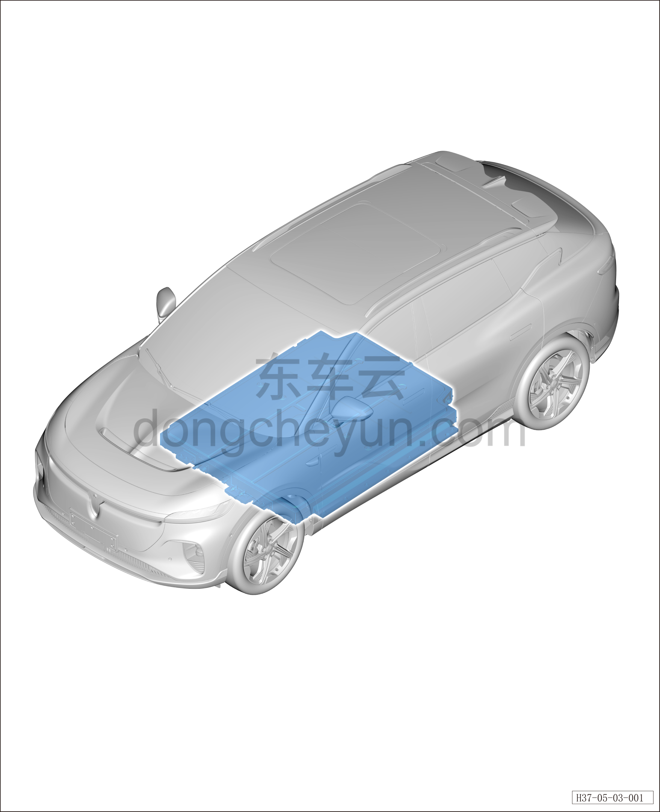

# Тяговая батарея (полный привод)

> Силовая система на новых источниках энергии › Система накопления энергии › Расположение компонентов  
> Оригинал: `动力电池（四驱）` · [dongcheyun 56746](https://dongcheyun.com/p/56746), страница `e11a1648cf5e4ff9b1bc2047bd407144` · [оглавление](../README.md)

