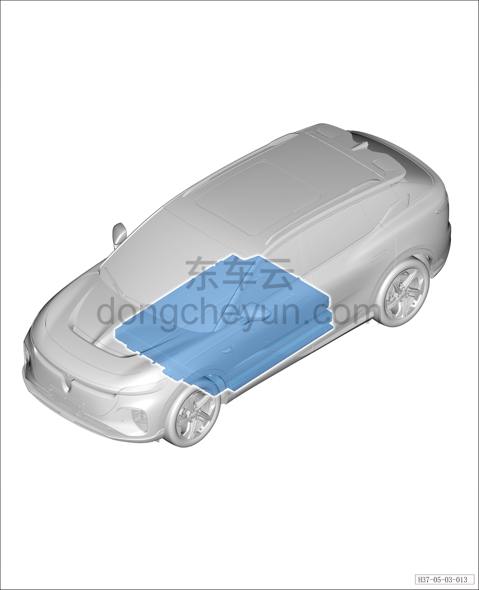

# Тяговая батарея (задний привод)

> Силовая система на новых источниках энергии › Система накопления энергии › Расположение компонентов  
> Оригинал: `动力电池（后驱）` · [dongcheyun 56746](https://dongcheyun.com/p/56746), страница `6c3bd0c5fb6949eabfe9854e8150843e` · [оглавление](../README.md)

