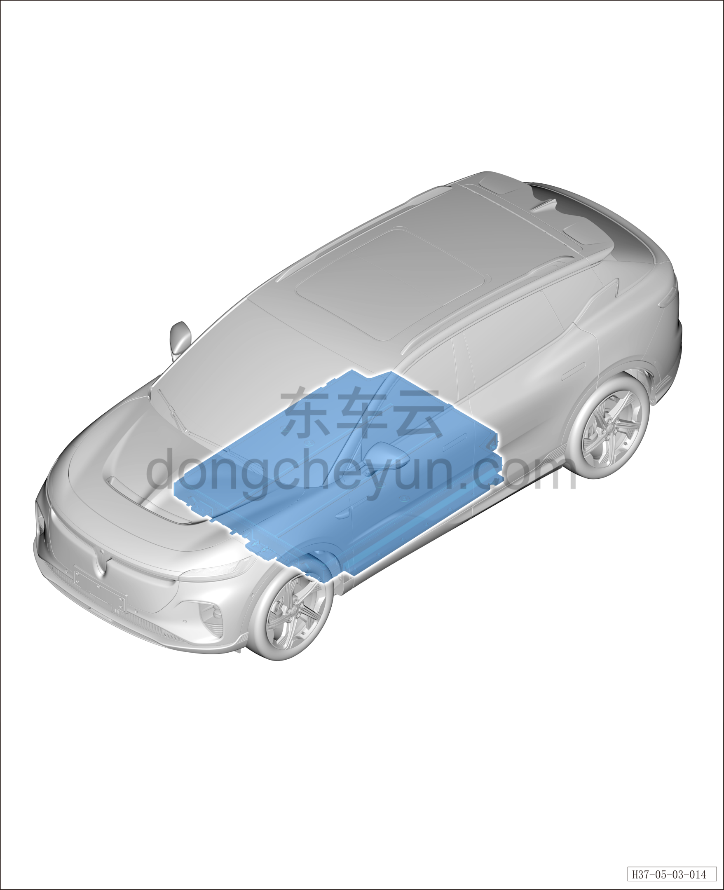

# Тяговая батарея (800В)

> Силовая система на новых источниках энергии › Система накопления энергии › Расположение компонентов  
> Оригинал: `动力电池（800V）` · [dongcheyun 56746](https://dongcheyun.com/p/56746), страница `eee9944f82de4880bc9e9bd5354b37db` · [оглавление](../README.md)

