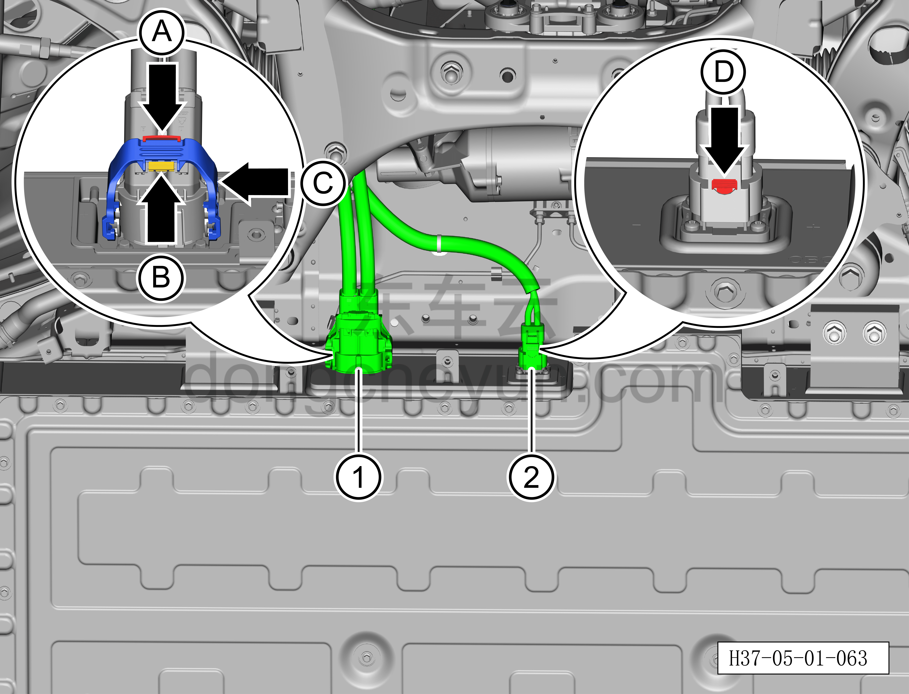
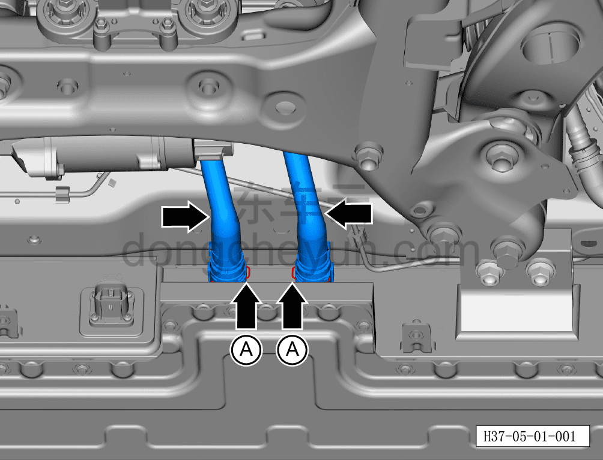
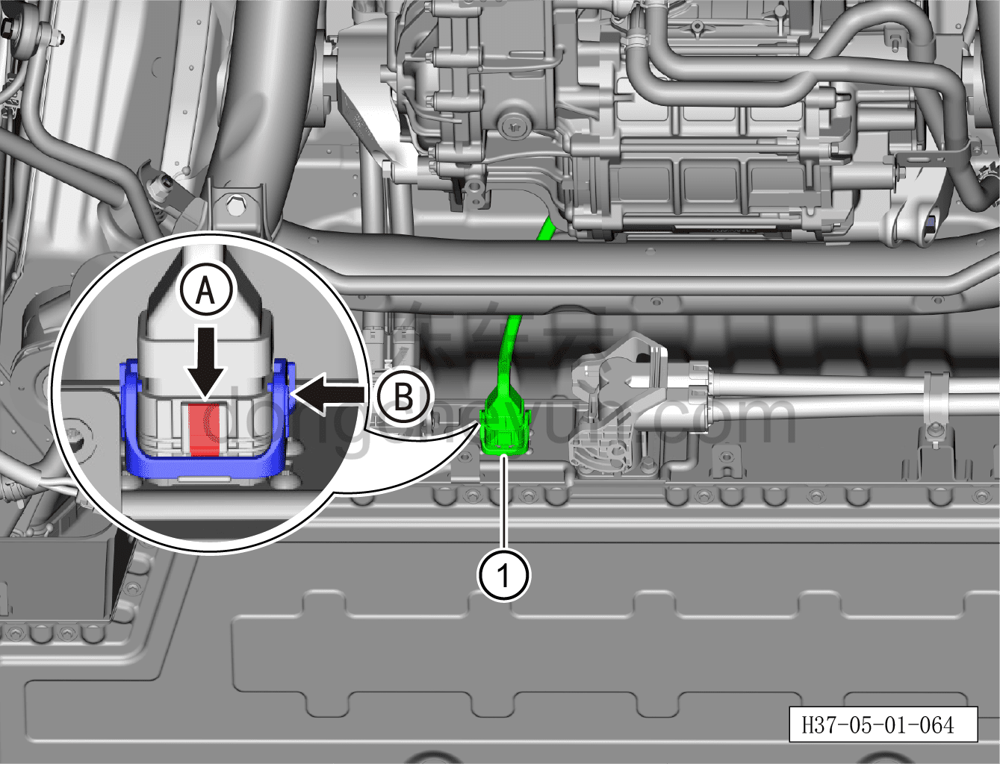
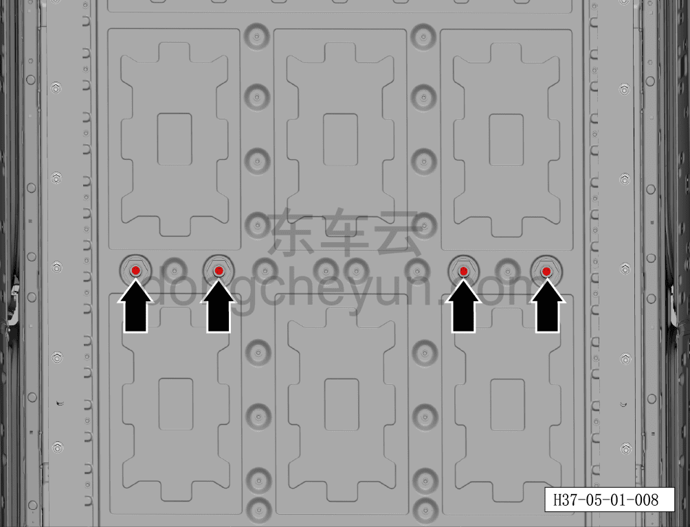
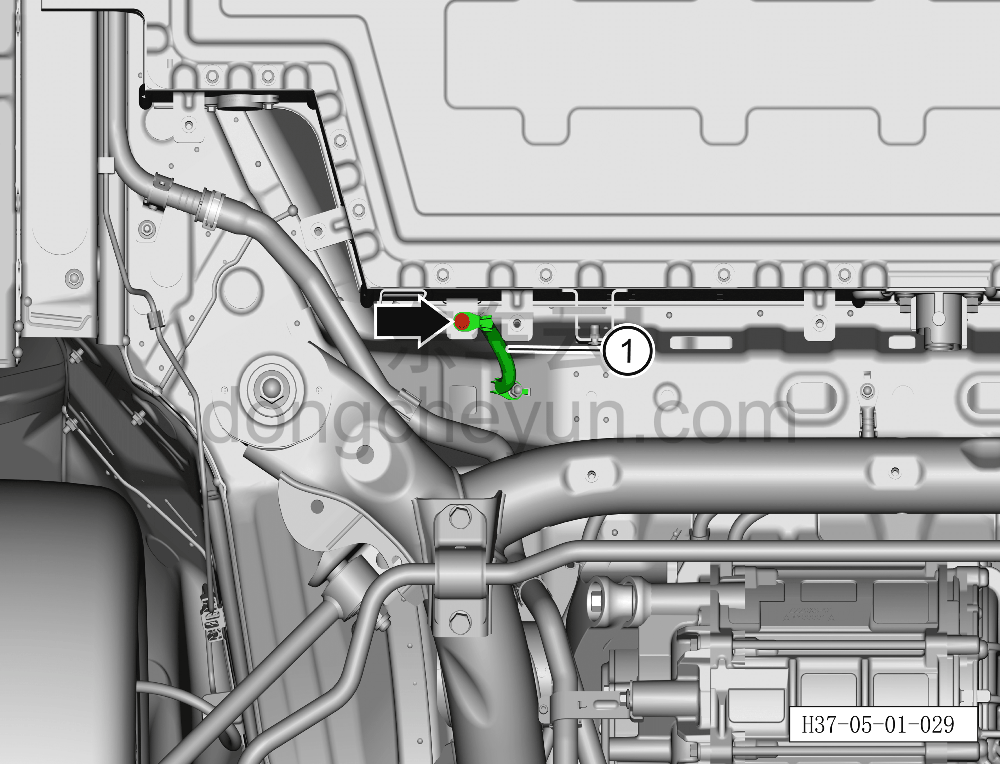
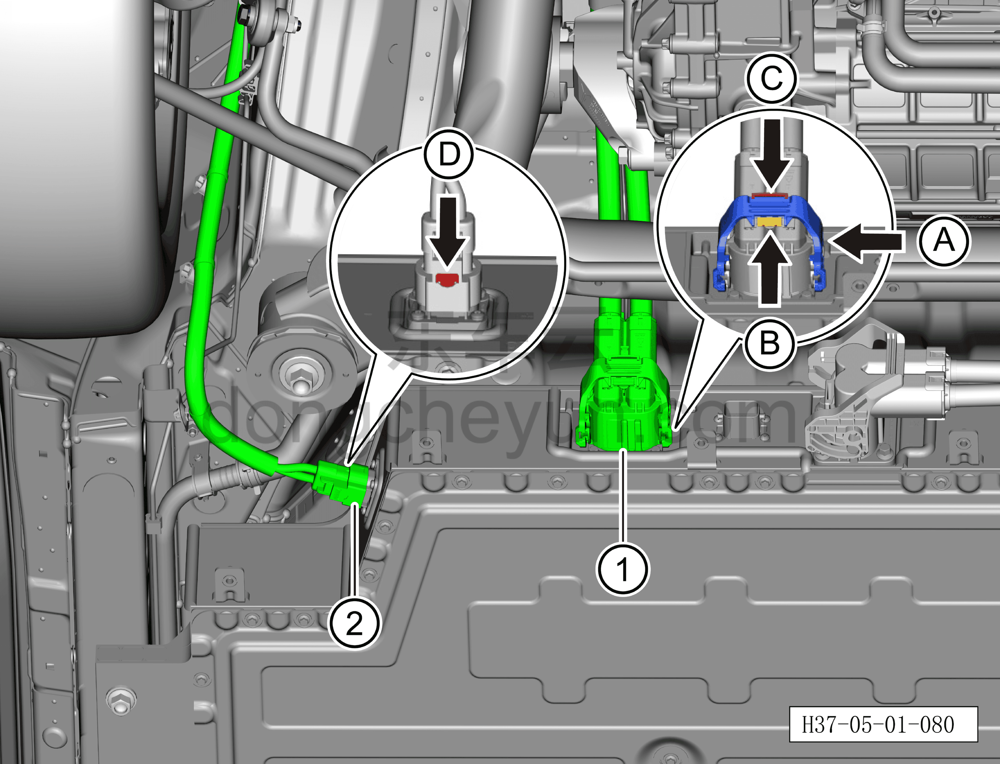
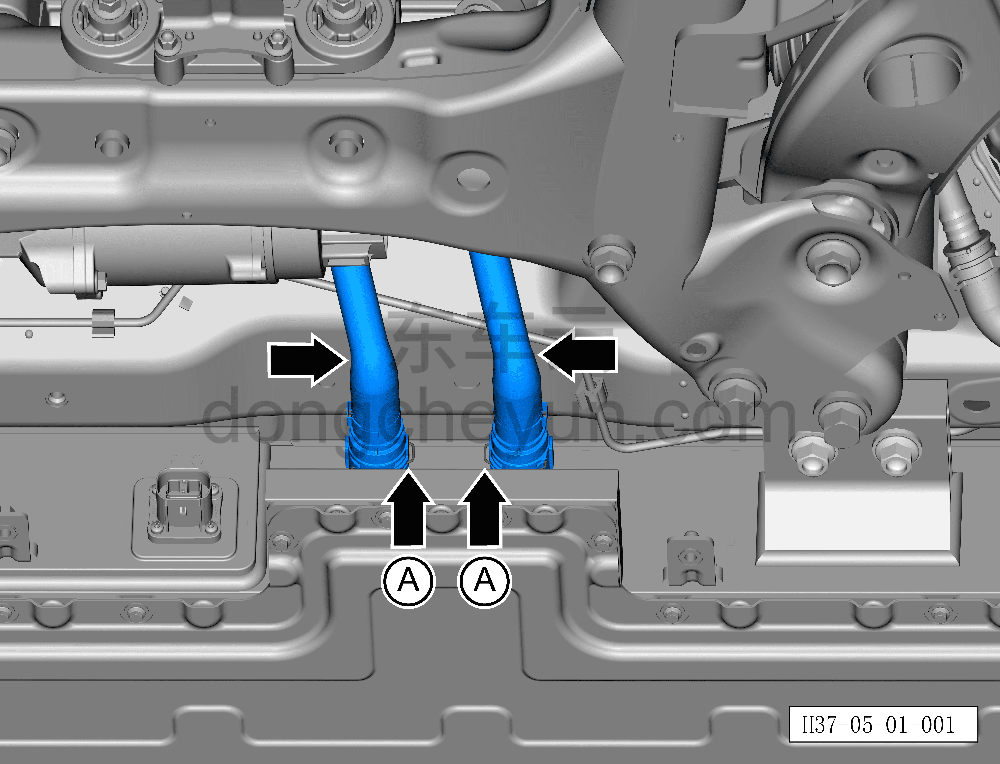

# Снятие и установка тяговой батареи (полный привод)

> Силовая система на новых источниках энергии › Система накопления энергии › Система батареи  
> Оригинал: `拆卸与安装动力电池（四驱）` · [dongcheyun 56746](https://dongcheyun.com/p/56746), страница `9ed57c7d380342e68aeac055df21684f` · [оглавление](../README.md)

**Внимание:**

**-Снятие должно выполняться двумя сотрудниками, при этом хотя бы один из них должен иметь удостоверение электрика по низковольтным работам и пройти внутреннее обучение предприятия, специализированное автомобильное обучение и т.п.**

**Примечание:**

**-Подождите, пока температура охлаждающей жидкости снизится ниже 60°C, затем приступайте к ремонтным работам.**

**- Обратите внимание на предупреждения и указания по ремонту высоковольтной системы, подробности см. [5.1.1 Указания](001-указания.md)**

**Порядок снятия**

1. Выключите все электроприборы, отключите питание.

2. Выполните обесточивание автомобиля для ремонта. См. [3.1.4.1 Обесточивание автомобиля](../03-техническое-обслуживание/005-обесточивание-автомобиля.md)

3. Поднять автомобиль на подъёмнике.

4. Снять передний нижний защитный щиток. См. [8.6.4.3 Снятие и установка переднего нижнего защитного щитка](../08-внутренняя-и-внешняя-отделка/193-снятие-и-установка-переднего-нижнего-защитного-щитка.md)

5. Слейте охлаждающую жидкость тяговой батареи. См. [3.1.5.1 Замена охлаждающей жидкости тягового электродвигателя и тяговой батареи](../03-техническое-обслуживание/006-замена-охлаждающей-жидкости-тягового-электродвигателя.md)

6. Снимите заднюю нижнюю защитную панель. См. [8.6.4.4 Снятие и установка задней нижней защитной панели](../08-внутренняя-и-внешняя-отделка/194-снятие-и-установка-заднего-нижнего-защитного-щитка.md)

7. Снимите тяговую батарею (полный привод).

a. Извлеките фиксирующую скобу разъёма A для разблокировки, удерживая нажатой кнопку фиксации разъёма B, поверните рукоятку разъёма C и отсоедините разъём высоковольтного жгута переднего электродвигателя (со стороны тяговой батареи) ①.

b. Извлеките фиксирующую скобу разъёма D и отсоедините разъём высоковольтного жгута PTC-нагревателя и компрессора (со стороны тяговой батареи) ②.

**Внимание:**

**- При работе с высоковольтными компонентами обязательно используйте изолирующие перчатки и изолирующий инструмент.**

**- После снятия закройте высоковольтный порт, соединяющий высоковольтный жгут переднего электродвигателя (со стороны тяговой батареи), чистым изолирующим защитным колпаком, чтобы предотвратить попадание посторонних предметов или случайное прикосновение.**

**- После снятия закройте высоковольтный порт, соединяющий высоковольтный жгут PTC-нагревателя и компрессора (со стороны тяговой батареи), чистым изолирующим защитным колпаком, чтобы предотвратить попадание посторонних предметов или случайное прикосновение.**

c. Плоской отвёрткой выньте фиксирующее стопорное кольцо A входной/выходной трубки и отсоедините входную/выходную трубку тяговой батареи.

**Внимание:**

**-После отсоединения трубки охлаждения тяговой батареи вытрите вытекшую охлаждающую жидкость нетканым материалом, чтобы после завершения установки можно было выполнить проверку.**

d. Нажмите на фиксирующую скобу разъёма A для разблокировки, поверните рукоятку разъёма B и отсоедините разъём жгута кузова ①.

**Внимание:**

**- После снятия закройте высоковольтный порт, соединяющий жгут кузова, чистым изолирующим защитным колпаком, чтобы предотвратить попадание посторонних предметов или случайное прикосновение.**

e. Извлеките фиксирующую скобу разъёма A для разблокировки, удерживая нажатой кнопку фиксации разъёма B, поверните рукоятку разъёма C и отсоедините разъём высоковольтного жгута заднего электродвигателя (со стороны тяговой батареи) ①.

f. Извлеките фиксирующую скобу разъёма D и отсоедините разъём высоковольтного жгута бортового зарядного устройства (со стороны тяговой батареи) ②.

**Внимание:**

**- После снятия закройте высоковольтный порт, соединяющий высоковольтный жгут заднего электродвигателя (со стороны тяговой батареи), чистым изолирующим защитным колпаком, чтобы предотвратить попадание посторонних предметов или случайное прикосновение.**

**- После снятия закройте высоковольтный порт, соединяющий жгут бортового зарядного устройства (со стороны тяговой батареи), чистым изолирующим защитным колпаком, чтобы предотвратить попадание посторонних предметов или случайное прикосновение.**

g. Головкой на 10мм выверните 2 крепёжных болта кронштейна высоковольтного жгута комбинированного разъёма быстрой/медленной зарядки.

Момент затяжки болта: 8±1 Н·м

h. Извлеките фиксирующую скобу разъёма A для разблокировки, поверните рукоятку разъёма B и отсоедините разъём высоковольтного жгута комбинированного разъёма быстрой/медленной зарядки (со стороны тяговой батареи) ①.

**Внимание:**

**- После снятия закройте высоковольтный порт, соединяющий высоковольтный жгут комбинированного разъёма быстрой/медленной зарядки (со стороны тяговой батареи), чистым изолирующим защитным колпаком, чтобы предотвратить попадание посторонних предметов или случайное прикосновение.**

i. Головкой на 10мм выверните крепёжный болт жгута заземления тяговой батареи.

Момент затяжки болта: 8±1 Н·м

j. Отсоедините жгут заземления тяговой батареи ①.

k. Головкой на 13мм выверните 4 крепёжных болта тяговой батареи.

Момент затяжки болта: 55±6 Н·м

l. Используя подъёмную платформенную тележку для тяговой батареи, установите на неё опору тяговой батареи, медленно поднимите подъёмную платформенную тележку так, чтобы опора полностью прилегала и слегка касалась тяговой батареи, не допускайте сдавливания; убедитесь, что тяговая батарея устойчиво расположена на подъёмной платформенной тележке.

m. Головкой на 18мм в несколько проходов выверните 18 крепёжных болтов тяговой батареи по диагонально-перекрёстной схеме.

Момент затяжки болта: 105±5 Н·м

n. При содействии двух человек, используя подъёмную платформенную тележку для тяговой батареи, медленно опустите тяговую батарею ①.

**Внимание:**

**-В процессе снятия следите за отсутствием помех вокруг тяговой батареи, чтобы не повредить другие детали.**

**Порядок установки**

**Внимание:**

**-При работе с высоковольтными компонентами обязательно используйте изолирующие перчатки и изолирующий инструмент.**

a. Установите специальный монтажный инструмент тяговой батареи (H52255001) по диагонали в отверстия для установочных болтов кузова тяговой батареи.

b. При содействии двух человек, используя подъёмную платформенную тележку для тяговой батареи, медленно поднимите тяговую батарею в сборе, отрегулируйте её положение, совместите два диагональных монтажных отверстия тяговой батареи со специальным монтажным инструментом тяговой батареи, убедитесь, что тяговая батарея точно установлена в правильное монтажное положение.

c. Снимите специальный монтажный инструмент тяговой батареи, головкой на 18мм предварительно затяните 18 крепёжных болтов тяговой батареи по диагонально-перекрёстной схеме, затем динамометрическим ключом окончательно затяните 18 крепёжных болтов по диагонально-перекрёстной схеме.

Момент затяжки болта: 105±5 Н·м

d. Головкой на 13мм затяните 4 крепёжных болта тяговой батареи в порядке от центра к краям.

Момент затяжки болта: 55±6 Н·м

e. Совместите жгут заземления тяговой батареи ① с монтажным положением на тяговой батарее, вкрутите крепёжный болт жгута заземления тяговой батареи и затяните его головкой на 10мм.

Момент затяжки болта: 8±1 Н·м

f. Снимите изолирующий защитный колпак с высоковольтного порта, установите на место разъём высоковольтного жгута комбинированного разъёма быстрой/медленной зарядки (со стороны тяговой батареи) ①, поверните рукоятку разъёма A, вставьте и зафиксируйте фиксирующую скобу разъёма B.

g. Вкрутите 2 крепёжных болта кронштейна высоковольтного жгута комбинированного разъёма быстрой/медленной зарядки и затяните их головкой на 10мм.

Момент затяжки болта: 8±1 Н·м

**Проверка:**

**- Приложив усилие не более 20Н, потяните наружу разъём высоковольтного жгута комбинированного разъёма быстрой/медленной зарядки (со стороны тяговой батареи) (не тянуть за жгут); разъём высоковольтного жгута комбинированного разъёма быстрой/медленной зарядки (со стороны тяговой батареи) не должен выниматься — это подтверждает надёжность соединения; затем повторно довставьте разъём высоковольтного жгута комбинированного разъёма быстрой/медленной зарядки (со стороны тяговой батареи) строго перпендикулярно вовнутрь, чтобы обратное движение не привело к плохому контакту.**

h. Снимите изолирующую защитную крышку с высоковольтного порта, установите разъём① высоковольтного жгута заднего электродвигателя (со стороны тяговой батареи) на место, поверните рукоятку разъёма A до фиксации в положении B, нажмите на фиксатор разъёма C до защёлкивания.

i. Снимите изолирующую защитную крышку с высоковольтного порта, установите разъём② высоковольтного жгута бортового зарядного устройства (со стороны тяговой батареи) на место, нажмите на фиксатор разъёма D до защёлкивания.

**Проверка:**

**- Потяните штекер высоковольтного жгута заднего электродвигателя (со стороны тяговой батареи) наружу с усилием не более 20 Н (не тянуть за жгут); штекер высоковольтного жгута заднего электродвигателя (со стороны тяговой батареи) не должен выниматься — убедитесь, что соединение выполнено правильно, затем повторно довставьте штекер высоковольтного жгута заднего электродвигателя (со стороны тяговой батареи) строго перпендикулярно внутрь, чтобы предотвратить некачественное соединение из-за обратного вытягивания.**

**- Потяните штекер высоковольтного жгута бортового зарядного устройства (со стороны тяговой батареи) наружу с усилием не более 20 Н (не тянуть за жгут); штекер высоковольтного жгута бортового зарядного устройства (со стороны тяговой батареи) не должен выниматься — убедитесь, что соединение выполнено правильно, затем повторно довставьте штекер высоковольтного жгута бортового зарядного устройства (со стороны тяговой батареи) строго перпендикулярно внутрь, чтобы предотвратить некачественное соединение из-за обратного вытягивания.**

j. Снимите изолирующую защитную крышку с высоковольтного порта, установите разъём① жгута кузова на место, поверните рукоятку разъёма A до защёлкивания фиксатором разъёма B.

**Проверка:**

**- Потяните штекер разъёма жгута кузова наружу с усилием не более 20 Н (не тянуть за жгут); штекер разъёма жгута кузова не должен выниматься — убедитесь, что соединение выполнено правильно, затем повторно довставьте штекер разъёма жгута кузова строго перпендикулярно внутрь, чтобы предотвратить некачественное соединение из-за обратного вытягивания.**

k. Совместите патрубки подачи и обратки охлаждающей жидкости тяговой батареи с портами установки на тяговой батарее и установите на место, нажмите на стопорное кольцо A патрубков до фиксации.

**Внимание:**

**- После завершения установки проверьте и убедитесь, что соединения патрубков закреплены надёжно.**

l. Снимите изолирующую защитную крышку с высоковольтного порта, установите разъём① высоковольтного жгута переднего электродвигателя (со стороны тяговой батареи) на место, поверните рукоятку разъёма A до фиксации в положении B, нажмите на фиксатор разъёма C до защёлкивания.

m. Снимите изолирующую защитную крышку с высоковольтного порта, установите разъём② высоковольтного жгута PTC-компрессора (со стороны тяговой батареи) на место, нажмите и надавите на фиксатор разъёма D.

**Проверка:**

**- Потяните штекер высоковольтного жгута переднего электродвигателя (со стороны тяговой батареи) наружу с усилием не более 20 Н (не тянуть за жгут); штекер высоковольтного жгута переднего электродвигателя (со стороны тяговой батареи) не должен выниматься — убедитесь, что соединение выполнено правильно, затем повторно довставьте штекер высоковольтного жгута переднего электродвигателя (со стороны тяговой батареи) строго перпендикулярно внутрь, чтобы предотвратить некачественное соединение из-за обратного вытягивания.**

**- Потяните штекер высоковольтного жгута PTC-компрессора (со стороны тяговой батареи) наружу с усилием не более 20 Н (не тянуть за жгут); штекер высоковольтного жгута PTC-компрессора (со стороны тяговой батареи) не должен выниматься — убедитесь, что соединение выполнено правильно, затем повторно довставьте штекер высоковольтного жгута PTC-компрессора (со стороны тяговой батареи) строго перпендикулярно внутрь, чтобы предотвратить некачественное соединение из-за обратного вытягивания.**

**Примечание**

**При замене тяговой батареи на новую после завершения замены необходимо выполнить следующие операции с помощью диагностического сканера или удалённой диагностики:**

**- Сначала прошить программное обеспечение до последней версии;**

**- После успешного обновления программного обеспечения выполнить процедуру замены детали для контроллера.**

**Внимание:**

**- До и после ремонта высоковольтной системы необходимо использовать измеритель сопротивления изоляции для проверки высоковольтных компонентов на утечку тока, иначе выполнять операции запрещается.**

**- При замене тяговой батареи необходимо выполнить сопряжение новой тяговой батареи с помощью диагностического сканера.**

**- После завершения установки залейте новую охлаждающую жидкость и выполните удаление воздуха (прокачку).**

**- После завершения установки проверьте соединения трубопроводов на признаки просачивания воды, убедитесь, что в местах соединения патрубков нет утечек.**

**- После завершения установки подключите диагностический сканер, проверьте наличие кодов неисправностей; при их наличии устраните причину и удалите коды неисправностей.**

**- После завершения установки подключите зарядный кабель, убедитесь, что система зарядки автомобиля работает нормально и автомобиль функционирует исправно.**
