# Снятие и установка тяговой батареи (800 В)

> Силовая система на новых источниках энергии › Система накопления энергии › Система батареи  
> Оригинал: `拆卸与安装动力电池 (800V）` · [dongcheyun 56746](https://dongcheyun.com/p/56746), страница `54f26f843921451eafe8bf9e29a05b93` · [оглавление](../README.md)

**Внимание:**

**- Процесс снятия должен выполняться двумя людьми, при этом хотя бы один из работников должен иметь удостоверение электрика по низковольтному оборудованию и пройти профессиональное обучение внутри предприятия, а также на предприятиях автомобильной отрасли.**

**Примечание:**

**- Обратите внимание на предупреждения и указания по ремонту высоковольтной системы, подробности см. [5.1.1 Указания](001-указания.md)**

**- Дождитесь снижения температуры охлаждающей жидкости ниже 60°C, затем приступайте к ремонтным операциям.**

**Порядок снятия**

1. Выключите все электроприборы, отключите питание.

2. Выполните операцию обесточивания автомобиля для ремонта. См. [3.1.4.1 Обесточивание автомобиля](../03-техническое-обслуживание/005-обесточивание-автомобиля.md)

3. Поднимите автомобиль на подъёмнике.

4. Слейте охлаждающую жидкость тяговой батареи. См. [3.1.5.1 Замена охлаждающей жидкости тягового электродвигателя и тяговой батареи](../03-техническое-обслуживание/006-замена-охлаждающей-жидкости-тягового-электродвигателя.md)

5. Снимите переднюю нижнюю защитную панель. См. [8.6.4.3 Снятие и установка передней нижней защитной панели](../08-внутренняя-и-внешняя-отделка/193-снятие-и-установка-переднего-нижнего-защитного-щитка.md)

6. Снимите левую и правую панели задней части передней нижней защитной панели. См. [8.6.4.7 Снятие и установка левой панели задней части передней нижней защитной панели (800 В)](../08-внутренняя-и-внешняя-отделка/197-снятие-и-установка-левой-задней-накладки-переднего.md)

7. Снимите заднюю нижнюю защитную панель. См. [8.6.4.4 Снятие и установка задней нижней защитной панели](../08-внутренняя-и-внешняя-отделка/194-снятие-и-установка-заднего-нижнего-защитного-щитка.md)

8. Снятие тяговой батареи (800 В).

a. Нажмите на фиксатор разъёма A для разблокировки, поверните рукоятку разъёма B, отсоедините разъём① жгута кузова.

**Внимание:**

**- При работе с высоковольтными компонентами обязательно используйте изолирующие перчатки и изолирующий инструмент.**

**- После снятия закройте высоковольтный порт, к которому подключается жгут кузова, чистой изолирующей защитной крышкой, чтобы предотвратить попадание посторонних предметов или случайное касание.**

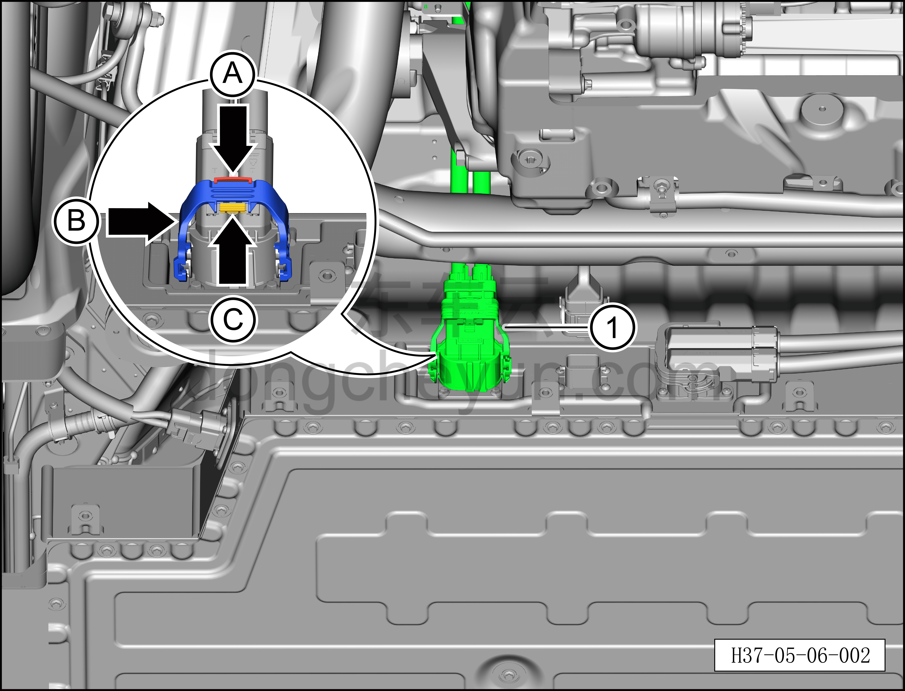

b. Вытяните фиксатор разъёма A для разблокировки, удерживая кнопку фиксации разъёма B, поверните рукоятку разъёма C, отсоедините разъём① высоковольтного жгута заднего электродвигателя (со стороны тяговой батареи).

**Внимание:**

**- После снятия закройте высоковольтный порт, соединяющий высоковольтный жгут заднего электродвигателя (со стороны тяговой батареи), чистым изолирующим защитным колпаком, чтобы предотвратить попадание посторонних предметов или случайное прикосновение.**

c. Вытяните фиксатор разъёма A, отсоедините разъём① высоковольтного жгута бортового зарядного устройства (со стороны тяговой батареи).

**Внимание:**

**- После снятия закройте высоковольтный порт, к которому подключается высоковольтный жгут бортового зарядного устройства (со стороны тяговой батареи), чистой изолирующей защитной крышкой, чтобы предотвратить попадание посторонних предметов или случайное касание.**

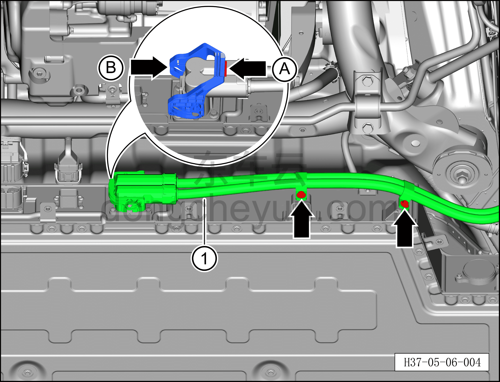

d. С помощью торцевой головки на 10 мм выверните 2 крепёжных болта кронштейна высоковольтного жгута комбинированного разъёма быстрой/медленной зарядки.

Момент затяжки болта: 8±1 Н·м

e. Вытяните фиксатор разъёма A для разблокировки, поверните рукоятку разъёма B, отсоедините разъём① высоковольтного жгута комбинированного разъёма быстрой/медленной зарядки (со стороны тяговой батареи).

**Внимание:**

**- После снятия закройте высоковольтный порт, соединяющий высоковольтный жгут комбинированного разъёма быстрой/медленной зарядки (со стороны тяговой батареи), чистым изолирующим защитным колпаком, чтобы предотвратить попадание посторонних предметов или случайное прикосновение.**

f. Вытяните фиксатор разъёма A, отсоедините разъём① высоковольтного жгута PTC-компрессора (со стороны тяговой батареи).

**Внимание:**

**- После снятия закройте высоковольтный порт, к которому подключается высоковольтный жгут PTC-компрессора (со стороны тяговой батареи), чистой изолирующей защитной крышкой, чтобы предотвратить попадание посторонних предметов или случайное касание.**

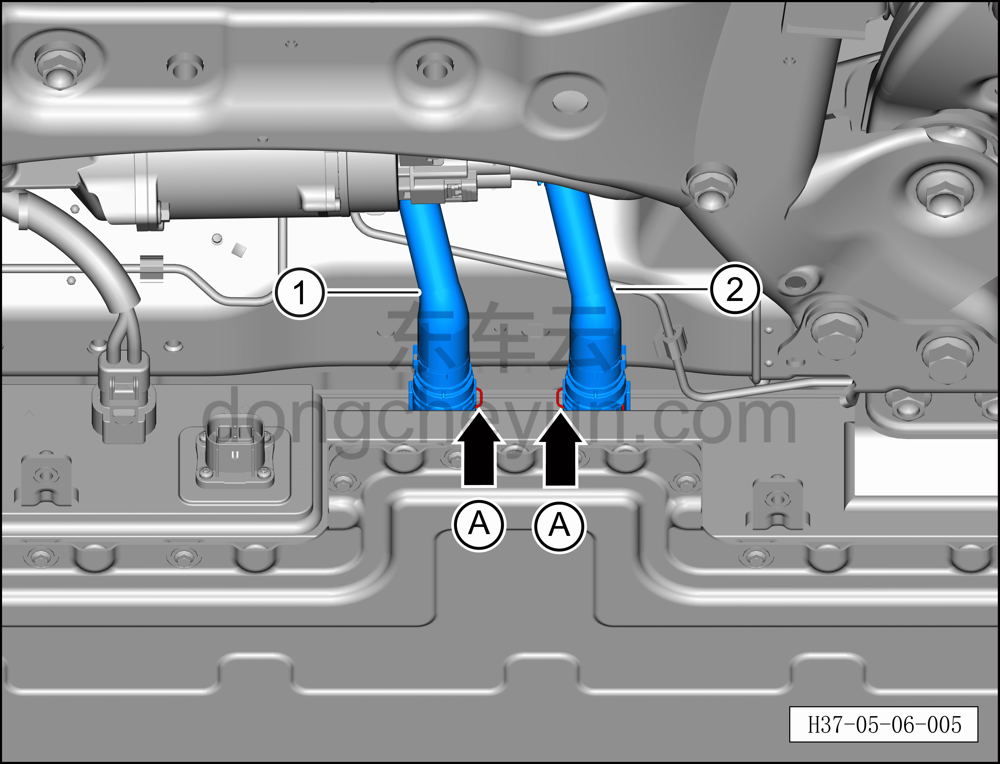

g. Используя плоскую отвёртку, выньте стопорное кольцо A патрубков подачи и обратки, отсоедините патрубок обратки① и патрубок подачи② тяговой батареи.

**Внимание:**

**- После снятия высокого напряжения необходимо выждать 15 минут для остывания автомобиля, чтобы убедиться, что охлаждающая жидкость остыла до температуры, безопасной для касания рукой.**

**- После отсоединения патрубков подачи и обратки охлаждающей жидкости тяговой батареи вытрите вытекшую охлаждающую жидкость нетканым материалом, чтобы облегчить проверку после завершения установки.**

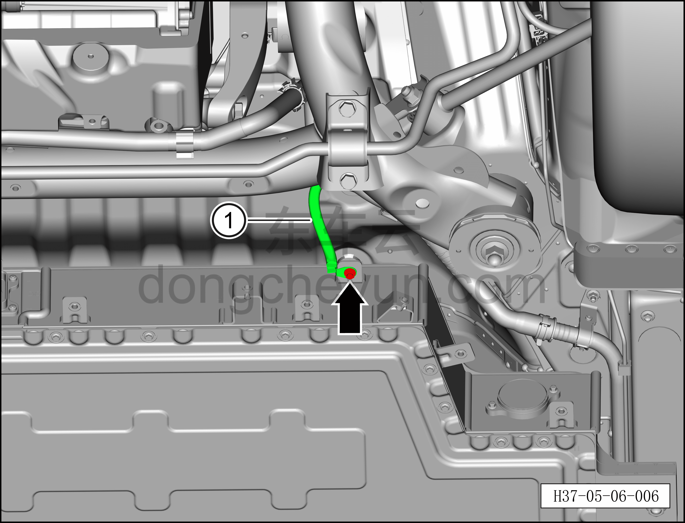

h. Используя торцевую головку на 10 мм, выверните крепёжный болт жгута заземления тяговой батареи.

Момент затяжки болта: 8±1 Н·м

i. Отсоедините жгут заземления① тяговой батареи.

j. Используя торцевую головку на 13 мм, выверните 4 крепёжных болта тяговой батареи.

Момент затяжки болта: 55±6 Н·м

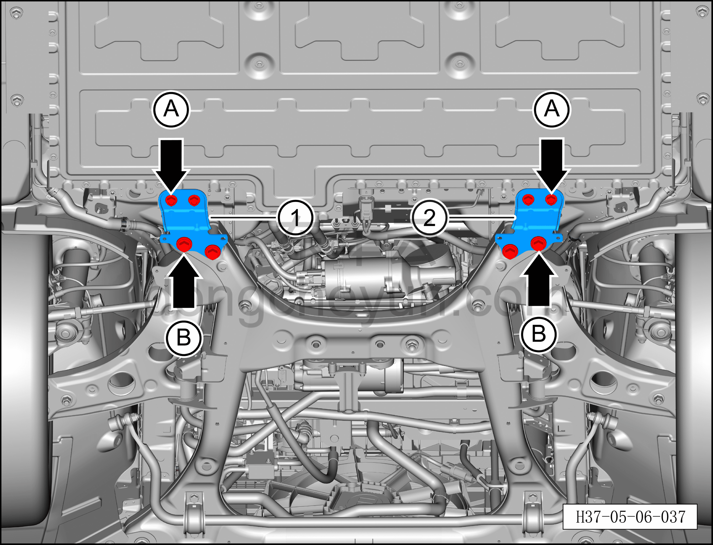

k. Используя торцевую головку на 18 мм, выверните 4 крепёжных болта A левой и правой задних усилительных пластин переднего подрамника.

Момент затяжки болта A: 105±5 Н·м

l. Используя торцевую головку на 21 мм, выверните 4 крепёжных болта B левой и правой задних усилительных пластин переднего подрамника.

Момент затяжки болта B: 164-215 Н·м

m. Снимите левую① и правую② задние усилительные пластины переднего подрамника.

**Примечание:**

**- При снятии крепёжных болтов левой и правой задних усилительных пластин переднего подрамника оставьте диагонально расположенный болт, одной рукой поддерживайте левую/правую заднюю усилительную пластину переднего подрамника, а другой рукой отворачивайте её крепёжный болт, чтобы предотвратить внезапное падение левой/правой задней усилительной пластины переднего подрамника и травмирование персонала.**

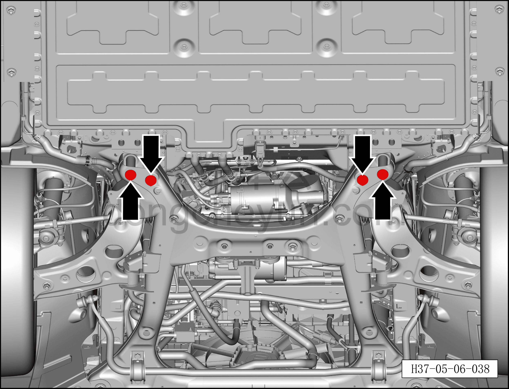

n. Вкрутите 4 крепёжных болта левой и правой задних усилительных пластин переднего подрамника и затяните торцевой головкой на 21 мм.

Момент затяжки болтов: 164-215 Н·м

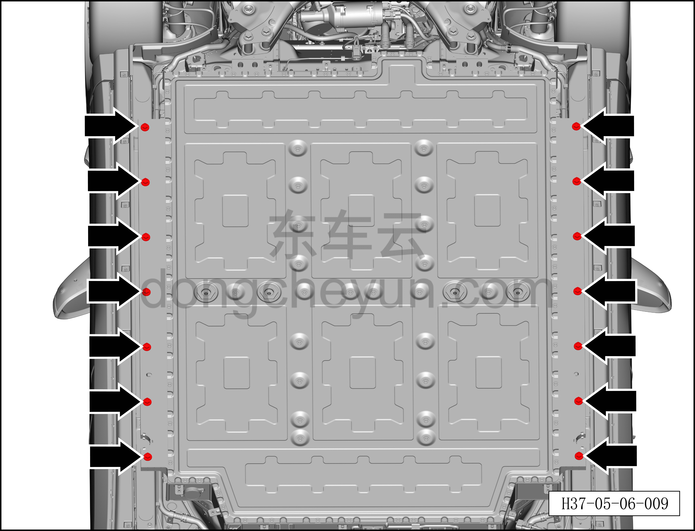

o. Используя платформу-подъёмник для тяговой батареи, установите на платформу-подъёмник поддон тяговой батареи, медленно поднимите платформу-подъёмник так, чтобы поддон полностью прилегал и слегка касался тяговой батареи, не допуская сдавливания, убедитесь, что тяговая батарея устойчиво расположена на платформе-подъёмнике.

p. Используя торцевую головку на 18 мм, в порядке крест-накрест по диагонали выверните за несколько проходов 14 крепёжных болтов тяговой батареи.

Момент затяжки болта: 105±5 Н·м

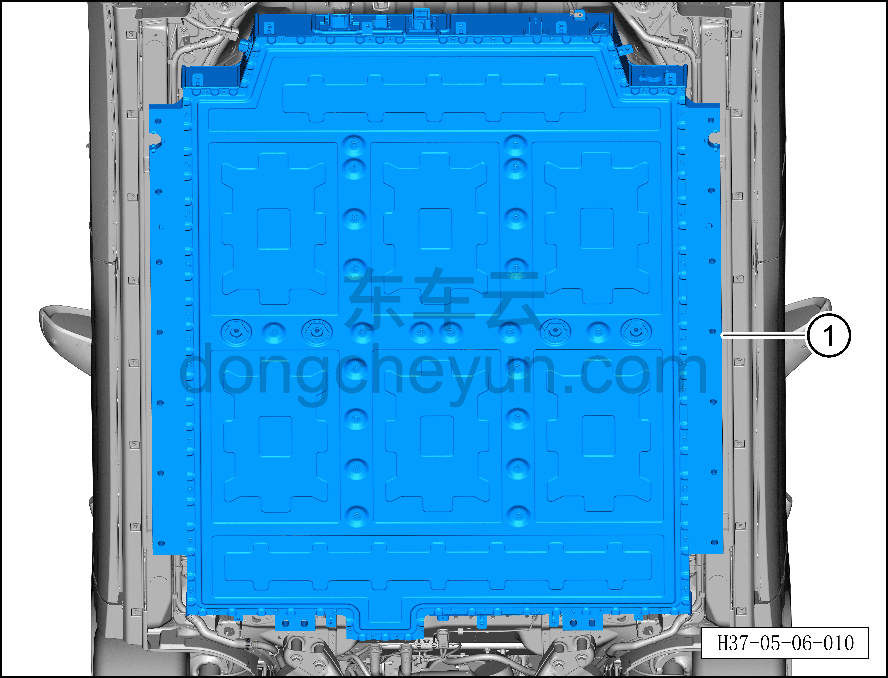

q. С помощью двух человек, используя платформу-подъёмник для тяговой батареи, медленно опустите тяговую батарею①.

**Внимание:**

**- В процессе снятия следите за отсутствием помех вокруг тяговой батареи, чтобы не повредить другие детали.**

**Порядок установки**

**Внимание:**

**-При работе с высоковольтными компонентами обязательно используйте изолирующие перчатки и изолирующий инструмент.**

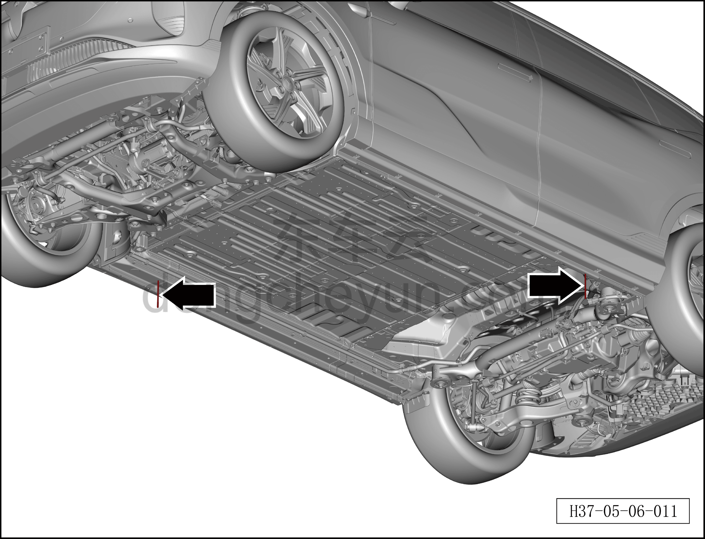

a. Установите специальный монтажный инструмент тяговой батареи (H52255001) по диагонали в отверстия для установочных болтов кузова тяговой батареи.

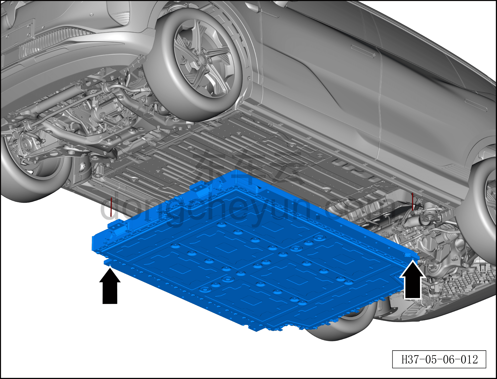

b. С помощью двух человек, используя платформу-подъёмник для тяговой батареи, медленно приподнимите тяговую батарею в сборе, отрегулируйте положение тяговой батареи, совместите два диагонально расположенных монтажных отверстия тяговой батареи со специальным инструментом для установки тяговой батареи, убедитесь, что тяговая батарея точно установлена в правильное монтажное положение.

c. Снимите специальный инструмент для установки тяговой батареи, используя торцевую головку на 18 мм, предварительно затяните в порядке крест-накрест по диагонали 14 крепёжных болтов тяговой батареи, затем затяните 14 крепёжных болтов динамометрическим ключом в порядке крест-накрест по диагонали.

Момент затяжки болта: 105±5 Н·м

d. Используя торцевую головку на 21 мм, выверните 4 крепёжных болта левой и правой задних усилительных пластин переднего подрамника.

Момент затяжки болтов: 164-215 Н·м

e. Совместите левую① и правую② задние усилительные пластины переднего подрамника с местом установки переднего подрамника, вкрутите 4 крепёжных болта A и 4 крепёжных болта B левой и правой задних усилительных пластин переднего подрамника.

f. Используя торцевую головку на 18 мм, затяните 4 крепёжных болта A левой и правой задних усилительных пластин переднего подрамника.

Момент затяжки болта A: 105±5 Н·м

g. Используя торцевую головку на 21 мм, затяните 4 крепёжных болта B левой и правой задних усилительных пластин переднего подрамника.

Момент затяжки болта B: 164-215 Н·м

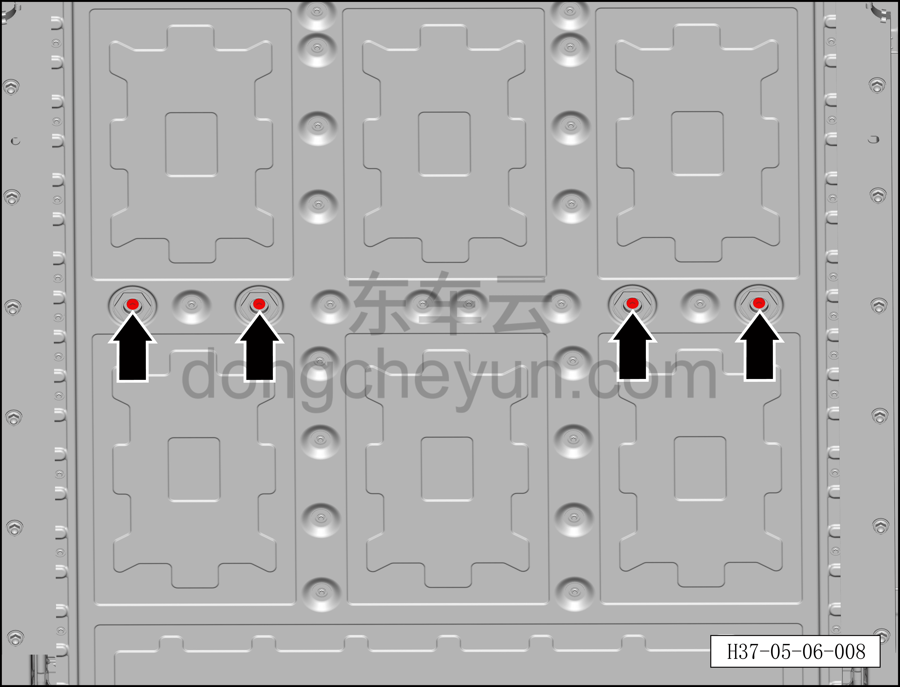

h. Используя торцевую головку на 13 мм, в порядке от центра к краям затяните 4 крепёжных болта тяговой батареи.

Момент затяжки болта: 55±6 Н·м

i. Совместите жгут заземления① тяговой батареи с местом установки тяговой батареи, вкрутите крепёжный болт жгута заземления тяговой батареи и затяните торцевой головкой на 10 мм.

Момент затяжки болта: 8±1 Н·м

j. Совместите патрубок обратки① и патрубок подачи② тяговой батареи с портами установки на тяговой батарее и установите на место, нажмите на стопорное кольцо A патрубков до фиксации.

**Внимание:**

**- После завершения установки проверьте и убедитесь, что соединения патрубков закреплены надёжно.**

k. Снимите изолирующую защитную крышку с высоковольтного порта, установите разъём① высоковольтного жгута PTC-компрессора (со стороны тяговой батареи) на место, нажмите на фиксатор разъёма A до защёлкивания.

**Проверка:**

**- Потяните штекер высоковольтного жгута PTC-компрессора (со стороны тяговой батареи) наружу с усилием не более 20 Н (не тянуть за жгут); штекер высоковольтного жгута PTC-компрессора (со стороны тяговой батареи) не должен выниматься — убедитесь, что соединение выполнено правильно, затем повторно довставьте штекер высоковольтного жгута PTC-компрессора (со стороны тяговой батареи) строго перпендикулярно внутрь, чтобы предотвратить некачественное соединение из-за обратного вытягивания.**

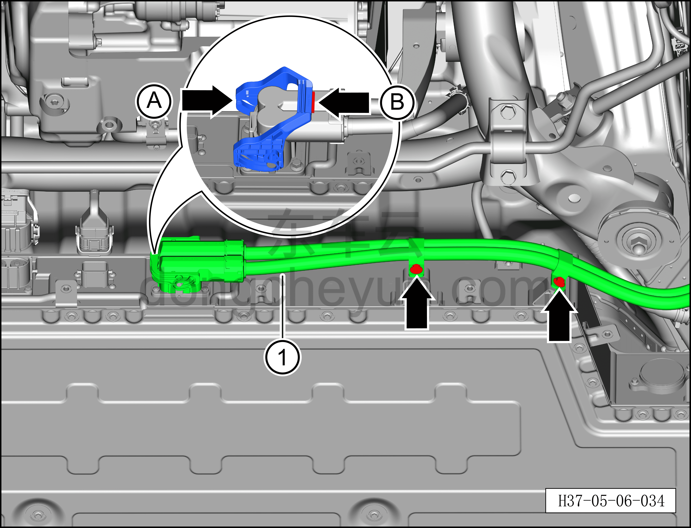

l. Снимите изолирующую защитную крышку с высоковольтного порта, установите разъём① высоковольтного жгута комбинированного разъёма быстрой/медленной зарядки (со стороны тяговой батареи) на место, поверните рукоятку разъёма A, нажмите на фиксатор разъёма B до фиксации.

m. Вкрутите 2 крепёжных болта кронштейна высоковольтного жгута комбинированного разъёма быстрой/медленной зарядки и затяните торцевой головкой на 10 мм.

Момент затяжки болта: 8±1 Н·м

**Проверка:**

**- Приложив усилие не более 20Н, потяните наружу разъём высоковольтного жгута комбинированного разъёма быстрой/медленной зарядки (со стороны тяговой батареи) (не тянуть за жгут); разъём высоковольтного жгута комбинированного разъёма быстрой/медленной зарядки (со стороны тяговой батареи) не должен выниматься — это подтверждает надёжность соединения; затем повторно довставьте разъём высоковольтного жгута комбинированного разъёма быстрой/медленной зарядки (со стороны тяговой батареи) строго перпендикулярно вовнутрь, чтобы обратное движение не привело к плохому контакту.**

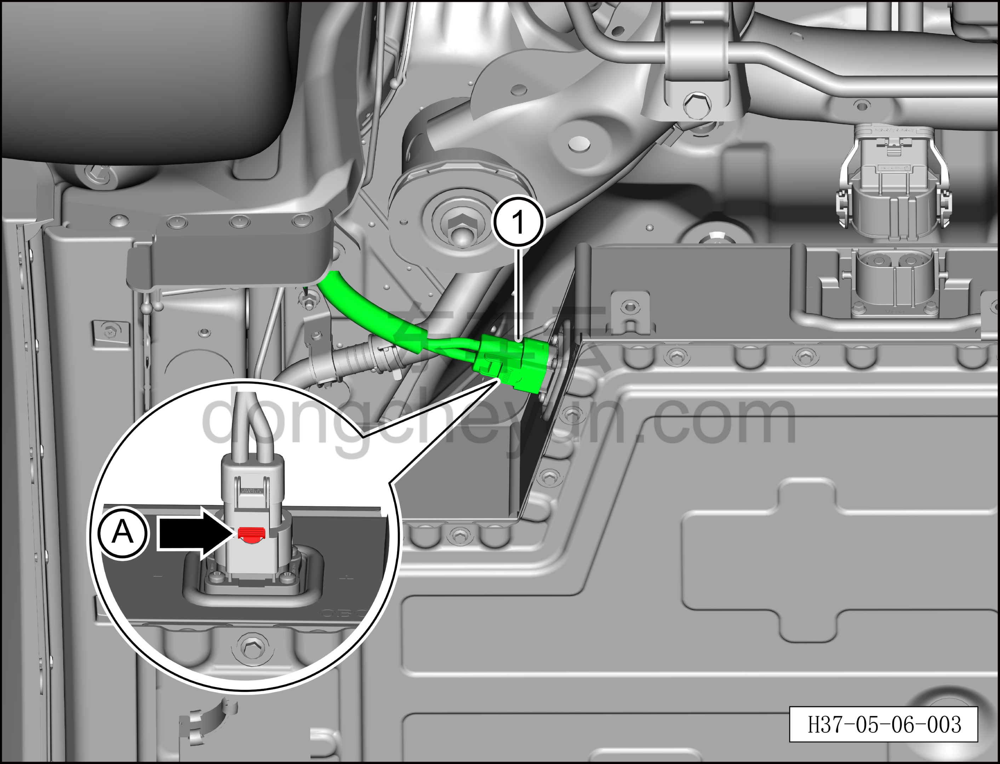

n. Снимите изолирующую защитную крышку с высоковольтного порта, установите разъём① высоковольтного жгута бортового зарядного устройства (со стороны тяговой батареи) на место, нажмите на фиксатор разъёма A до защёлкивания.

**Проверка:**

**- Потяните штекер высоковольтного жгута бортового зарядного устройства (со стороны тяговой батареи) наружу с усилием не более 20 Н (не тянуть за жгут); штекер высоковольтного жгута бортового зарядного устройства (со стороны тяговой батареи) не должен выниматься — убедитесь, что соединение выполнено правильно, затем повторно довставьте штекер высоковольтного жгута бортового зарядного устройства (со стороны тяговой батареи) строго перпендикулярно внутрь, чтобы предотвратить некачественное соединение из-за обратного вытягивания.**

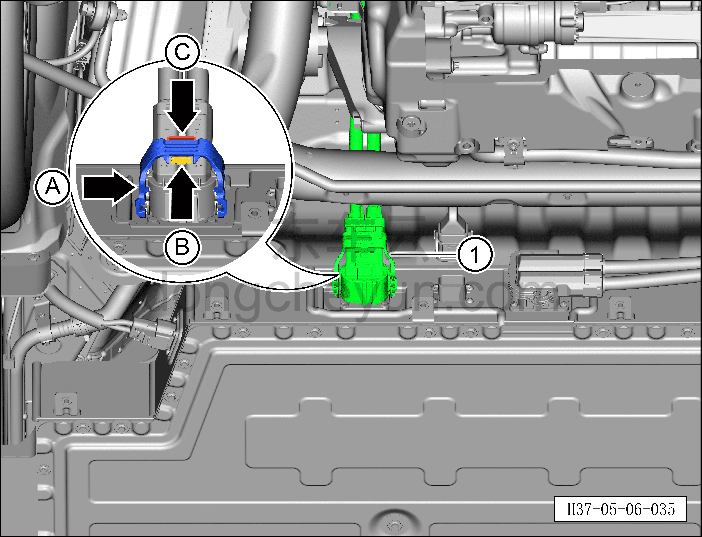

o. Снимите изолирующую защитную крышку с высоковольтного порта, установите разъём① высоковольтного жгута заднего электродвигателя (со стороны тяговой батареи) на место, поверните рукоятку разъёма A до фиксации в положении B, нажмите на фиксатор разъёма C до защёлкивания.

**Проверка:**

**- Потяните штекер высоковольтного жгута заднего электродвигателя (со стороны тяговой батареи) наружу с усилием не более 20 Н (не тянуть за жгут); штекер высоковольтного жгута заднего электродвигателя (со стороны тяговой батареи) не должен выниматься — убедитесь, что соединение выполнено правильно, затем повторно довставьте штекер высоковольтного жгута заднего электродвигателя (со стороны тяговой батареи) строго перпендикулярно внутрь, чтобы предотвратить некачественное соединение из-за обратного вытягивания.**

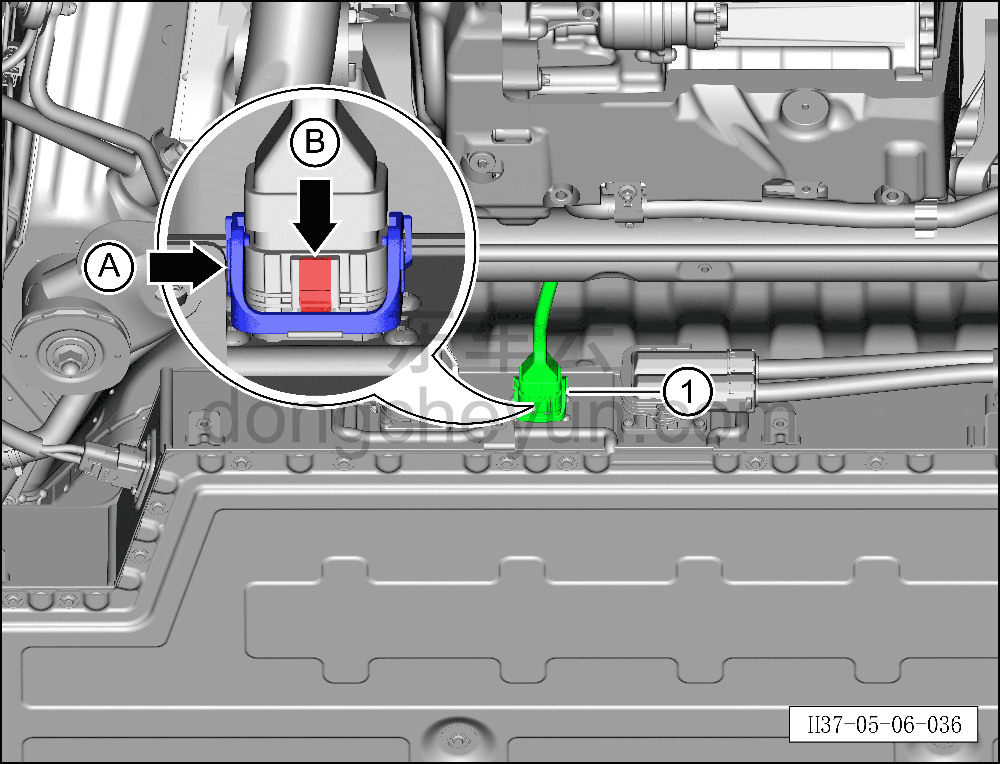

p. Снимите изолирующую защитную крышку с высоковольтного порта, установите разъём① жгута кузова на место, поверните рукоятку разъёма A до защёлкивания фиксатором разъёма B.

**Проверка:**

**- Потяните штекер разъёма жгута кузова наружу с усилием не более 20 Н (не тянуть за жгут); штекер разъёма жгута кузова не должен выниматься — убедитесь, что соединение выполнено правильно, затем повторно довставьте штекер разъёма жгута кузова строго перпендикулярно внутрь, чтобы предотвратить некачественное соединение из-за обратного вытягивания.**

**Примечание**

**При замене тяговой батареи на новую после завершения замены необходимо выполнить следующие операции с помощью диагностического сканера или удалённой диагностики:**

**- Сначала прошить программное обеспечение до последней версии;**

**- После успешного обновления программного обеспечения выполнить процедуру замены детали для контроллера.**

**Внимание:**

**- До и после ремонта высоковольтной системы необходимо использовать измеритель сопротивления изоляции для проверки высоковольтных компонентов на утечку тока, иначе выполнять операции запрещается.**

**- При замене тяговой батареи необходимо выполнить сопряжение новой тяговой батареи с помощью диагностического сканера.**

**- После завершения установки подключите диагностический сканер, проверьте наличие кодов неисправностей; при их наличии устраните причину и удалите коды неисправностей.**

**- После завершения установки залейте новую охлаждающую жидкость и выполните удаление воздуха (прокачку).**

**- После завершения установки проверьте соединения трубопроводов на признаки просачивания воды, убедитесь, что в местах соединения патрубков нет утечек.**

**- После завершения установки подключите зарядный кабель, убедитесь, что система зарядки автомобиля работает нормально и автомобиль функционирует исправно.**
