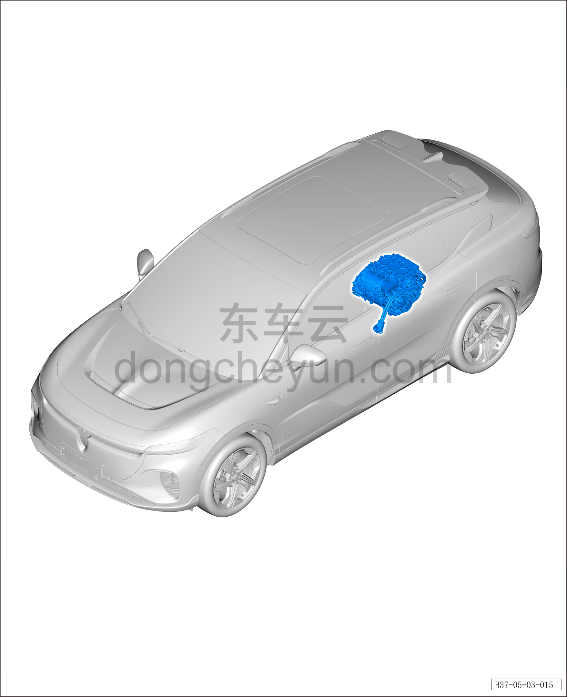

# Задний привод (800 В)

> Силовая система на новых источниках энергии › Система электропривода › Расположение компонентов  
> Оригинал: `后驱（800V）` · [dongcheyun 56746](https://dongcheyun.com/p/56746), страница `228ea9b4237747da8ff09e97362b376b` · [оглавление](../README.md)

