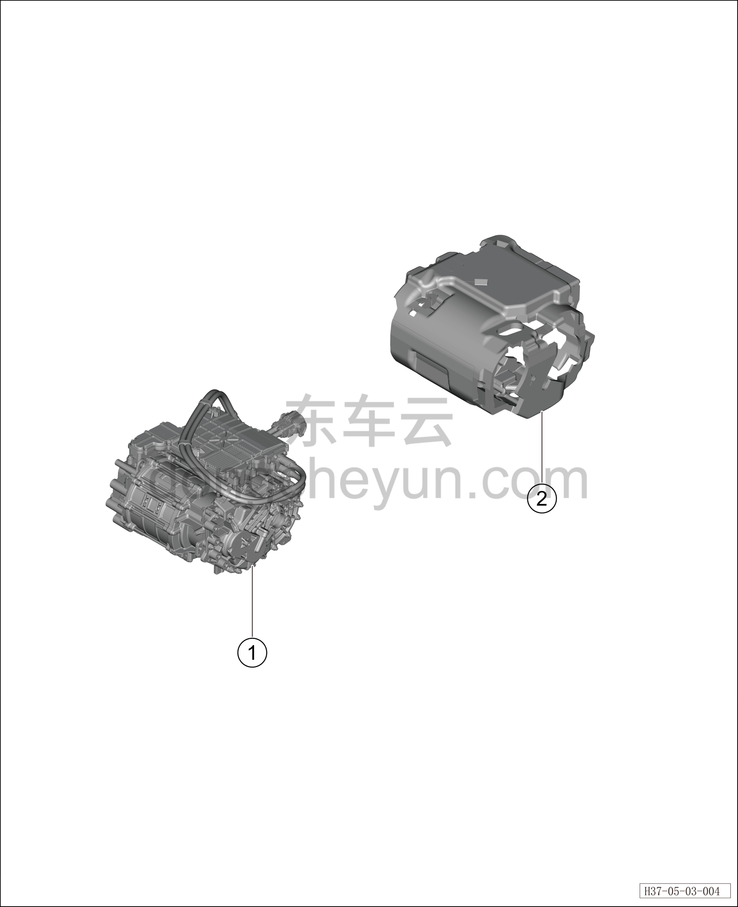

# Узел переднего электродвигателя

> Силовая система на новых источниках энергии › Система электропривода › Покомпонентный вид (деталировка)  
> Оригинал: `前电机组件` · [dongcheyun 56746](https://dongcheyun.com/p/56746), страница `52215faad1314b7ca1c7e6714d6f2e10` · [оглавление](../README.md)

| № | Наименование детали | Кол-во на автомобиль | Примечание |
|---|---|---|---|
| 1 | Передний тяговый электродвигатель | 1 |   |
| 2 | Кожух переднего электродвигателя | 1 |   |
