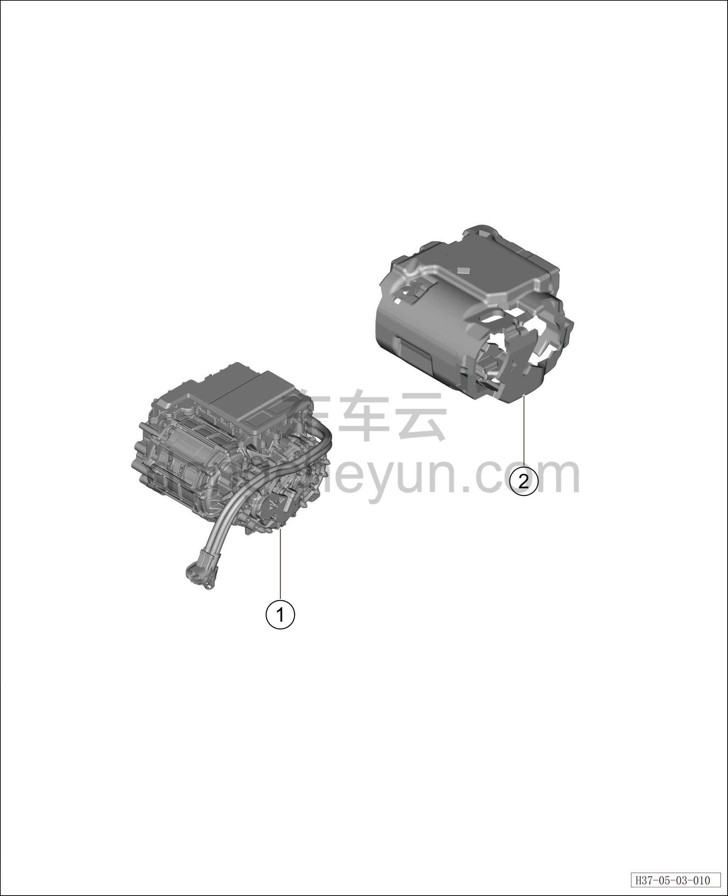

# Узел заднего электродвигателя (400 В)

> Силовая система на новых источниках энергии › Система электропривода › Покомпонентный вид (деталировка)  
> Оригинал: `后电机组件（400V）` · [dongcheyun 56746](https://dongcheyun.com/p/56746), страница `7b57780df34c4f98872f348aa1b96ddd` · [оглавление](../README.md)

| № | Наименование детали | Кол-во на автомобиль | Примечание |
|---|---|---|---|
| 1 | Задний тяговый электродвигатель | 1 | TZ220XSP02 |
| 2 | Кожух переднего электродвигателя | 1 | Полный привод: установка заднего электродвигателя |
