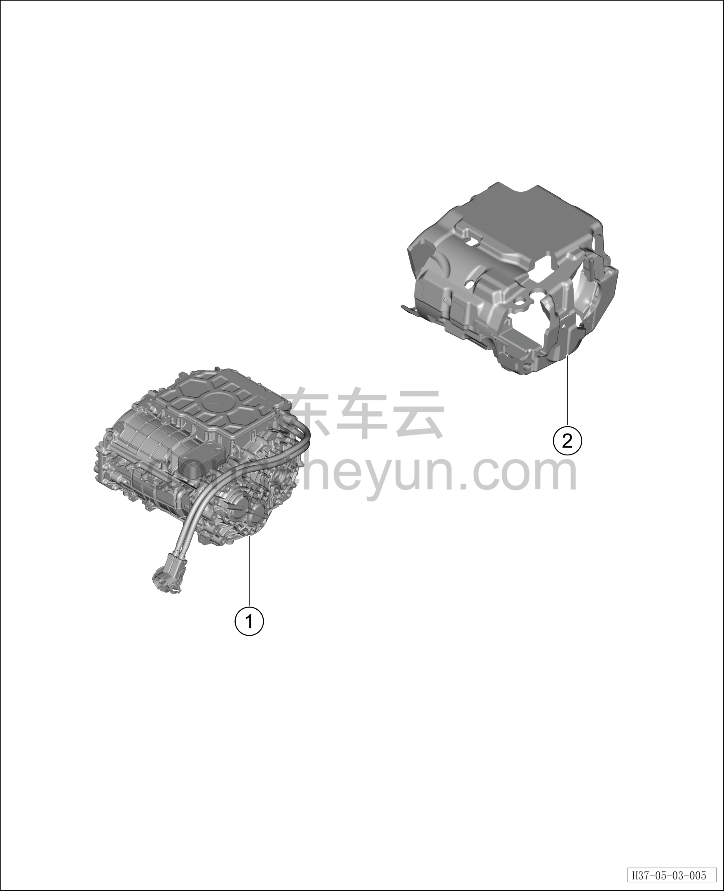

# Узел заднего электродвигателя (800 В)

> Силовая система на новых источниках энергии › Система электропривода › Покомпонентный вид (деталировка)  
> Оригинал: `后电机组件（800V）` · [dongcheyun 56746](https://dongcheyun.com/p/56746), страница `7fa6dafb5c624c7fa64a58c3e345cf7b` · [оглавление](../README.md)

| № | Наименование детали | Кол-во на автомобиль | Примечание |
|---|---|---|---|
| 1 | Задний тяговый электродвигатель | 1 | TZ225XYH02 |
| 2 | Кожух заднего электродвигателя | 1 |   |
