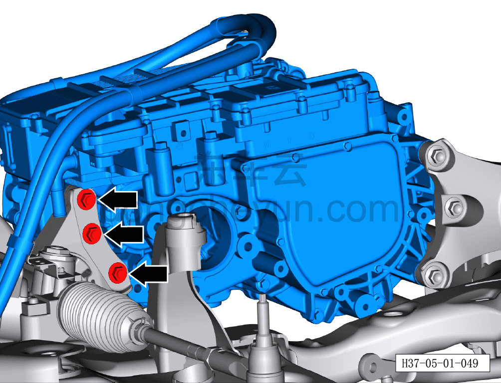
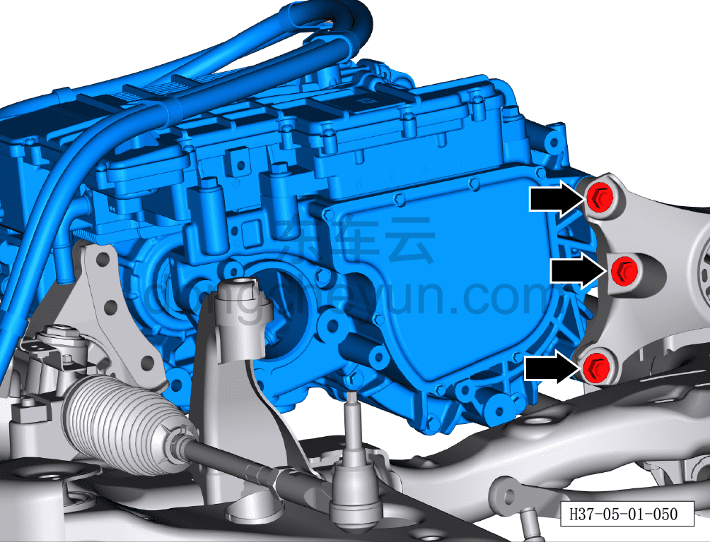
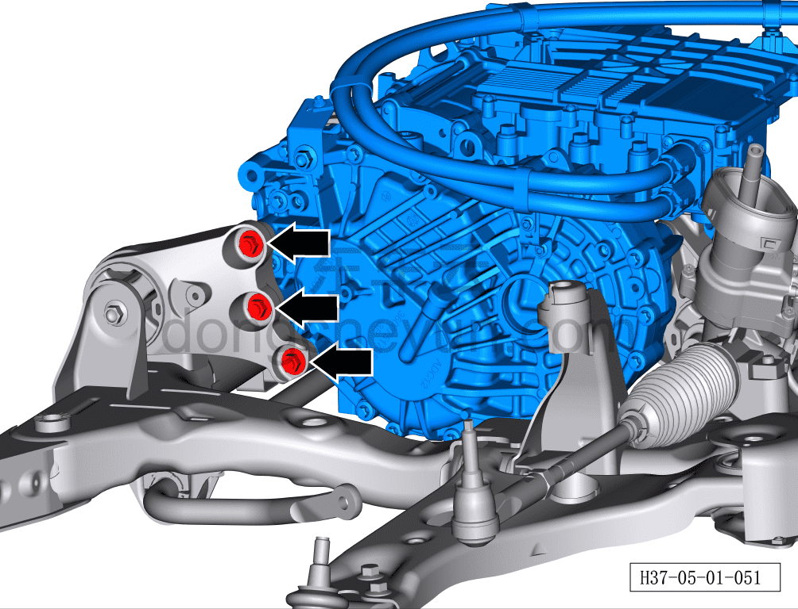
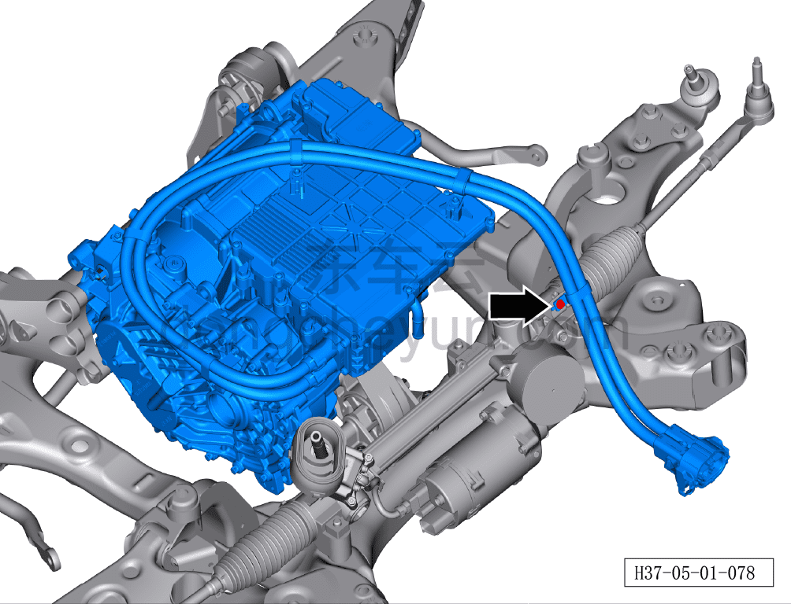
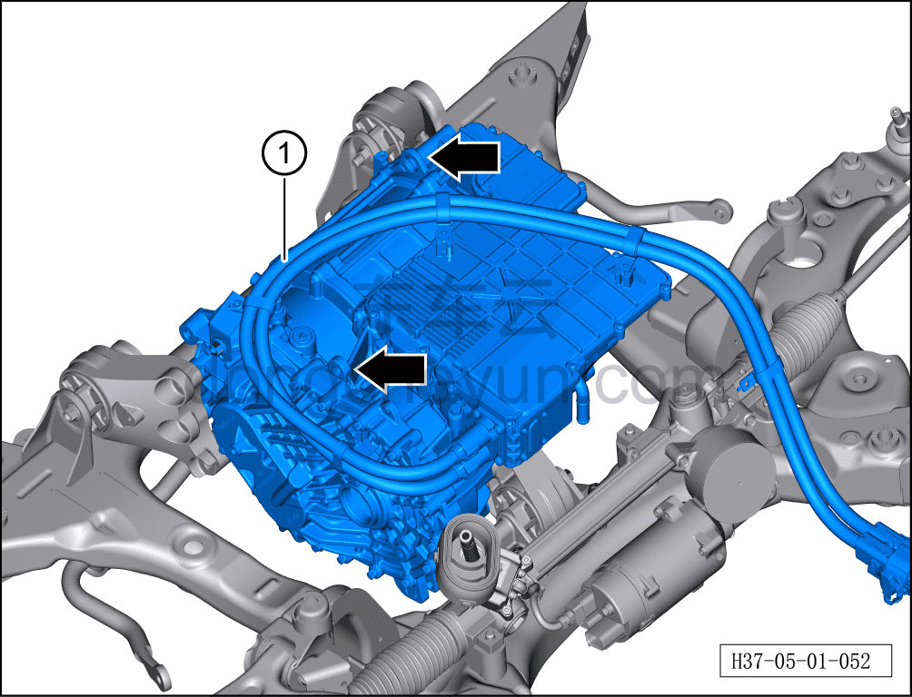

# Снятие и установка переднего тягового электродвигателя

> Силовая система на новых источниках энергии › Система электропривода › Передняя система электропривода  
> Оригинал: `拆卸与安装前驱动电机` · [dongcheyun 56746](https://dongcheyun.com/p/56746), страница `a7858f5284f34403920072cfe2ffd2f9` · [оглавление](../README.md)

**Порядок снятия**

**Примечание:**

**- Обратите внимание на предупреждения и указания по ремонту высоковольтной системы, подробнее см. [5.1.1 Меры предосторожности](001-указания.md)**

1. Выключите все электроприборы, отключите питание.

2. Выполните обесточивание автомобиля для ремонта. См. [3.1.4.1 Обесточивание автомобиля](../03-техническое-обслуживание/005-обесточивание-автомобиля.md)

3. Слейте охлаждающую жидкость переднего тягового электродвигателя. См. [3.1.5.1 Замена охлаждающей жидкости тягового электродвигателя и тяговой батареи](../03-техническое-обслуживание/006-замена-охлаждающей-жидкости-тягового-электродвигателя.md)

4. Соберите (откачайте) хладагент. См. [10.1.6.12 Сбор/откачка/заправка хладагента](../10-кондиционер/045-сбор-вакуумирование-заправка-хладагента.md)

5. Снимите передний подрамник и передний тяговый электродвигатель. См. [6.2.9.1 Снятие и установка переднего подрамника и переднего тягового электродвигателя в сборе](../06-система-шасси/022-снятие-и-установка-переднего-подрамника-и-переднего.md)

6. Снимите кронштейн компрессора. См. [10.1.5.6 Снятие и установка кронштейна компрессора (полноприводные версии)](../10-кондиционер/015-снятие-и-установка-кронштейна-компрессора-версия-awd.md)

7. Снимите левый передний приводной вал. См. [6.7.11.1 Снятие и установка левого переднего приводного вала (полный привод)](../06-система-шасси/119-снятие-и-установка-левого-переднего-приводного-вала.md)

8. Снимите правый передний приводной вал. См. [6.7.11.2 Снятие и установка правого переднего приводного вала (полный привод)](../06-система-шасси/120-снятие-и-установка-правого-переднего-приводного-вала.md)

9. Снятие переднего тягового электродвигателя.

a. Снимите кожух переднего электродвигателя, используя торцевую головку на 15 мм, выверните 3 крепёжных болта задней опоры переднего электродвигателя.

Момент затяжки болта: 100±10 Н·м

**Внимание:**

**- В процессе снятия используйте подъёмную траверсу, зацепив 2 рым-петли электродвигателя, чтобы передний тяговый электродвигатель оставался устойчивым**

b. Используя торцевую головку на 15 мм, выверните 3 крепёжных болта правой опоры переднего электродвигателя.

Момент затяжки болта: 100±10 Н·м

c. Используя торцевую головку на 15 мм, выверните 3 крепёжных болта левой опоры переднего электродвигателя.

Момент затяжки болта: 100±10 Н·м

d. Используя торцевую головку на 8 мм, выверните крепёжный болт высоковольтного жгута переднего тягового электродвигателя.

Момент затяжки болта: 8±1 Н·м.

e. Зацепите 2 рым-петли переднего тягового электродвигателя, с помощью двух человек, используя подъёмную траверсу, медленно извлеките передний тяговый электродвигатель①.

**Порядок установки**

Установка выполняется в обратном порядке.

**Внимание:**

**- При работе с высоковольтными компонентами обязательно используйте изолирующие перчатки и изолирующий инструмент.**

**- Согласно стандартным параметрам тягового электродвигателя, замените смазочное масло редуктора тягового электродвигателя на новое.**

**- Охлаждающую жидкость нельзя использовать повторно, смешивать, а также нельзя заменять охлаждающей жидкостью другого цвета.**

**- После завершения установки подключите диагностический сканер, проверьте наличие кодов неисправностей; при их наличии устраните причину и удалите коды неисправностей.**

**- Запустите автомобиль, убедитесь, что электродвигатель работает без отклонений.**

**- После завершения установки всех узлов необходимо выполнить регулировку развал-схождения и провести дорожное испытание автомобиля, убедиться в отсутствии увода и посторонних шумов.**

**- После завершения испытательной поездки поднимите автомобиль на подъёмнике и убедитесь в отсутствии утечек масла.**
