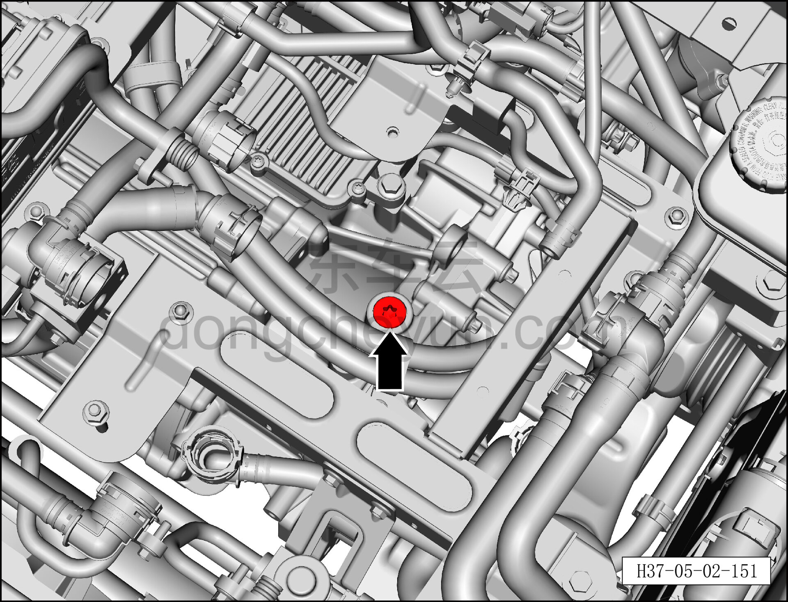

# Снятие и установка маслозаливной пробки переднего тягового электродвигателя

> Силовая система на новых источниках энергии › Система электропривода › Передняя система электропривода  
> Оригинал: `拆卸与安装前驱动电机加油螺塞` · [dongcheyun 56746](https://dongcheyun.com/p/56746), страница `a2c605c9a14547808178e584e8c5f90c` · [оглавление](../README.md)

**Порядок снятия**

**Примечание:**

**- Обратите внимание на предупреждения и указания по ремонту высоковольтной системы, подробнее см. [5.1.1 Меры предосторожности](001-указания.md)**

1. Выключите все электроприборы, отключите питание.

2. Выполните обесточивание автомобиля для ремонта. См. [3.1.4.1 Обесточивание автомобиля](../03-техническое-обслуживание/005-обесточивание-автомобиля.md)

3. Слейте охлаждающую жидкость переднего тягового электродвигателя. См. [3.1.5.1 Замена охлаждающей жидкости тягового электродвигателя и тяговой батареи](../03-техническое-обслуживание/006-замена-охлаждающей-жидкости-тягового-электродвигателя.md)

4. Соберите (откачайте) хладагент. См. [10.1.6.12 Сбор/откачка/заправка хладагента](../10-кондиционер/045-сбор-вакуумирование-заправка-хладагента.md)

5. Снимите узел интегрированного расширительного бачка с электрическим водяным насосом. См. [4.1.7.26 Снятие и установка узла интегрированного расширительного бачка с электрическим водяным насосом](../04-интегрированная-силовая-система/045-снятие-и-установка-интегрированного-расширительного.md)

6. Снятие маслозаливной пробки переднего тягового электродвигателя.

a. Выверните маслозаливную пробку узла переднего тягового электродвигателя, закройте отверстие пробки чистой ветошью, чтобы предотвратить попадание посторонних предметов.

b. Установите новую маслозаливную пробку.

Момент затяжки маслозаливного болта: 7±1 Н·м

**Внимание**

**-Заливная пробка является одноразовой деталью, повторно не использовать.**

**-В процессе работы масло должно храниться надлежащим образом, не допускать проливания, разбрызгивания, что может привести к травмам.**

**Порядок установки**

Установка выполняется в обратном порядке.

**Внимание:**

**- При работе с высоковольтными компонентами обязательно используйте изолирующие перчатки и изолирующий инструмент.**

**- Согласно стандартным параметрам тягового электродвигателя, залейте новое смазочное масло редуктора тягового электродвигателя.**

**- Охлаждающую жидкость нельзя использовать повторно, смешивать, а также нельзя заменять охлаждающей жидкостью другого цвета.**

**- После завершения установки подключите диагностический сканер, проверьте наличие кодов неисправностей; при их наличии устраните причину и удалите коды неисправностей.**

**- Запустите автомобиль, убедитесь, что электродвигатель работает без отклонений.**

**- После завершения установки всех узлов необходимо выполнить регулировку развал-схождения и провести дорожное испытание автомобиля, убедиться в отсутствии увода и посторонних шумов.**

**- После завершения испытательной поездки поднимите автомобиль на подъёмнике и убедитесь в отсутствии утечек масла.**
