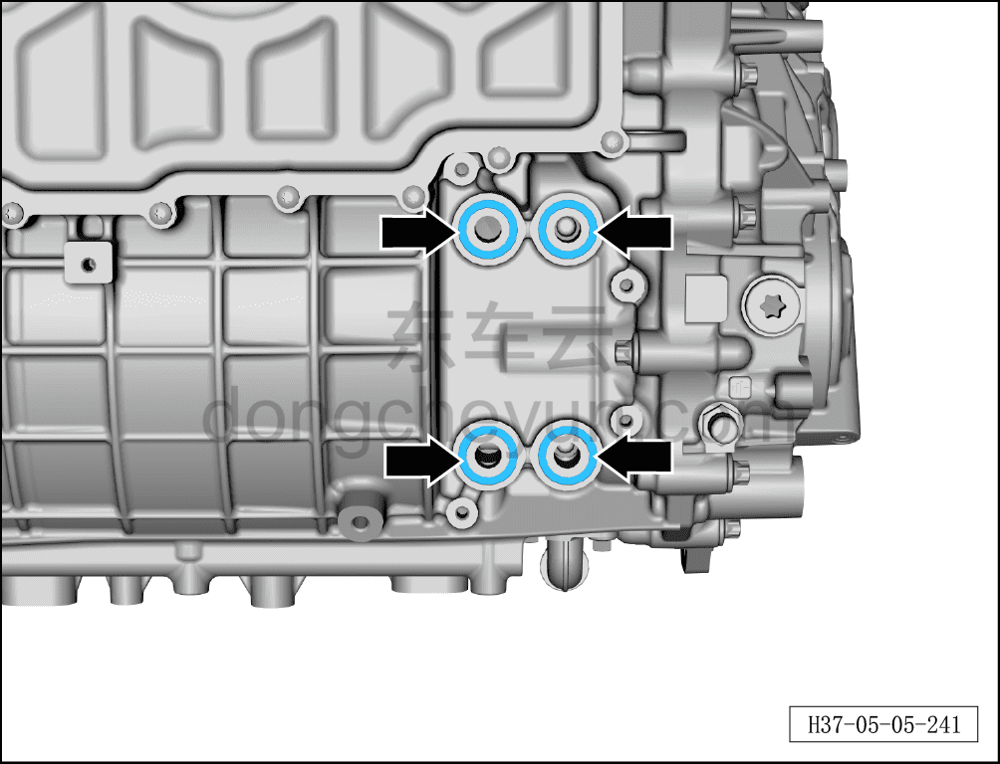
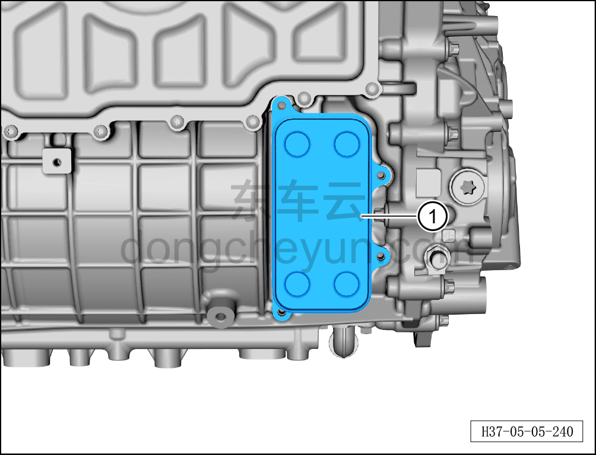
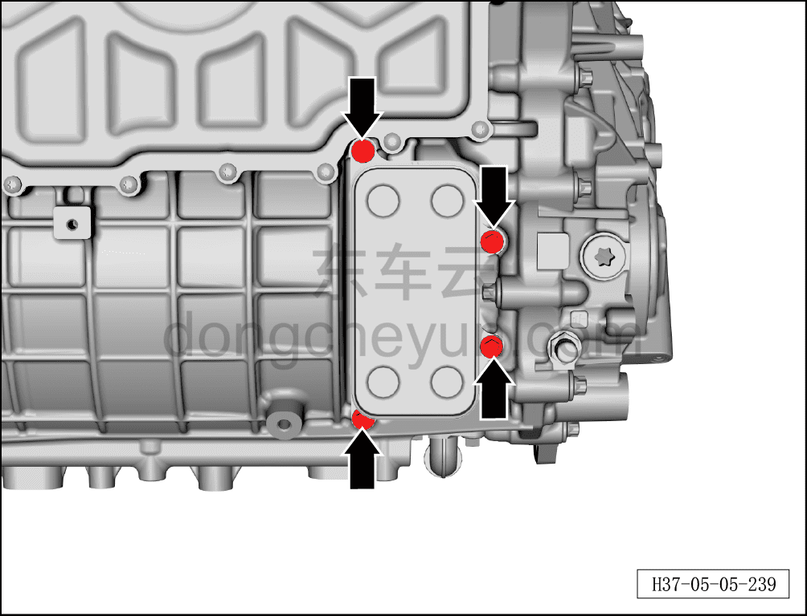

# Снятие и установка масляного радиатора (800 В)

> Силовая система на новых источниках энергии › Система электропривода › Задняя система электропривода  
> Оригинал: `拆卸与安装油冷器（800V）` · [dongcheyun 56746](https://dongcheyun.com/p/56746), страница `109dd41831a54b5f8e0fba8e1ed0307b` · [оглавление](../README.md)

**Порядок снятия**

**Примечание:**

**- Обратите внимание на предупреждения и указания по ремонту высоковольтной системы, подробнее см. [5.1.1 Меры предосторожности](001-указания.md)**

1. Выключить все электроприборы, обесточить автомобиль.

2. Выполните обесточивание автомобиля для ремонта. См. [3.1.4.1 Обесточивание автомобиля](../03-техническое-обслуживание/005-обесточивание-автомобиля.md)

3. Слейте охлаждающую жидкость. См. [3.1.5.1 Замена охлаждающей жидкости тягового электродвигателя и тяговой батареи](../03-техническое-обслуживание/006-замена-охлаждающей-жидкости-тягового-электродвигателя.md)

4. Слейте смазочное масло узла заднего тягового электродвигателя, см. [3.1.5.13 Замена смазочного масла узла заднего тягового электродвигателя (800 В)](../03-техническое-обслуживание/018-замена-смазочного-масла-заднего-тягового.md)

5. Снимите узел заднего тягового электродвигателя, см. [5.2.7.2 Снятие и установка заднего тягового электродвигателя (800 В)](024-снятие-и-установка-заднего-тягового-электродвигателя.md)

6. Снятие масляного радиатора.

a. Используя торцевую головку на 8 мм, выверните 4 крепёжных болта масляного радиатора.

Момент затяжки болтов составляет: 10±1 Н·м

**Примечание:**

**- Болты являются одноразовыми деталями, при установке необходимо заменить их на новые.**

b. Снимите масляный радиатор①.

**Примечание:**

**- Положите масляный радиатор на чистую рабочую поверхность в перевёрнутом положении.**

c. Снимите и утилизируйте 4 уплотнительных кольца круглого сечения.

**Примечание:**

**- Уплотнительные кольца являются одноразовыми деталями, после снятия повторное использование не допускается — при установке необходимо заменить их на новые уплотнительные кольца круглого сечения.**

**- После снятия масляного радиатора, если он не будет установлен обратно немедленно, необходимо закрыть места соединений чистым нетканым материалом, чтобы предотвратить попадание посторонних предметов и повреждение электродвигателя.**

Порядок установки

1. Установка масляного радиатора.

a. Очистите посадочные поверхности масляного радиатора и уплотнительных колец круглого сечения.

b. Установите 4 новых уплотнительных кольца круглого сечения в уплотнительные канавки.

c. Совместите с монтажными отверстиями, установите масляный радиатор①.

**Примечание:**

**- Перед установкой проверьте масляный радиатор на наличие повреждений, коррозии и т.п.; при обнаружении — замените.**

d. Установите 4 крепёжных болта масляного радиатора, затяните динамометрическим ключом в порядке, указанном на рисунке.

Момент затяжки составляет: 10±1 Н·м

2. Установите узел заднего тягового электродвигателя, см. [5.2.7.2 Снятие и установка заднего тягового электродвигателя (800 В)](024-снятие-и-установка-заднего-тягового-электродвигателя.md)

3. Залейте смазочное масло узла заднего тягового электродвигателя, см. [3.1.5.13 Замена смазочного масла узла заднего тягового электродвигателя (800 В)](../03-техническое-обслуживание/018-замена-смазочного-масла-заднего-тягового.md)

4. Залейте охлаждающую жидкость. См. [3.1.5.1 Замена охлаждающей жидкости тягового электродвигателя и тяговой батареи](../03-техническое-обслуживание/006-замена-охлаждающей-жидкости-тягового-электродвигателя.md)

5. Включение высокого напряжения, см. [3.1.4.1 Обесточивание автомобиля](../03-техническое-обслуживание/005-обесточивание-автомобиля.md)

**Внимание:**

**- Подключите минусовой провод аккумуляторной батареи.**

**- Подключите диагностический сканер, удалите коды неисправностей, запустите автомобиль, убедитесь, что электродвигатель работает без отклонений.**

**- После завершения установки всех узлов необходимо выполнить регулировку развал-схождения и провести дорожное испытание автомобиля, убедиться в отсутствии увода и посторонних шумов.**

**- После завершения дорожного испытания проверьте масляный радиатор на утечки; при их наличии необходимо устранить неисправность и выполнить установку повторно.**
