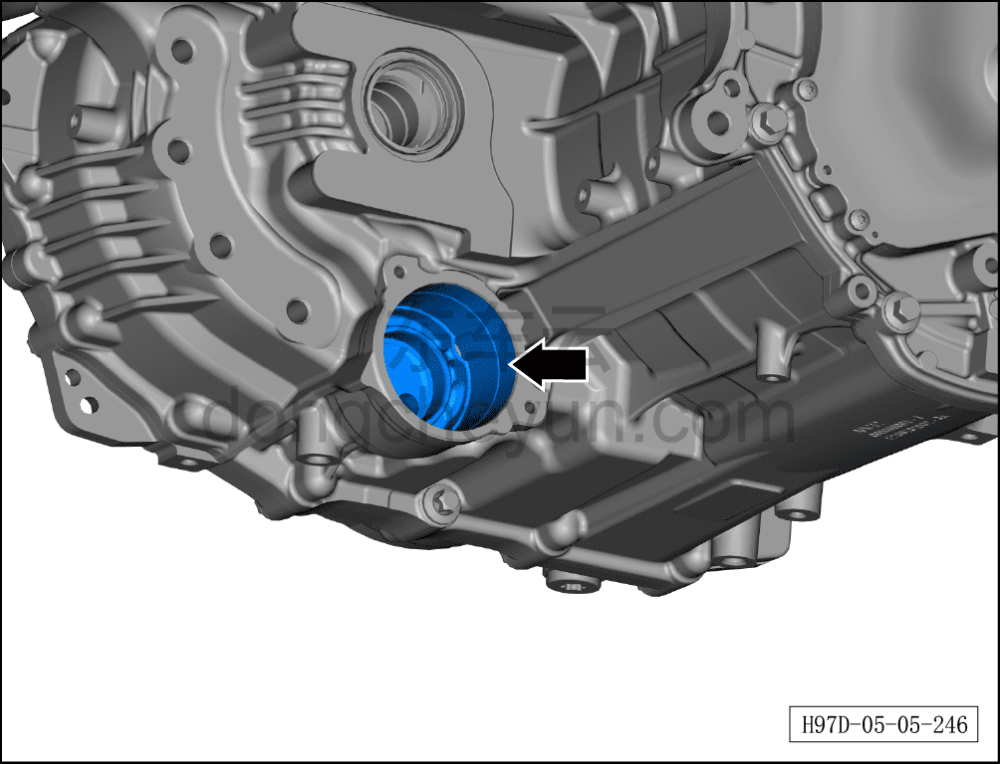
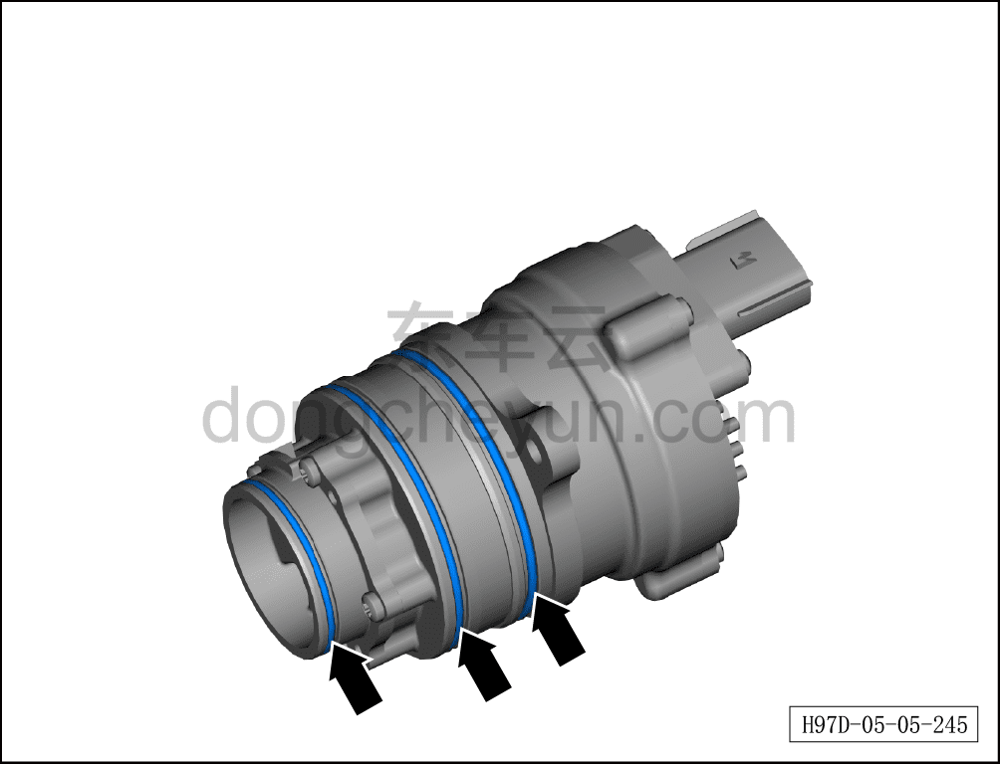
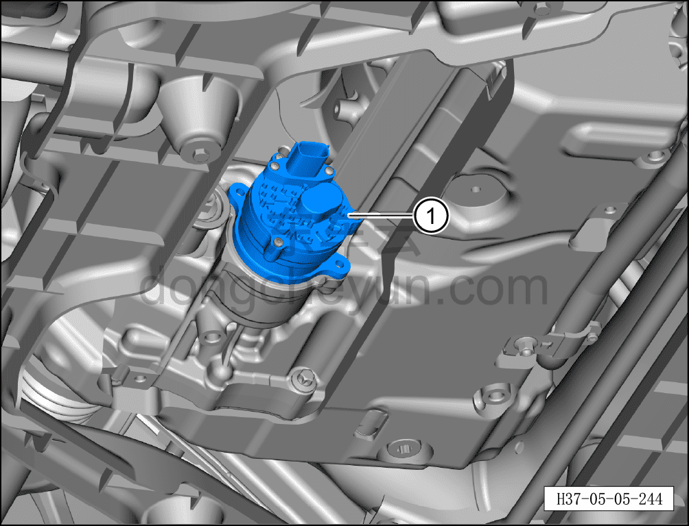
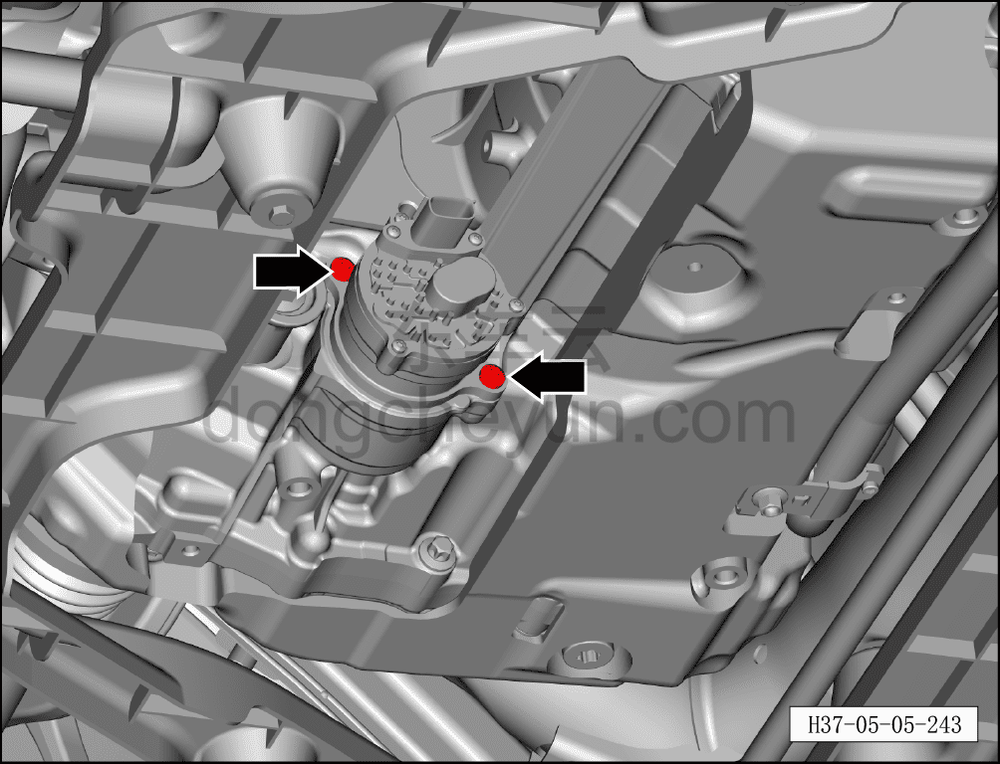
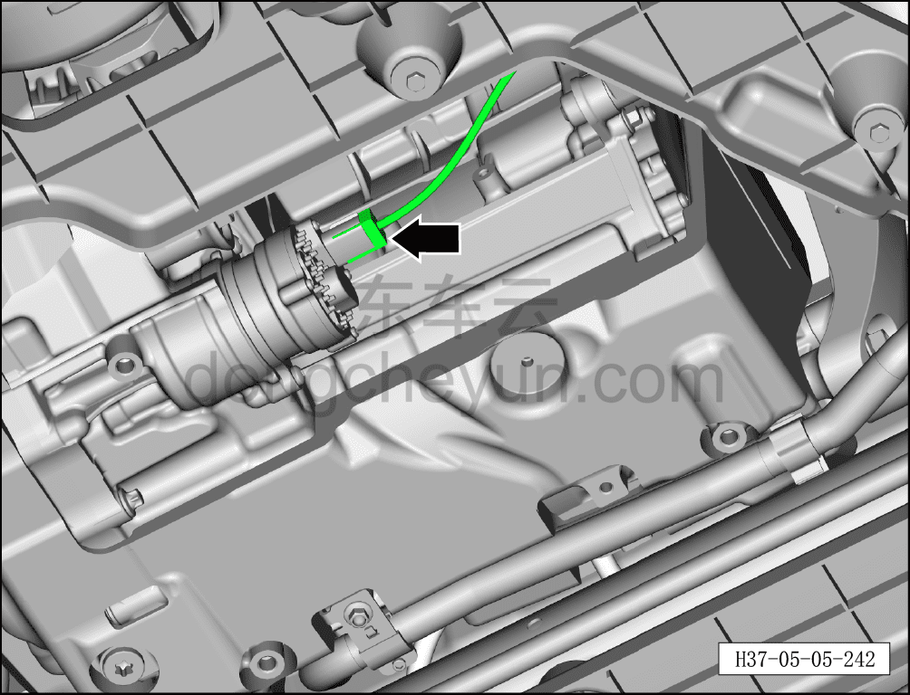

# Снятие и установка маслонасоса (800 В)

> Силовая система на новых источниках энергии › Система электропривода › Задняя система электропривода  
> Оригинал: `拆卸与安装油泵（800V）` · [dongcheyun 56746](https://dongcheyun.com/p/56746), страница `8c429fac2f144f3ea03b1970e8c271ae` · [оглавление](../README.md)

**Порядок снятия**

**Примечание:**

**- Обратите внимание на предупреждения и указания по ремонту высоковольтной системы, подробнее см. [5.1.1 Меры предосторожности](001-указания.md)**

**- Перед ремонтом убедитесь, что масло остыло.**

1. Выключить все электроприборы, обесточить автомобиль.

2. Выполните обесточивание автомобиля для ремонта. См. [3.1.4.1 Обесточивание автомобиля](../03-техническое-обслуживание/005-обесточивание-автомобиля.md)

3. Снимите заднюю нижнюю защитную панель, см. [8.6.4.4 Снятие и установка задней нижней защитной панели](../08-внутренняя-и-внешняя-отделка/194-снятие-и-установка-заднего-нижнего-защитного-щитка.md)

4. Слейте смазочное масло узла заднего тягового электродвигателя, см. [3.1.5.13 Замена смазочного масла узла заднего тягового электродвигателя (800 В)](../03-техническое-обслуживание/018-замена-смазочного-масла-заднего-тягового.md)

5. Снятие маслонасоса.

a. Удерживая фиксатор разъёма, отсоедините разъём маслонасоса.

b. Используя биту T30, выверните 2 крепёжных болта маслонасоса.

**Примечание:**

**- Болты являются одноразовыми деталями, при установке необходимо заменить их на новые.**

c. Снимите маслонасос①.

**Примечание:**

**- Положите маслонасос на чистую рабочую поверхность в перевёрнутом положении.**

**- В процессе снятия соблюдайте меры защиты, чтобы предотвратить попадание посторонних предметов внутрь полости.**

d. Снимите и утилизируйте 3 уплотнительных кольца круглого сечения.

**Примечание:**

**- Уплотнительные кольца являются одноразовыми деталями, после снятия повторное использование не допускается — при установке необходимо заменить их на новые уплотнительные кольца круглого сечения.**

**- После снятия маслонасоса, если он не будет установлен обратно немедленно, необходимо закрыть места соединений чистым нетканым материалом, чтобы предотвратить попадание посторонних предметов и повреждение электродвигателя.**

Порядок установки

1. Установка маслонасоса.

a. Очистите маслонасос и монтажные отверстия маслонасоса.

b. Установите новые уплотнительные кольца на маслонасос.

**Примечание:**

**- Нанесите смазку на поверхность уплотнительных колец, сохраняйте корпус чистым и обеспечьте защиту монтажного положения.**

c. Совместите маслонасос① с монтажными отверстиями, медленно вставьте, покачивая влево-вправо; амплитуда покачивания не должна быть слишком большой, до тех пор пока посадочные поверхности маслонасоса и корпуса не прилегут друг к другу.

**Примечание:**

**- В процессе установки следует избегать порезов кромкой уплотнительного кольца, повреждений от сдавливания и подобных ситуаций.**

d. Установите 2 крепёжных болта маслонасоса, затяните битой T30.

Момент затяжки составляет: 10±1 Н·м

e. Установите разъём маслонасоса до щелчка, свидетельствующего о правильной установке.

2. Залейте смазочное масло узла заднего тягового электродвигателя, см. [3.1.5.13 Замена смазочного масла узла заднего тягового электродвигателя (800 В)](../03-техническое-обслуживание/018-замена-смазочного-масла-заднего-тягового.md)

3. Выполните операцию включения питания автомобиля, см. [3.1.4.1 Обесточивание автомобиля](../03-техническое-обслуживание/005-обесточивание-автомобиля.md)

**Примечание:**

**После завершения замены необходимо выполнить следующие операции с помощью диагностического сканера или удалённой диагностики:**

**- Сначала прошить программное обеспечение до последней версии;**

**- После успешного обновления программного обеспечения выполнить процедуру замены детали для контроллера.**

**Внимание:**

**- Подключите минусовой провод аккумуляторной батареи.**

**- Подключите диагностический сканер, удалите коды неисправностей, запустите автомобиль, выполните дорожное испытание протяжённостью 10–30 км, считайте коды неисправностей всего автомобиля, проверьте маслонасос электродвигателя на утечки; при их наличии необходимо устранить неисправность и выполнить установку повторно; при их отсутствии установите заднюю нижнюю защитную панель, см. [8.6.4.4 Снятие и установка задней нижней защитной панели.](../08-внутренняя-и-внешняя-отделка/194-снятие-и-установка-заднего-нижнего-защитного-щитка.md)**
